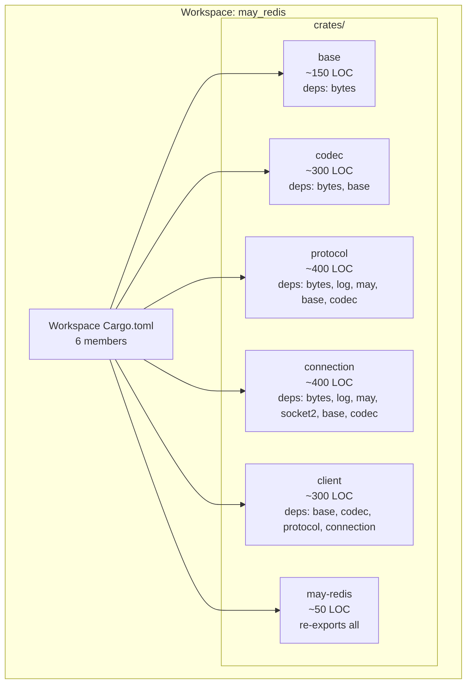

# may-redis

A coroutine-native Redis client for the [may](https://crates.io/crates/may) runtime.

Zero tokio. Zero async-await. Only may coroutines.

## Architecture



### Dependency Chain


## How It Works

may-redis is built exclusively on the `may` coroutine runtime. This is not optional, not a preference, and not subject to debate — it is the entire *raison d'être* of the project.

- **No tokio.** `#[tokio::test]`, `.await`, `async fn` — none of it.
- **No other runtimes.** Only `may` coroutines: `may::go!`, `may::coroutine::yield_now()`, `may::sync::spsc`, `may::net::TcpStream`.
- **Epoll-driven connection loop.** A single `go!` coroutine runs an epoll loop sharing one TCP socket, dispatching responses via monotonically increasing tags for request-response matching.
- **Reference: may_postgres.** The connection layer, request-response pipeline, and may primitive usage follow patterns from the sibling `may_postgres` crate.

## Workspace Structure

| Crate | Description | Dependencies |
|-------|-------------|--------------|
| `base` | Core types: `RedisValue`, `RedisError`, `FromRedisValue`, `ToRedisArgs` | `bytes` |
| `codec` | RESP2 encoding/decoding: `RESPWriter`, `RESPReader` | `bytes`, `base` |
| `protocol` | Command construction: `CommandBuilder`, `Commands` trait | `bytes`, `log`, `may`, `base`, `codec` |
| `connection` | Epoll connection loop, TCP, coroutine management | `bytes`, `log`, `may`, `socket2`, `base`, `codec` |
| `client` | Public API: `RedisClient`, `Pipeline` | `base`, `codec`, `protocol`, `connection` |
| `may-redis` | Umbrella re-export crate | all above |

### Feature Flags

- `default`: `["connection", "client"]`
- `connection`: Enable TCP connection support
- `client`: Enable `RedisClient` and `Pipeline`
- `pool`: Connection pooling (future)
- `test`: Test helpers and `InMemoryClient`

## Getting Started

```rust
use may_redis::{RedisClient, Commands};

may::run(|| {
    may::go(|| {
        let mut client = RedisClient::connect("127.0.0.1:6379").block_on();
        client.set("key", "value").block_on();
        let val: Option<String> = client.get("key").block_on();
    }).join();
});
```

## Reference Docs

- [`docs/01-protocol-analysis.md`](./docs/01-protocol-analysis.md) — RESP wire format analysis
- [`docs/02-may_postgres_comparison.md`](./docs/02-may_postgres_comparison.md) — may_postgres architecture and patterns
- [`docs/03-sesame-idam-redis-usage.md`](./docs/03-sesame-idam-redis-usage.md) — Sesame-IDAM Redis command inventory
- [`docs/08-module-structure.md`](./docs/08-module-structure.md) — Target modular workspace architecture
- [`docs/10-test-strategy.md`](./docs/10-test-strategy.md) — Test architecture and verification

## Epic Plan

Implementation is organized into 7 epics, each with granular stories:

- [`docs/Epics/Epic_0/`](./docs/Epics/Epic_0/) — **Scaffolding** — Workspace structure, Cargo.toml, lint tooling, documentation
- [`docs/Epics/Epic_1/`](./docs/Epics/Epic_1/) — **base crate** — Core types implementation
- [`docs/Epics/Epic_2/`](./docs/Epics/Epic_2/) — **codec crate** — RESP2 encoding/decoding
- [`docs/Epics/Epic_3/`](./docs/Epics/Epic_3/) — **protocol crate** — Command builder and Commands trait
- [`docs/Epics/Epic_4/`](./docs/Epics/Epic_4/) — **connection crate** — Epoll connection loop
- [`docs/Epics/Epic_5/`](./docs/Epics/Epic_5/) — **client crate** — RedisClient and Pipeline
- [`docs/Epics/Epic_6/`](./docs/Epics/Epic_6/) — **Integration and polish** — End-to-end tests, benchmarks

Epics run in strict order: 0 → 1 → 2 → 3 → 4 → 5 → 6. Each epic's stories must all pass `cargo test` before moving to the next epic.
