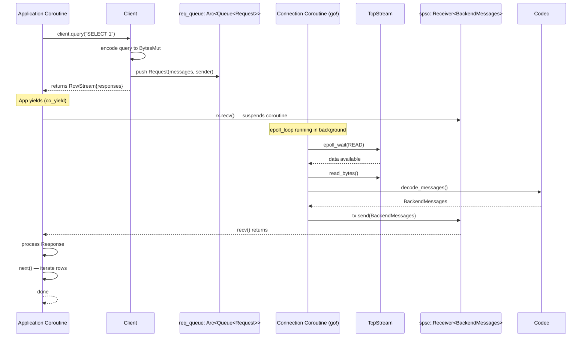
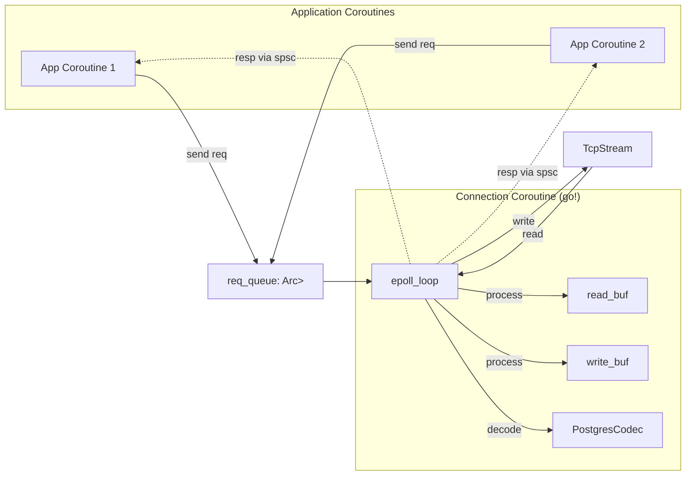

# may_postgres Architecture Analysis

## may_postgres Module Structure

```mermaid
graph TB
    subgraph "may_postgres"
        subgraph "Connection Layer"
            C[connect.rs]
            CR[connect_raw.rs]
            CS[connect_socket.rs]
            Conn[connection.rs]
        end
        subgraph "Client Layer"
            Client[client.rs]
            InnerClient[InnerClient]
            CoChannel[CoChannel]
            Responses[Responses]
        end
        subgraph "Protocol Layer"
            Codec[codec.rs]
            PostgresCodec[PostgresCodec]
            FE[FrontendMessage]
            BE[BackendMessage/BackendMessages]
        end
        subgraph "Operations"
            Q[query.rs]
            S[statement.rs]
            P[prepare.rs]
            T[transaction.rs]
            SQ[simple_query.rs]
            CI[copy_in.rs]
            CO[copy_out.rs]
        end
        subgraph "Types"
            Types[types.rs]
            Row[row.rs]
            Portal[portal.rs]
        end
    end
    
    C --> CR --> CS --> Conn
    Conn --> Client
    Client --> InnerClient
    InnerClient --> CoChannel
    InnerClient --> Codec
    Codec --> FE
    Codec --> BE
    Q --> Client
    S --> Client
    P --> Client
    T --> Client
    SQ --> Client
    CI --> Client
    CO --> Client
    Types --> Row
    Types --> Portal
    Q --> S
    Q --> Row
    SQ --> Row
```

## may_postgres Core Architecture: The "may" Pattern

The key insight is that may_postgres replaces **all** async/await with **coroutine yields**:



### Key may_primitives used by may_postgres

| Primitive | Module | Usage |
|-----------|--------|-------|
| `may::net::TcpStream` | net/tcp.rs | TCP sockets (may-aware) |
| `WaitIo` / `WaitIoWaker` | io/wait_io.rs | epoll-based async I/O |
| `may::go!` | coroutine | Spawn connection loop as co |
| `may::sync::spsc` | sync/spsc.rs | Co-to-co request/response channel |
| `may::queue::mpsc::Queue` | queue/mpsc.rs | Thread-safe request queue |
| `spin::Mutex` | spin crate | Co-internal lock on InnerClient state |
| `may::timer::sleep` | timer | Timeout handling |

### Connection Architecture



The Connection coroutine is **single-threaded, single-epoll** — all applications share
one connection but pipeline their requests. The `req_queue` is an mpsc Queue (not a channel)
because it's written from multiple coroutines and read by the single connection coroutine.

### Request-Response Pipeline

```mermaid
graph TD
    subgraph "Request Flow (Application -> Connection)"
        A1[Client.execute()] --> A2[encode SQL → BytesMut]
        A2 --> A3[client.send RequestMessages::Single]
        A3 --> A4[InnerClient.raw_send]
        A4 --> A5[req_queue.push Request]
        A5 --> A6[waker.wakeup]
    end
    
    subgraph "Response Flow (Connection -> Application)"
        C1[epoll read] --> C2[decode Messages]
        C2 --> C3[find matching Response by tag]
        C3 --> C4[tx.send BackendMessages]
        C4 --> C5[Application rx.recv wakes]
        C5 --> C6[parse Rows]
    end
    
    A6 -.signal.-> B[Connection Coroutine]
    B -.data.-> C1
```

## Key Differences from Async Rust Patterns

| Aspect | tokio/async-await | may_postgres (coroutines) |
|--------|-------------------|--------------------------|
| I/O await | Future-based poll loop | Co-yield (stackful) |
| Task scheduling | Green threads (OS thread pool) | Cooperative coroutines |
| State machine | Generated by compiler | Explicit state via yield points |
| Stack size | Heap-allocated | Fixed per-coroutine (configurable) |
| Blocking | Can't block (must .await) | Can use co_yield for I/O wait |
| Concurrency model | Async fn → Future | go! → JoinHandle → co_yield |

