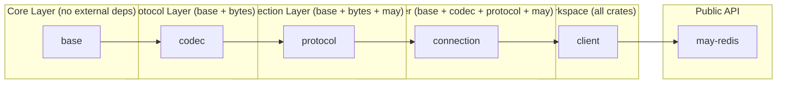
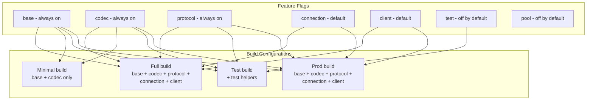

# May-redis — System Design

## Goal

Build a coroutine-native Redis client for the `may` runtime that replaces the tokio-dependent
`redis` crate in sesame-idam. **Zero tokio, zero async-await, only may coroutines.**

## Design Principles

1. **Modular by default** — each subsystem is a separate crate with its own `Cargo.toml`, versioned independently, testable in isolation.
2. **Familiar API surface** — mirror the `redis::Commands` trait so sesame-idam migration is
   a mechanical `may_redis::cmd()` → `redis::cmd()` search/replace.
3. **Minimal protocol scope** — only RESP2 (simpler than RESP3), only the commands we use.
4. **may_postgres parity** — same connection loop pattern: epoll-based `go!` coroutine sharing
   one TCP socket via an mpsc request queue, pipelining through spsc per-request channels.
5. **Pipelining** — support sending multiple commands before reading responses (same as
   may_postgres RowStream pattern).
6. **Pipeline-first** — no blocking `.get_connection()` API. Everything returns a co-awaitable
   response. Test code uses `InMemoryClient` instead of `redis::cmd().query()`.

## Architecture Overview

```mermaid
graph TB
    subgraph "Application Coroutines"
        App1[App Coroutine 1]
        App2[App Coroutine 2]
    end
    
    subgraph "may_redis Workspace"
        subgraph "base"
            Base[Core Types\n RedisError, Value]
        end
        
        subgraph "codec"
            Codec[RESP Codec\n Encode, Decode]
        end
        
        subgraph "protocol"
            Proto[Protocol Layer\n CommandBuilder, Responses]
        end
        
        subgraph "connection"
            Conn[Connection Loop\n epoll, I/O]
        end
        
        subgraph "client"
            Client[RedisClient\n connect, send, execute]
        end
        
        subgraph "may-redis (umbrella)"
            Lib[Public API\n re-exports, features]
        end
        
        Base --> Codec
        Codec --> Proto
        Proto --> Conn
        Conn --> Client
        Client --> Lib
    end
    
    App1 -->|cmd().send()| Client
    App2 -->|cmd().send()| Client
    
    Lib --> Client
    Client --> Conn
    Conn --> Proto
    Proto --> Codec
    Codec --> Base
```

## Crate Dependency Graph



## Crate Responsibilities

### `base` — Core Types (~150 LOC)

The foundation crate. No external dependencies except `bytes`. Contains:

- `RedisValue` — the union type for all Redis data (bulk string, integer, array, error, null)
- `RedisError` — the error type with all Redis error variants
- `FromRedisValue` — trait for extracting Rust types from `RedisValue`
- `ToRedisArgs` — trait for converting Rust types to Redis command arguments

```rust
// Base crate — no may dependency, no network, no codec
pub enum RedisValue {
    BulkString(Vec<u8>),
    Array(Vec<RedisValue>),
    Integer(i64),
    SimpleString(String),
    Error(String),
    Null,
}

pub trait FromRedisValue: Sized {
    fn from_redis_value(v: &RedisValue) -> Result<Self, RedisError>;
}

pub trait ToRedisArgs {
    fn write_redis_args(&self, buf: &mut Vec<u8>);
}
```

**Why separate?** Base is pure data + traits. It can be tested without any I/O, without any network. It's the only crate that can be reused in contexts where you don't need the full client (e.g., testing other parts of the codebase).

### `codec` — RESP Protocol Codec (~300 LOC)

Handles RESP wire format encoding/decoding. Depends on `base` + `bytes`:

- `RESPWriter` — writes RESP commands into a `BytesMut`
- `RESPReader` — reads RESP responses from a `BytesMut`
- `encode_command()` — converts `RedisValue` array into RESP wire format
- `decode_response()` — converts RESP wire format into `RedisValue`

```rust
// Codec crate — no may dependency, pure encoding/decoding
pub struct RESPWriter {
    buf: BytesMut,
}

pub struct RESPReader {
    buf: BytesMut,
}

pub fn encode_command(args: &[RedisValue], buf: &mut BytesMut);
pub fn decode_response(reader: &mut RESPReader) -> Result<RedisValue, RedisError>;
```

**Why separate?** The codec is pure encoding/decoding logic. It can be unit-tested in complete isolation. It's also the most likely candidate for future optimization (SIMD, zero-copy, etc.) without touching connection or client code.

### `protocol` — Command Protocol (~400 LOC)

Builds Redis commands from the `Commands` trait and manages the request-response protocol. Depends on `base` + `codec` + `may`:

- `CommandBuilder` — fluent API for building Redis commands
- `Commands` trait — methods like `get()`, `set()`, `exists()`, `incr()`
- `Request` — wraps a command + response channel
- `Responses` — iterator over pipelined responses

```rust
// Protocol crate — uses codec and may primitives
pub struct CommandBuilder {
    args: Vec<RedisValue>,
}

pub trait Commands {
    fn get<K: ToRedisArgs, V: FromRedisValue>(&self, key: K) -> CommandBuilder;
    fn set<K: ToRedisArgs, V: ToRedisArgs>(&self, key: K, value: V) -> CommandBuilder;
    fn exists<K: ToRedisArgs>(&self, key: K) -> CommandBuilder;
    fn incr<K: ToRedisArgs>(&self, key: K) -> CommandBuilder;
}

pub struct Request {
    tag: usize,
    command: BytesMut,
    tx: spsc::Sender<RedisValue>,
}
```

**Why separate?** This is the "business logic" layer. It knows Redis semantics (what commands exist, what arguments they take) but doesn't know about network I/O. It can be tested with a fake connection.

### `connection` — Connection Loop (~400 LOC)

Handles the TCP connection, epoll loop, and coroutine lifecycle. Depends on `base` + `codec` + `may`:

- `Connection` — background coroutine running the epoll loop
- `RequestQueue` — mpsc queue for sending requests to the connection
- `ResponseDispatcher` — routes responses to correct waiters
- `TcpConnector` — establishes TCP connections (may-aware)

```rust
// Connection crate — uses may primitives, no protocol logic
pub struct Connection {
    io_handle: JoinHandle<()>,
    req_queue: Arc<Queue<Request>>,
    waker: WaitIoWaker,
}

pub struct TcpConnector;

impl TcpConnector {
    pub fn connect(host: &str, port: u16) -> Result<TcpStream, ConnectionError>;
}
```

**Why separate?** The connection layer is the most may-specific. It's the only part that deals with `go!`, `epoll`, `WaitIo`, `WaitIoWaker`. It can be swapped out (e.g., for a mock connection in tests) without touching protocol logic.

### `client` — Public Client API (~300 LOC)

The user-facing API. Depends on all other crates:

- `RedisClient` — entry point, wraps a connection
- `Pipeline` — batch command execution
- `ConnectionPool` — optional multi-connection management (future)

```rust
// Client crate — assembles all layers
pub struct RedisClient {
    inner: Arc<InnerClient>,
}

impl RedisClient {
    pub fn connect(url: &str) -> Result<Self, ConnectionError>;
    pub fn execute<T: FromRedisValue>(&self, cmd: CommandBuilder) -> Result<T, RedisError>;
    pub fn pipeline<F, T>(&self, f: F) -> Result<T, RedisError> where F: FnOnce(&mut Pipeline) -> T;
}
```

**Why separate?** This is the public API surface. It's where feature flags are applied, where the API is polished, and where user-facing behavior is defined. It can evolve independently from the internal crates.

### `may-redis` — Workspace / Public API (~50 LOC)

The umbrella crate. Re-exports from all sub-crates and applies feature flags:

- `base` features — always enabled
- `codec` features — always enabled
- `protocol` features — always enabled
- `connection` features — enabled by default, optional for test-only builds
- `client` features — enabled by default
- `test` features — disabled by default, enables `InMemoryClient`

```rust
// Umbrella crate — just re-exports and feature flags
pub use base::*;
pub use codec::*;
pub use protocol::*;
pub use connection::*;
pub use client::*;
```

**Why separate?** This is the crate users `Cargo.toml`. It provides a stable public API surface that can evolve independently. Sub-crates can have breaking changes without affecting the public API (as long as re-exports are maintained).

## Feature Flag Matrix



## Crate Size Estimates

| Crate | Lines | Dependencies | External Deps |
|-------|-------|-------------|---------------|
| `base` | ~150 | none | `bytes` |
| `codec` | ~300 | base | `bytes` |
| `protocol` | ~400 | base, codec | `bytes`, `may` |
| `connection` | ~400 | base, codec | `bytes`, `may` |
| `client` | ~300 | all | `bytes`, `may` |
| `may-redis` (umbrella) | ~50 | all | — |
| **Total** | **~1600** | | **`bytes`, `may`** |

## Benefits of Modular Design

1. **Independent testing** — each crate can be tested in isolation without pulling in the full stack
2. **Incremental adoption** — teams can use just the base/codec crates for testing without the full client
3. **Clear ownership** — each crate has a single responsibility, making PR reviews easier
4. **Faster compilation** — only changed crates need recompilation
5. **Feature control** — users can exclude unused parts (e.g., no connection pooling if not needed)
6. **Parallel development** — multiple developers can work on different crates simultaneously
