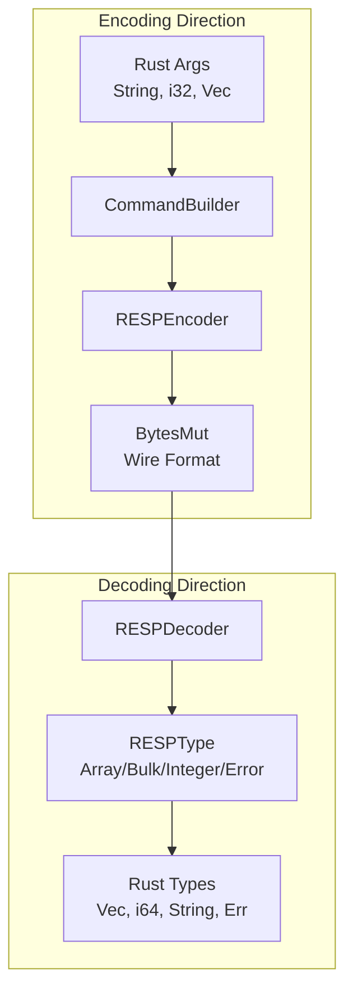
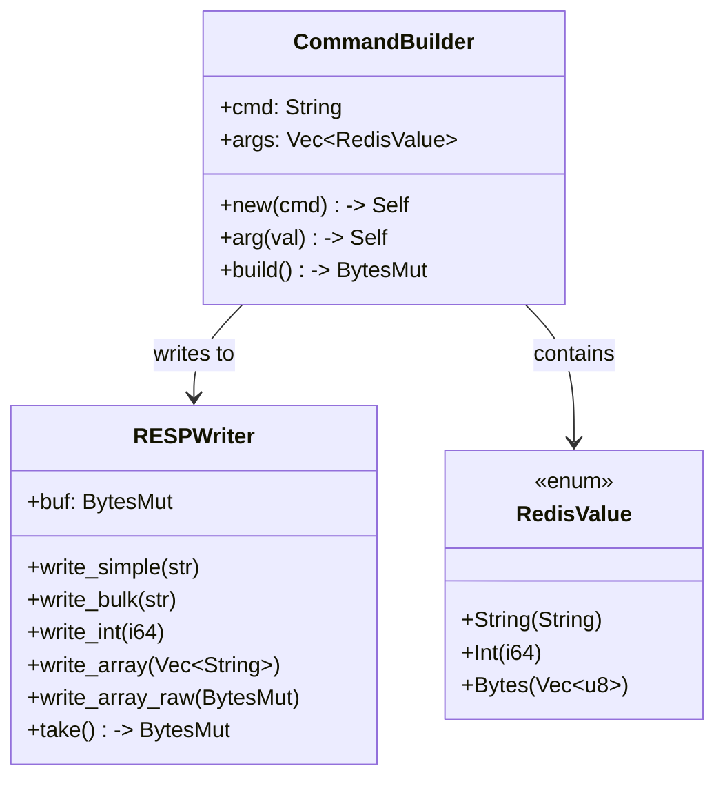
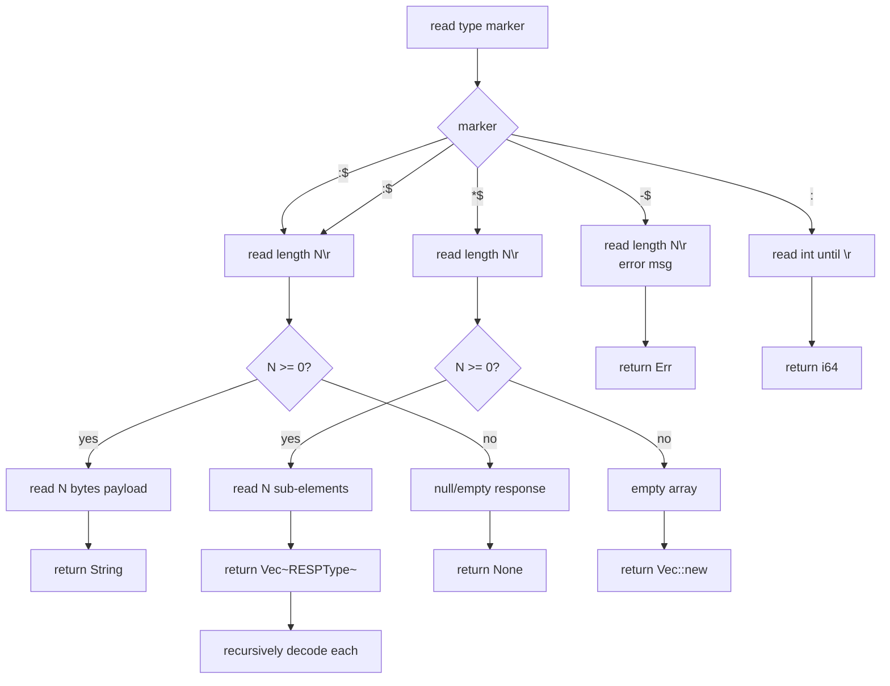

# Protocol Layer Design — RESP Codec

## Overview

The protocol layer handles two concerns:
1. **Encoding** — Application commands (strings, integers) → RESP wire format
2. **Decoding** — RESP wire format → application-native Rust types



## RESP Encoding

### Command Structure

Every Redis command is a **bulk array of bulk strings**:
```
*<arg_count>\r\n
$<len0>\r\n<arg0>\r\n
$<len1>\r\n<arg1>\r\n
...
```

### Encoder Implementation



### Encoding Algorithm

For `SET key value EX 60`:

```
1. CommandBuilder::new("SET")
   → cmd = "SET"
   → args = ["key", "value", "EX", "60"]

2. CommandBuilder::build()
   → Write "*4\r\n" (4 arguments)
   → For each arg:
     - Write "$N\r\n" where N = arg.len()
     - Write arg bytes
     - Write "\r\n"
   
3. Result:
   *4\r\n
   $3\r\nSET\r\n
   $3\r\nkey\r\n
   $5\r\nvalue\r\n
   $2\r\nEX\r\n
   $2\r\n60\r\n
```

### Decoding Algorithm



### Decoding an Array Response

For a response from `KEYS user:*` returning `["user:1", "user:2"]`:

```
*2\r\n
$8\r\nuser:1\r\n
$8\r\nuser:2\r\n

1. Read '*' → array of 2 elements
2. Read first sub-element:
   - Read '$8' → bulk string of 8 bytes
   - Read "user:1\r\n" → "user:1"
3. Read second sub-element:
   - Read '$8' → bulk string of 8 bytes
   - Read "user:2\r\n" → "user:2"
4. Return ["user:1", "user:2"]
```

### Type Mapping

| RESP Type | Rust Type | Example Response |
|-----------|-----------|-----------------|
| `+OK` | `Result<(), E>` | Simple string |
| `:42` | `i64` | Integer |
| `$5\r\nhello\r\n` | `String` | Bulk string |
| `$-1` | `Option<String>` | Null bulk string |
| `*2\r\n$3\r\nfoo\r\n$3\r\nbar\r\n` | `Vec<String>` | Array of strings |
| `*0\r\n` | `Vec<String>` | Empty array |
| `-ERR msg\r\n` | `RedisError` | Error |

