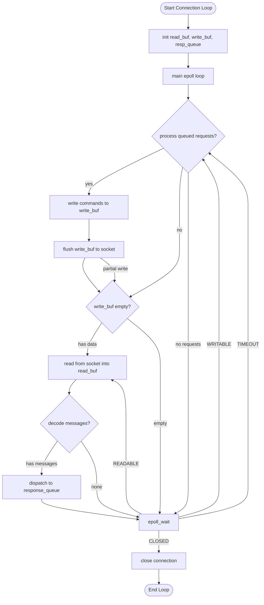
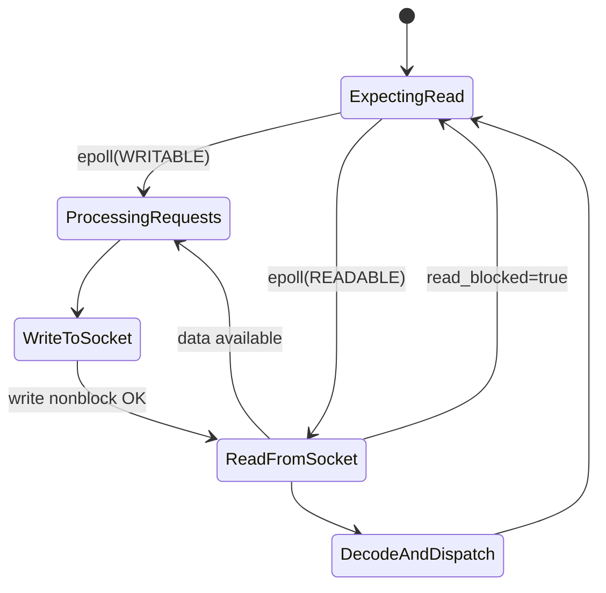
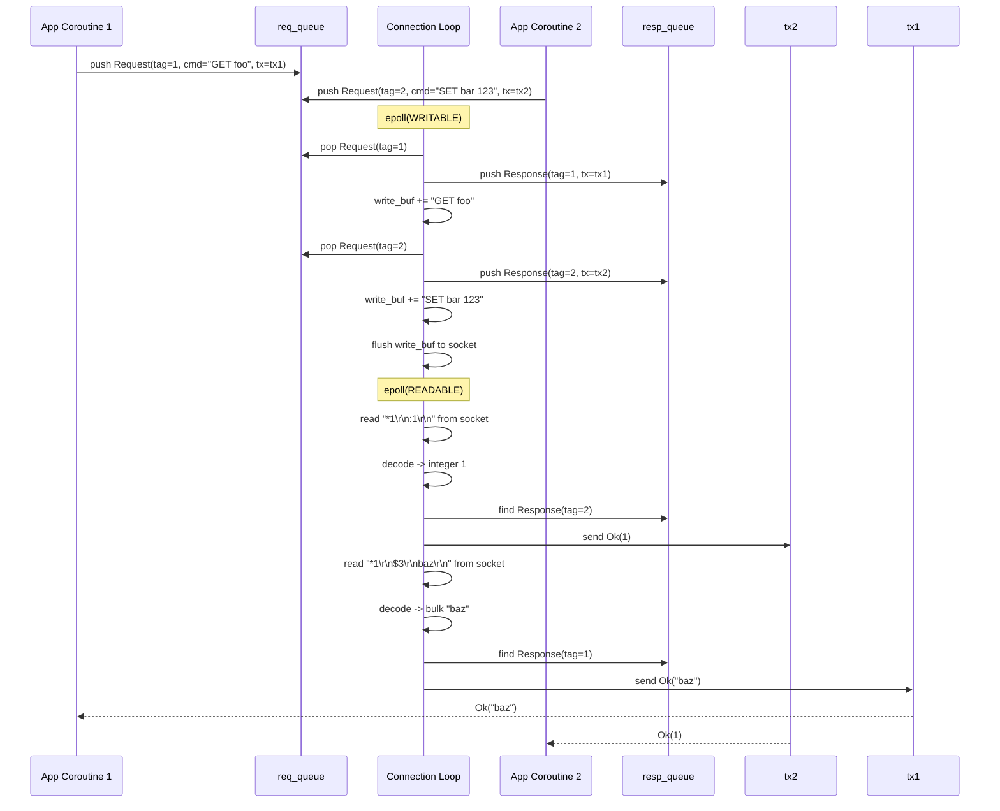

# Connection Layer Design — The Connection Loop

## Overview

The connection layer is the heart of may_redis — it runs a single `go!` coroutine that:
1. Receives commands from application coroutines via an mpsc request queue
2. Reads/writes the TCP socket using epoll
3. Dispatches responses back to the correct application coroutine via spsc channels

```mermaid
graph TB
    subgraph "Application Coroutines"
        App1[App Coroutine 1\n is_seen(jti-abc)]
        App2[App Coroutine 2\n record(jti-def)]
        App3[App Coroutine 3\n get(key)]
    end
    
    subgraph "Request Queue"
        Queue[Arc~Queue~Request>]\n mpsc Queue]
        Waker[WaitIoWaker]
    end
    
    subgraph "Connection Coroutine"
        Loop[epoll connection_loop]
        ReadBuf[read_buf: BytesMut]
        WriteBuf[write_buf: BytesMut]
        RespBuf[response_queue: VecDeque~Response~]
        Codec[RESP Codec]
    end
    
    subgraph "Transport"
        TCP[TcpStream\n may::net]
    end
    
    App1 -->|request.push()| Queue
    App2 -->|request.push()| Queue
    App3 -->|request.push()| Queue
    
    Queue -->|pop| Loop
    Loop -->|signal| Waker
    
    Loop -->|read| TCP
    TCP -->|data| Loop
    Loop -->|write| TCP
    
    Loop -->|decode| Codec
    Codec -->|dispatch| RespBuf
    RespBuf -->|tx.send()| App1
    RespBuf -->|tx.send()| App2
    RespBuf -->|tx.send()| App3
```

## Core Types

### Request

```
struct Request {
    tag: usize,                    // Sequence number for matching response
    command: BytesMut,             // Encoded RESP command
    sender: spsc::Sender<RedisResponse>,  // Response channel for this request
}
```

The `tag` is a monotonically increasing counter from a shared cell. Each request
gets a unique tag. The connection loop tags each response with the same tag,
so responses can be dispatched to the correct channel even when pipelined.

### Response

```
struct Response {
    tag: usize,
    tx: spsc::Sender<RedisResponse>,
}
```

### Connection

```
struct Connection {
    io_handle: JoinHandle<()>,    // The go! coroutine
    req_queue: Arc<Queue<Request>>, // Shared request queue
    waker: WaitIoWaker,           // Epoll signal to wake connection loop
    id: usize,                    // For debugging/logging
}
```

## Connection Loop Algorithm



### Detailed Loop Body

```
fn connection_loop(stream: TcpStream, req_queue: Arc<Queue<Request>>) {
    let mut read_buf = BytesMut::with_capacity(4096 * 2);
    let mut write_buf = BytesMut::with_capacity(4096 * 2);
    let mut resp_queue = VecDeque::with_capacity(512);
    
    loop {
        // 1. Process incoming requests from the queue
        while let Some(req) = req_queue.pop() {
            let response = Response { tag: req.tag, tx: req.tx };
            resp_queue.push_back(response);
            write_buf.extend_from_slice(&req.command);
        }
        
        // 2. Non-blocking write
        nonblock_write(&mut stream, &mut write_buf);
        
        // 3. Non-blocking read
        let read_blocked = nonblock_read(&mut stream, &mut read_buf);
        
        // 4. Decode buffered data into responses
        decode_messages(&mut read_buf, &mut resp_queue);
        
        // 5. epoll_wait for next event
        //    - If read not blocked: poll with READABLE priority
        //    - If write has data: poll with WRITABLE priority
        //    - If no pending data: poll with READABLE (expecting new requests)
    }
}
```

### Non-Blocking I/O

The same non-blocking read/write pattern as may_postgres:

```
fn nonblock_read(stream: &mut TcpStream, read_buf: &mut BytesMut) -> bool {
    let remaining = read_buf.capacity() - read_buf.len();
    let buf: &mut [u8] = unsafe { transmute(read_buf.chunk_mut()) };
    let mut read_cnt = 0;
    
    while read_cnt < remaining {
        match stream.read(unsafe { buf.get_unchecked_mut(read_cnt..) }) {
            Ok(0) => return false,  // Connection closed
            Ok(n) => read_cnt += n,
            Err(e) if e.kind() == WouldBlock => break,  // No more data
            Err(e) => return Err(e),
        }
    }
    
    unsafe { read_buf.advance_mut(read_cnt) };
    read_cnt < remaining  // true = still more data available
}
```

## Epoll Event Handling



The epoll events drive the state machine:
- **READABLE** → try to read from socket, decode buffer, dispatch responses
- **WRITABLE** → pop more requests from queue, write to socket
- **Both** → process writes first (flush pending data), then read

## Request-Response Matching



The tag ensures correct response ordering regardless of which coroutine sends first.

