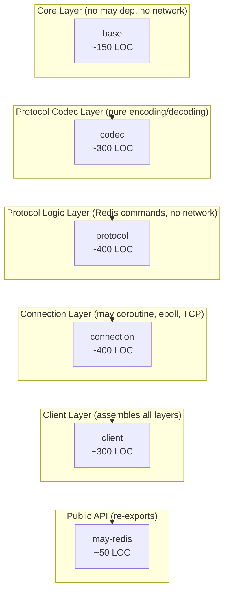

# Module Structure

## Workspace Layout

```
may_redis/
├── Cargo.toml                    # Workspace definition
├── README.md
├── crates/
│   ├── base/                     # Core types — pure data + traits
│   │   ├── Cargo.toml
│   │   └── src/
│   │       ├── lib.rs            # RedisValue, RedisError, FromRedisValue
│   │       └── to_redis_args.rs  # ToRedisArgs implementations
│   │
│   ├── codec/                    # RESP encoding/decoding
│   │   ├── Cargo.toml
│   │   └── src/
│   │       ├── lib.rs            # RESPWriter, RESPReader
│   │       ├── writer.rs         # Encoding commands to wire format
│   │       └── reader.rs         # Decoding responses from wire format
│   │
│   ├── protocol/                 # Command protocol + traits
│   │   ├── Cargo.toml
│   │   └── src/
│   │       ├── lib.rs            # CommandBuilder, Commands trait
│   │       ├── builder.rs        # CommandBuilder fluent API
│   │       └── commands.rs       # Commands trait methods
│   │
│   ├── connection/               # Connection loop + TCP
│   │   ├── Cargo.toml
│   │   └── src/
│   │       ├── lib.rs            # Connection, Request
│   │       ├── loop.rs           # epoll connection loop
│   │       ├── tcp.rs            # TCP connector (may-aware)
│   │       └── queue.rs          # Request queue management
│   │
│   ├── client/                   # Public client API
│   │   ├── Cargo.toml
│   │   └── src/
│   │       ├── lib.rs            # RedisClient, Pipeline
│   │       ├── client.rs         # RedisClient impl
│   │       └── pipeline.rs       # Pipeline support
│   │
│   └── may-redis/                # Umbrella / public API
│       ├── Cargo.toml
│       └── src/
│           └── lib.rs            # Re-exports, feature flags
│
└── docs/
    ├── 01-protocol-analysis.md
    ├── 02-may_postgres_comparison.md
    ├── 03-sesame-idam-redis-usage.md
    ├── 04-system-design.md
    ├── 05-protocol-layer-design.md
    ├── 06-connection-layer-design.md
    ├── 07-client-api-design.md
    ├── 08-module-structure.md
    ├── 09-migration-guide.md
    ├── 10-test-strategy.md
    └── 11-dependencies.md
```

## Workspace Cargo.toml

```toml
[workspace]
members = [
    "crates/base",
    "crates/codec",
    "crates/protocol",
    "crates/connection",
    "crates/client",
    "crates/may-redis",
]
resolver = "2"

[workspace.package]
version = "0.1.0"
edition = "2021"
license = "MIT OR Apache-2.0"
repository = "https://github.com/microscaler/may_redis"

[workspace.dependencies]
bytes = "1.6"
log = "0.4"
may = { version = "0.3", default-features = false }
socket2 = "0.5"

# Internal crates (workspace members)
base = { path = "crates/base" }
codec = { path = "crates/codec" }
protocol = { path = "crates/protocol" }
connection = { path = "crates/connection" }
client = { path = "crates/client" }
```

**Note:** I named it `base` not `core` because `core` is a Rust reserved crate name and would cause conflicts. `base` is short, clear, and unambiguous.

## Crate Dependency Graph



## Crate-Level Feature Flags

### base

No feature flags. This is always-on.

```toml
[package]
name = "base"

[dependencies]
bytes = { workspace = true }
```

### codec

No feature flags. Always-on.

```toml
[package]
name = "codec"

[dependencies]
bytes = { workspace = true }
base = { workspace = true }
```

### protocol

```toml
[package]
name = "protocol"

[features]
default = []

[dependencies]
bytes = { workspace = true }
log = { workspace = true }
base = { workspace = true }
codec = { workspace = true }
may = { workspace = true }
```

### connection

```toml
[package]
name = "connection"

[features]
default = ["tcp"]
tcp = []

[dependencies]
bytes = { workspace = true }
log = { workspace = true }
base = { workspace = true }
codec = { workspace = true }
may = { workspace = true, features = ["io"] }
socket2 = { workspace = true, optional = true }
```

### client

```toml
[package]
name = "client"

[features]
default = ["pool"]
pool = []

[dependencies]
base = { workspace = true }
codec = { workspace = true }
protocol = { workspace = true }
connection = { workspace = true }
```

### may-redis (umbrella)

```toml
[package]
name = "may-redis"

[features]
default = ["connection", "client"]
connection = ["dep:connection"]
client = ["dep:client"]
pool = ["client", "client/pool"]
test = []

[dependencies]
base = { workspace = true }
codec = { workspace = true }
protocol = { workspace = true }
connection = { workspace = true, optional = true }
client = { workspace = true, optional = true }
```

## Module Responsibility Map

| Crate | LOC | Responsibility | External Deps | may Primitives Used |
|-------|-----|----------------|---------------|-------------------|
| `base` | ~150 | `RedisValue`, `RedisError`, traits | `bytes` | none |
| `codec` | ~300 | RESP encoding/decoding | `bytes`, base | none |
| `protocol` | ~400 | `CommandBuilder`, `Commands` trait | `bytes`, base, codec, `may` | `may::sync::spsc` |
| `connection` | ~400 | epoll loop, TCP, coroutine lifecycle | `bytes`, base, codec, `may` | `go!`, `WaitIo`, `WaitIoWaker`, `Queue`, `spsc` |
| `client` | ~300 | `RedisClient`, `Pipeline` | base, codec, protocol, connection | — |
| `may-redis` | ~50 | Re-exports, feature flags | all crates | — |
| **Total** | **~1600** | | **`bytes`, `may`, `log`, `socket2`** | |

## Build Commands

```bash
# Build entire workspace
cargo build --workspace

# Build only base (fastest, no may dependency)
cargo build -p base

# Build with only base + codec (useful for testing other systems)
cargo build -p codec

# Build specific crate
cargo build -p protocol

# Run tests for specific crate (no network needed)
cargo test -p base
cargo test -p codec
cargo test -p protocol

# Run all workspace tests
cargo test --workspace

# Check clippy for all crates
cargo clippy --workspace
```

## Development Workflow

```mermaid
flowchart LR
    A[Change in base] --> B[cargo test -p base]
    B --> C[pass?]
    C -->|yes| D[update deps in codec]
    C -->|no| A
    
    D --> E[cargo test -p codec]
    E --> F[pass?]
    F -->|yes| G[update deps in protocol]
    F -->|no| D
    
    G --> H[cargo test -p protocol]
    H --> I[pass?]
    I -->|yes| J[update deps in connection]
    I -->|no| G
    
    J --> K[cargo test -p connection]
    K --> L[pass?]
    L -->|yes| M[update deps in client]
    L -->|no| J
    
    M --> N[cargo test -p client]
    N --> O[pass?]
    O -->|yes| P[cargo test --workspace]
    O -->|no| M
```



The dependency chain enforces a strict bottom-up build order. Changes propagate upward through the dependency chain, and each crate's tests verify the contract before the next crate is built.

## Benefits of Modular Design

1. **Independent testing** — each crate can be tested in isolation without pulling in the full stack
2. **Incremental adoption** — teams can use just the base/codec crates for testing without the full client
3. **Clear ownership** — each crate has a single responsibility, making PR reviews easier
4. **Faster compilation** — only changed crates need recompilation
5. **Feature control** — users can exclude unused parts (e.g., no connection pooling if not needed)
6. **Parallel development** — multiple developers can work on different crates simultaneously
7. **Dependency isolation** — the codec doesn't know about may, the base doesn't know about the network
