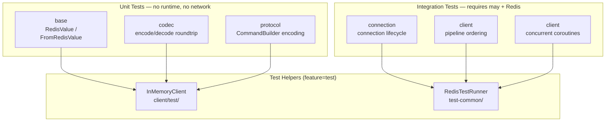

# Test Strategy

## Overview

Testing may-redis requires a dual approach:
1. **Unit tests** — pure data + encoding/decoding, runs in a regular `#[test]` with no runtime
2. **Integration tests** — full may coroutine stack with real Redis server

We cannot use `#[tokio::test]` or any tokio runtime. All integration tests must run inside
a `may` coroutine context via `may::go!` or `may::run_sync`.

## Test Architecture



## Test Infrastructure by Crate

### base — Pure Unit Tests

No runtime needed. Tests are pure `#[test]` functions.

```rust
#[test]
fn test_from_redis_value_integer() {
    let v = RedisValue::Integer(42);
    let n: i64 = FromRedisValue::from_redis_value(&v).unwrap();
    assert_eq!(n, 42);
}

#[test]
fn test_from_redis_value_array() {
    let v = RedisValue::Array(vec![
        RedisValue::BulkString(b"foo".into()),
        RedisValue::BulkString(b"bar".into()),
    ]);
    let items: Vec<String> = FromRedisValue::from_redis_value(&v).unwrap();
    assert_eq!(items, vec!["foo", "bar"]);
}

#[test]
fn test_from_redis_value_null() {
    let v = RedisValue::Null;
    let opt: Option<String> = FromRedisValue::from_redis_value(&v).unwrap();
    assert!(opt.is_none());
}
```

**Scope:** `FromRedisValue` extraction for every Rust type we support, `RedisError` variants, `ToRedisArgs` encoding for every Rust type.

### codec — Pure Unit Tests

No runtime needed. Tests are pure `#[test]` functions that exercise the encoder/decoder roundtrip.

```rust
#[test]
fn test_encode_simple_string() {
    let mut buf = BytesMut::new();
    RESPWriter::write_simple(&mut buf, "OK");
    assert_eq!(buf.to_bytes(), "+OK\r\n");
}

#[test]
fn test_encode_bulk_string() {
    let mut buf = BytesMut::new();
    RESPWriter::write_bulk(&mut buf, b"hello");
    assert_eq!(buf.to_bytes(), "$5\r\nhello\r\n");
}

#[test]
fn test_encode_array() {
    let mut buf = BytesMut::new();
    RESPWriter::write_array(&mut buf, &[
        RedisValue::BulkString(b"SET".into()),
        RedisValue::BulkString(b"key".into()),
        RedisValue::BulkString(b"value".into()),
    ]);
    assert_eq!(buf.to_bytes(), "*3\r\n$3\r\nSET\r\n$3\r\nkey\r\n$5\r\nvalue\r\n");
}

#[test]
fn test_decode_integer() {
    let data = b":42\r\n";
    let mut reader = RESPReader::new(BytesMut::from(data));
    let v = RESPReader::read_value(&mut reader).unwrap();
    assert_eq!(v, RedisValue::Integer(42));
}

#[test]
fn test_decode_array() {
    let data = b"*2\r\n$3\r\nfoo\r\n$3\r\nbar\r\n";
    let mut reader = RESPReader::new(BytesMut::from(data));
    let v = RESPReader::read_value(&mut reader).unwrap();
    assert_eq!(v, RedisValue::Array(vec![
        RedisValue::BulkString(b"foo".into()),
        RedisValue::BulkString(b"bar".into()),
    ]));
}

#[test]
fn test_roundtrip_set_command() {
    let mut buf = BytesMut::new();
    RESPWriter::write_array(&mut buf, &[
        RedisValue::BulkString(b"SET".into()),
        RedisValue::BulkString(b"key".into()),
        RedisValue::BulkString(b"value".into()),
    ]);
    let decoded = RESPReader::read_value(&mut RESPReader::new(buf)).unwrap();
    assert_eq!(decoded, RedisValue::Array(vec![
        RedisValue::BulkString(b"SET".into()),
        RedisValue::BulkString(b"key".into()),
        RedisValue::BulkString(b"value".into()),
    ]));
}
```

**Scope:** Every RESP type marker (`+`, `$`, `:`, `*`, `-`), edge cases (null bulk string `$-1`, empty array `*0\r\n`), encoding length calculations, large payloads.

### protocol — Unit Tests + Fake Connection Tests

No network needed. Tests use a `FakeConnection` that implements the same interface as a real connection.

```rust
// Fake connection — captures sent commands, returns canned responses
struct FakeConnection {
    sent_commands: Arc<Mutex<Vec<BytesMut>>>,
    responses: Arc<Mutex<VecDeque<RedisValue>>>,
}

impl ConnectionDriver for FakeConnection {
    fn send(&self, cmd: BytesMut) { self.sent_commands.lock().unwrap().push(cmd); }
    fn recv(&self) -> RedisValue { self.responses.lock().unwrap().pop_front().unwrap(); }
}
```

```rust
#[test]
fn test_command_builder_encoding() {
    let cmd = cmd("GET").arg("mykey");
    let bytes = cmd.build();
    // Verify the bytes match expected RESP format
    assert_eq!(bytes, b"*2\r\n$3\r\nGET\r\n$5\r\nmykey\r\n");
}

#[test]
fn test_commands_trait_integration() {
    let fake = FakeConnection::new();
    let client = FakeClient::new(fake.clone());
    
    let result: Result<String, _> = client.get("key");
    assert_eq!(result.unwrap(), "value");
    
    // Verify the command was encoded correctly
    let sent = fake.sent_commands.lock().unwrap();
    assert_eq!(sent[0], b"*2\r\n$3\r\nGET\r\n$3\r\nkey\r\n");
}
```

**Scope:** `CommandBuilder::build()` output matches RESP wire format, `Commands` trait methods encode correctly, request tag assignment is monotonic, pipeline command ordering is preserved.

### connection — Integration Tests

Requires `may` runtime and real (or mocked) TCP.

```rust
// Uses may::go! to spawn the connection loop, real TCP socket
#[test]
fn test_connection_established() {
    may::run(|| {
        may::go(|| {
            let conn = Connection::connect("127.0.0.1", 6379);
            assert!(conn.is_ok());
        }).join();
    });
}
```

**Scope:** Connection lifecycle (connect, close, reconnect), TCP keepalive, non-blocking I/O correctness, epoll event ordering.

### client — Integration Tests

Requires `may` runtime and real Redis.

```rust
#[test]
fn test_set_get_pipeline() {
    may::run(|| {
        let client = RedisClient::connect("redis://127.0.0.1:6379").unwrap();
        client.set("key", "value").unwrap();
        let result: String = client.get("key").unwrap();
        assert_eq!(result, "value");
    });
}
```

## Test Categories by Crate

### base (~10 tests, pure `#[test]`)

| Test | What it validates |
|------|------------------|
| `test_from_redis_value_integer` | `i64` extraction |
| `test_from_redis_value_string` | `String` extraction |
| `test_from_redis_value_option` | `Option<T>` extraction |
| `test_from_redis_value_vec` | `Vec<T>` extraction |
| `test_from_redis_value_error` | `RedisError` extraction |
| `test_to_redis_args_string` | String → `RedisValue` |
| `test_to_redis_args_int` | Integer → `RedisValue` |
| `test_to_redis_args_multiple` | Multiple args batching |
| `test_redis_error_display` | Error formatting |
| `test_redis_value_clone` | Value immutability |

### codec (~15 tests, pure `#[test]`)

| Test | What it validates |
|------|------------------|
| `test_encode_simple_string` | `+OK\r\n` |
| `test_encode_bulk_string` | `$N\r\ndata\r\n` |
| `test_encode_integer` | `:42\r\n` |
| `test_encode_array` | `*N\r\n...` |
| `test_encode_null_bulk` | `$-1\r\n` |
| `test_encode_empty_array` | `*0\r\n` |
| `test_decode_simple_string` | `+OK` → `RedisValue::SimpleString` |
| `test_decode_bulk_string` | `$5\r\nhello\r\n` → `RedisValue::BulkString` |
| `test_decode_integer` | `:42` → `RedisValue::Integer` |
| `test_decode_array` | `*2...` → `RedisValue::Array` |
| `test_decode_error` | `-ERR msg` → `RedisValue::Error` |
| `test_decode_null_bulk` | `$-1` → `RedisValue::Null` |
| `test_decode_empty_array` | `*0` → `RedisValue::Array([])` |
| `test_roundtrip_set_command` | Encode → Decode → Compare |
| `test_large_payload_encoding` | 64KB payload encoding |

### protocol (~10 tests, `#[test]` with FakeConnection)

| Test | What it validates |
|------|------------------|
| `test_command_builder_encoding` | `cmd("GET").arg("k").build()` |
| `test_commands_trait_get` | `Commands::get()` encodes correctly |
| `test_commands_trait_set` | `Commands::set()` encodes correctly |
| `test_commands_trait_exists` | `Commands::exists()` encodes correctly |
| `test_commands_trait_incr` | `Commands::incr()` encodes correctly |
| `test_request_tag_monotonic` | Tags increase sequentially |
| `test_pipeline_request_ordering` | Commands sent in declaration order |
| `test_response_decoding_success` | Response → typed result |
| `test_response_decoding_error` | Server error → `RedisError` |
| `test_empty_command_args` | `PING` with no args |

### connection (~5 tests, requires may runtime)

| Test | What it validates |
|------|------------------|
| `test_connect_to_redis` | TCP connection established |
| `test_close_connection` | Clean shutdown |
| `test_connection_reset` | Handle server disconnect |
| `test_request_queue_overflow` | Backpressure behavior |
| `test_epoll_event_ordering` | READABLE vs WRITABLE priority |

### client (~10 tests, requires may + Redis)

| Test | What it validates |
|------|------------------|
| `test_connect` | `RedisClient::connect()` |
| `test_set_get` | Store and retrieve |
| `test_set_get_ex` | SET with EXPIRE |
| `test_del` | Delete key |
| `test_incr` | Atomic increment |
| `test_exists` | Key existence check |
| `test_ttl` | Check TTL |
| `test_expire` | Set expiration |
| `test_pipeline_ordering` | Commands execute in order |
| `test_error_propagation` | Server errors bubble up |

### Concurrency Tests (connection + client, 5 tests)

| Test | What it validates |
|------|------------------|
| `test_concurrent_requests` | Multiple coroutines sharing one client |
| `test_pipeline_concurrent` | Pipeline + normal requests interleaved |
| `test_connection_reset_during_pipeline` | Handle reset mid-pipeline |
| `test_concurrent_pipelines` | Two pipelines running simultaneously |
| `test_backpressure_under_load` | Queue fills correctly, coroutines yield |

## Running Tests

```bash
# Base crate — pure unit tests, fastest
cargo test -p base

# Codec crate — pure unit tests
cargo test -p codec

# Protocol crate — unit tests with FakeConnection
cargo test -p protocol

# Connection crate — needs Redis
cargo test -p connection

# Client crate — needs Redis
cargo test -p client

# All tests (base + codec + protocol + connection + client)
cargo test --workspace

# Only unit tests (no Redis needed)
cargo test -p base -p codec -p protocol

# With test feature (includes test helpers)
cargo test -p may-redis --features test
```

## Test Isolation

Each integration test must call `FLUSHDB` before and after execution. The `InMemoryClient` (feature `test`) is automatically clean per test.

```rust
#[test]
fn test_pipeline_ordering() {
    may::run(|| {
        let client = RedisClient::connect("redis://127.0.0.1:6379").unwrap();
        client.execute(cmd("FLUSHDB")).unwrap();
        
        // ... test logic ...
        
        client.execute(cmd("FLUSHDB")).unwrap();
    });
}
```

## may Runtime for Tests

Since we can't use `#[tokio::test]`, we use `may::run` to create the coroutine context:

```rust
#[test]
fn test_with_may_runtime() {
    may::run(|| {
        may::go(|| {
            // Test code runs here in a coroutine
            let client = RedisClient::connect("redis://127.0.0.1:6379").unwrap();
            let result: String = client.get("key").unwrap();
            assert_eq!(result, "value");
        }).join();
    });
}
```

This is analogous to `#[tokio::test]` but uses may's cooperative coroutine model.
