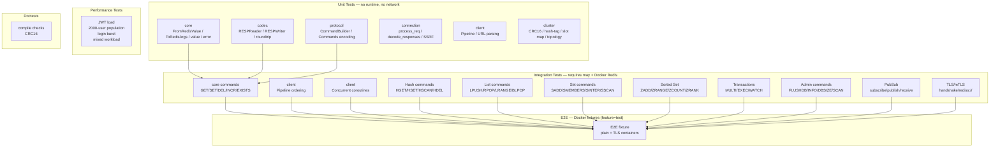

# Test Strategy

## Overview

Testing may-redis requires a three-tier approach:

1. **Unit tests** — pure data + encoding/decoding, runs in a regular `#[test]` with no runtime
2. **Integration tests** — full may coroutine stack with real Redis server (via Docker fixtures)
3. **E2E & performance tests** — Docker-managed containers, JWT load scenarios

We cannot use `#[tokio::test]` or any tokio runtime. All integration tests must run inside
a `may` coroutine context via `may::go!` or `may::run`.

## Test Architecture


```mermaid
graph TB
    subgraph "Unit Tests — no runtime, no network"
        UE[core<br/>FromRedisValue / ToRedisArgs / value / error]
        UC[codec<br/>RESPReader / RESPWriter / roundtrip]
        UP[protocol<br/>CommandBuilder / Commands encoding]
        UU[connection<br/>process_req / decode_responses / SSRF]
        UPI[client<br/>Pipeline / URL parsing]
        UCL[cluster<br/>CRC16 / hash-tag / slot map / topology]
    end
    
    subgraph "Integration Tests — requires may + Docker Redis"
        IE[core commands<br/>GET/SET/DEL/INCR/EXISTS]
        IP[client<br/>Pipeline ordering]
        IC[client<br/>Concurrent coroutines]
        IHA[Hash commands<br/>HGET/HSET/HSCAN/HDEL]
        ILS[List commands<br/>LPUSH/RPOP/LRANGE/BLPOP]
        IST[Set commands<br/>SADD/SMEMBERS/SINTER/SSCAN]
        ISS[Sorted Set<br/>ZADD/ZRANGE/ZCOUNT/ZRANK]
        ITX[Transactions<br/>MULTI/EXEC/WATCH]
        IAD[Admin commands<br/>FLUSHDB/INFO/DBSIZE/SCAN]
        IPS[PubSub<br/>subscribe/publish/receive]
        ITS[TLS/mTLS<br/>handshake/rediss://]
    end
    
    subgraph "E2E — Docker fixtures (feature=test)"
        EF[E2E fixture<br/>plain + TLS containers]
    end
    
    subgraph "Performance Tests"
        EP[JWT load<br/>2000-user population<br/>login burst<br/>mixed workload]
    end
    
    subgraph "Doctests"
        ED[compile checks<br/>CRC16]
    end
    
    UE --> IE
    UC --> IE
    UP --> IE
    IE --> EF
    IP --> EF
    IC --> EF
    IHA --> EF
    ILS --> EF
    IST --> EF
    ISS --> EF
    ITX --> EF
    IAD --> EF
    IPS --> EF
    ITS --> EF
```

## v0.1.0 Test Summary

|| Suite | Tests | Runtime | Network | What validates |
|------|-------|---------|---------|------------|
| **core/unit** | 140+ | `#[test]` | None | FromRedisValue, ToRedisArgs, RedisValue, RedisError, f64/u64/i32/u8 parsing |
| **codec/unit** | 60+ | `#[test]` | None | RESPReader, RESPWriter, roundtrip, CRLF handling, depth/length caps |
| **protocol/unit** | 50+ | `#[test]` | None (FakeConnection) | CommandBuilder, Commands encoding, CommandPolicy, FakeConnection |
| **cluster/unit** | 27 | `#[test]` | None | CRC16, hash-tag extraction, slot distribution, topology parsing, redirects |
| **connection/unit** | 40+ | `#[test]` | None | SSRF protection (all IP ranges), URL parsing, connection errors, decode_responses, process_req |
| **client/unit** | 10 | `#[test]` | None | Commands trait methods, RedisClient struct, URL parsing |
| **integration** | 100+ | `may::run` | Docker Redis | End-to-end command execution across all 9 data categories |
| **TLS integration** | 10+ | `may::run` | Docker TLS Redis | TLS handshake, rediss:// URL parsing, client certs, connection methods |
| **PubSub integration** | 3+ | `may::run` | Docker Redis | subscribe, psubscribe, receive push messages |
| **Docker fixture** | 2 | `may::run` | Docker | Plain + TLS container lifecycle |
| **Perf tests** | 7 | `may::run` | None | 2000-user JWT load, login burst, mixed workload, concurrent population, authz latency, token refresh storm, authz load 10k |
| **Doctests** | 8 | `#[test]` | None | Compile checks, CRC16 correctness |
| **TOTAL** | **620** | | | **0 failures, 13 ignored** |

## Test Infrastructure by Crate

### core — Pure Unit Tests (~140 tests)

No runtime needed. Tests are pure `#[test]` functions.

**Scope:** `FromRedisValue` extraction for every Rust type we support (i64, String, Option<T>, Vec<T>, f64, u64, i32, u8, usize), `RedisError` variants, `ToRedisArgs` encoding for every Rust type, `RedisValue` enum operations.

**Key test categories:**
- `FromRedisValue` for primitives (i64 min/max, u64 max, u8 overflow, f64 edge cases including NaN/Inf/zero/exp)
- `FromRedisValue` for Option<T> (Some bulk string → Some, Null → None, SimpleString → Some)
- `FromRedisValue` for Vec<T> (array → Vec, single value → single-element Vec, error handling)
- `ToRedisArgs` for all types (String, &str, bytes, i64, u32, bool, Vec, unit)
- `RedisValue` variants (clone, default, is_null, all six variants)
- `RedisError` display formatting

### codec — Pure Unit Tests (~60 tests)

No runtime needed. Tests are pure `#[test]` functions that exercise the encoder/decoder roundtrip.

**Scope:** Every RESP type marker (`+`, `$`, `:`, `*`, `-`), edge cases (null bulk string `$-1`, empty array `*0\r\n`), encoding length calculations, large payloads, CRLF handling, depth/length caps.

**Key test categories:**
- RESP writer: simple string, bulk string, integer, array, null bulk, empty array, error
- RESP reader: decode every type marker, null bulk, empty array, error
- Roundtrip: SET command, array of mixed types, large payload (64KB), unicode, binary
- Reader caps: depth limit, array size cap, bulk string size cap
- CRLF handling: missing CRLF after bulk, double LF, empty buffer

### protocol — Unit Tests + Fake Connection Tests (~50 tests)

No network needed. Tests use a `FakeConnection` that implements the same interface as a real connection.

**Scope:** `CommandBuilder::build()` output matches RESP wire format for all 96+ commands, `Commands` trait methods encode correctly, request tag assignment is monotonic, pipeline command ordering is preserved, `CommandPolicy` enforcement (AllowAll, DenyCommands, AllowCommands), `FakeConnection` roundtrip.

**Key test categories:**
- CommandBuilder: `cmd("GET").arg("key").build()` produces exact RESP bytes
- Commands trait: every method (get, set, set_ex, mget, hset, hscan, lpush, sadd, zadd, multi, subscribe, etc.) encodes correctly
- CommandPolicy: default allows safe commands, deny blocks dangerous ones (CONFIG, FLUSHALL, SHUTDOWN, DEBUG, KEYS)
- FakeConnection: send → recv roundtrip, multiple commands in sequence
- Pipeline ordering: commands sent in declaration order, response matching by FIFO position

### cluster — Pure Unit Tests (27 tests)

No network needed. Tests verify CRC16 computation, hash-tag extraction, and topology parsing.

**Scope:** CRC16 standard vectors, hash-tag extraction (all bracket patterns), slot distribution, slot map CRUD, topology parsing (cluster slots, cluster nodes), fan-out result aggregation, redirect parsing.

**Key test categories:**
- CRC16: standard test vectors, deterministic output, empty input, known inputs ("foo"), different inputs
- Hash-tag extraction: simple prefix, nested braces, closing before opening, complex tag, no closing brace, plain key unchanged, space/digit in tag, special chars
- Slot: range validation, single-byte key, distribution across 16384 slots
- Fan-out: single slot vs multi slot del/mget, result aggregation (mixed results, single value)
- Redirect: MOVED parsing, ASK parsing, invalid formats, simple string not error
- Slot map: empty, add master, node info lookup, replica no slots, all slots, down node, remove node
- Topology: single master all slots, 3 masters, with replicas, cluster nodes parsing, empty lines, invalid format

### connection — Unit Tests (~40 tests)

No network needed (except where explicitly tagged `requires live Redis server`).

**Scope:** SSRF protection for all IP ranges (v4 private, v4 link-local, v4 reserved, v4 multicast, v6 link-local, v6 loopback, v6 multicast, v6 unique-local), URL parsing, connection error display/formatting, `decode_responses` for every RESP type, `process_req` ordering, `epoll_loop` event handling.

**Key test categories:**
- SSRF: public IPs allowed, private ranges blocked (10.x, 172.16-31, 192.168), link-local blocked, loopback blocked, multicast blocked, reserved blocked, zero blocked, mixed flags, default config
- URL: valid redis://, rediss://, timeout param, port overflow, invalid formats, hostname vs IP
- Connection errors: display formatting for timeout, connect, general, SSRF violation
- Decode responses: bulk string, integer, error, array, multiple values in one buffer, pubsub push message, incomplete, unexpected type, ten bulk strings, multiple with partial trailing

### client — Unit Tests (~10 tests)

No network needed. Tests the Commands trait and URL parsing.

**Scope:** Commands trait method existence, RedisClient struct, URL parsing for redis:// and rediss://.

**Key test categories:**
- Commands trait: all trait methods exist and are callable
- RedisClient: struct fields, method signatures
- URL parsing: basic, query params, case insensitive, empty value, missing equals, trailing ampersand, URL decoding (percent, double percent, plus, colon, at sign, UTF-8, null byte)
- TLS URL: rediss:// basic, no CA fails, custom CA

## Running Tests

```bash
# All tests with features (unit + integration + E2E + perf + doctests)
cargo test --workspace --features test

# Unit tests only (fastest, no network)
cargo test --workspace

# Performance tests
cargo test --test perf

# Docker fixture E2E tests
cargo test --test fixture_e2e --features test

# Integration tests only
cargo test --workspace --features test -- --test-threads=1

# Doctests
cargo test --doc

# Specific module
cargo test connection::tcp_tests
cargo test cluster::crc16
cargo test client::client_tests::integration_strings_basic
```

## Test Infrastructure

### Docker test fixtures (feature = test)

The `test_fixture` module provides bollard-managed Docker containers:

```rust
use may_redis::test_fixture;

// Check if Docker is available
if test_fixture::skip_docker_tests() {
    return; // Skip gracefully
}

// Get a shared fixture (one Redis container per test run)
let fixture = test_fixture::shared_fixture();

// Connect to the plain Redis container
let client = RedisClient::connect("127.0.0.1", fixture.port()).unwrap();

// Connect to the TLS Redis container
let tls_port = test_fixture::tls_redis_port().unwrap();
```

**Features:**
- Auto-spins up Redis container on first use (RAII)
- Auto-cleans up on drop (Docker container removal)
- Skips gracefully when Docker is unavailable (`skip_docker_tests()`)
- Supports both plain Redis (port 6379) and TLS Redis (dynamic port)
- Uses bollard (Docker SDK for Rust) for container management

### InMemoryClient (feature = test)

`InMemoryClient` provides a clean per-test in-memory backend implementing the `Commands` semantics. Useful for unit tests that need command semantics without a running server.

```rust
let mut client = InMemoryClient::new();
client.execute(client.set("key", "value")).unwrap();
let result: Option<String> = client.get("key").unwrap();
assert_eq!(result.as_deref(), Some("value"));
```

## Test Isolation

Each integration test must call `FLUSHDB` before and after execution. The `InMemoryClient` (feature `test`) is automatically clean per test.

```rust
#[test]
fn test_pipeline_ordering() {
    may::run(|| {
        let client = RedisClient::connect("127.0.0.1", 6379).unwrap();
        client.execute(cmd("FLUSHDB")).unwrap();
        
        // ... test logic ...
        
        client.execute(cmd("FLUSHDB")).unwrap();
    });
}
```

## may Runtime for Tests

Since we can't use `#[tokio::test]`, we use `may::run` + `may::go!` to create the coroutine context:

```rust
#[test]
fn test_with_may_runtime() {
    may::run(|| {
        may::go(|| {
            // Test code runs here in a coroutine
            let client = RedisClient::connect("127.0.0.1", 6379).unwrap();
            let result: String = client.get("key").unwrap();
            assert_eq!(result, "value");
        }).join();
    });
}
```

This is analogous to `#[tokio::test]` but uses may's cooperative coroutine model.

## Key Testing Rules

1. **Never use `#[tokio::test]`, `async fn`, or `.await` anywhere.**
2. **Integration tests must use `may::run` / `may::go!`** to create the coroutine context.
3. **Reuse a single `RedisClient` across all integration tests** via the `shared_client()` `OnceLock`. Creating a fresh connection per test spawns a fresh epoll coroutine which is then cancelled on drop, and after ~4 tests the may scheduler runs out of free coroutine slots.
4. **Run integration tests under `-- --test-threads=1`.** They share Redis state via `FLUSHDB` and will race otherwise.
5. **Add a multi-value test for every decoder change.** Single-value tests will not catch dispatch bugs that only appear when several RESP frames share one TCP read (Bug 2).
6. **EPOLL drain loop must be tested.** The edge-triggered epoll fix (v0.1.0) ensures the kernel buffer is drained before decoding — pipeline batches with many bulk GET replies must not hang.
