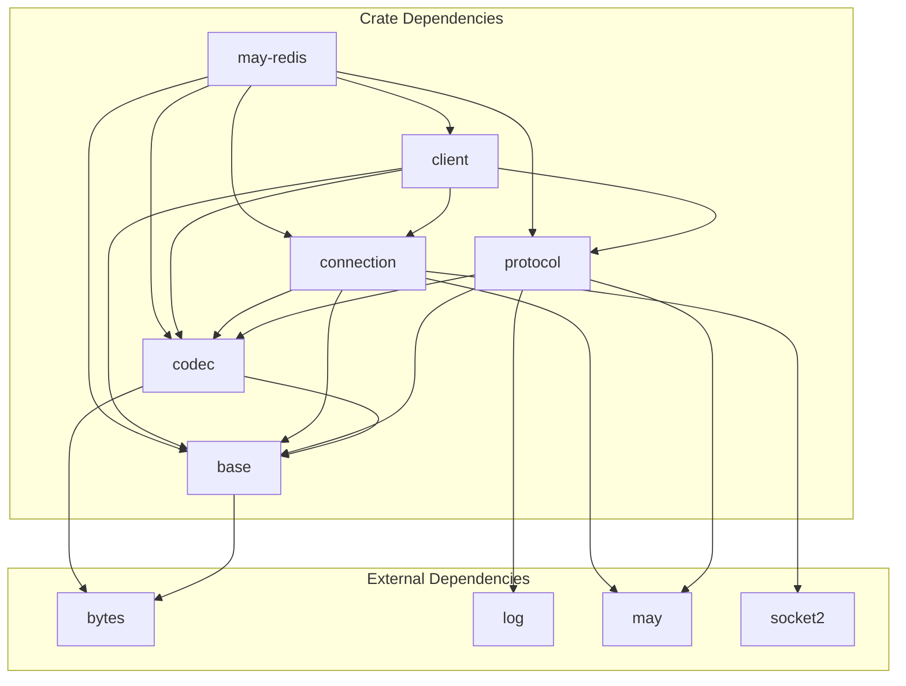
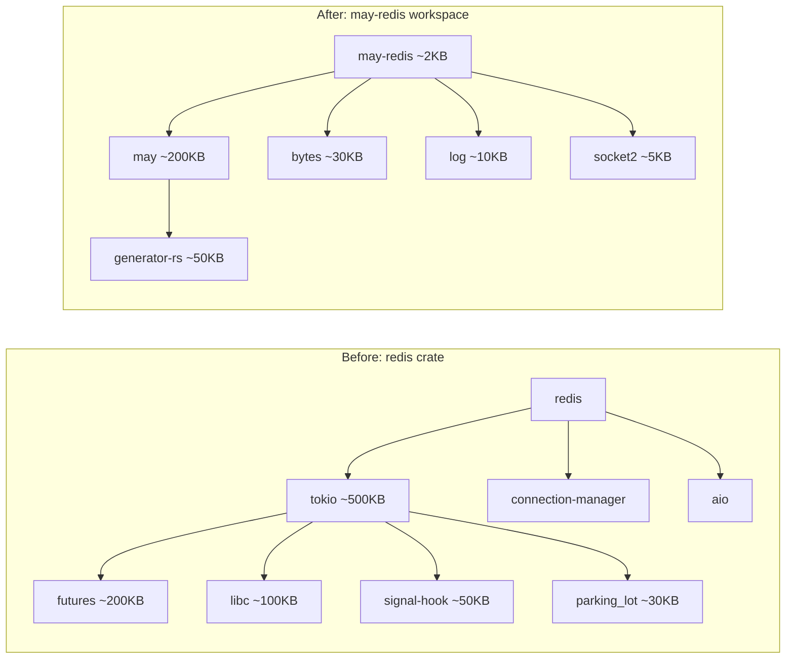

# Dependencies

## Workspace-Level Cargo.toml

```toml
[workspace]
members = [
    "crates/base",
    "crates/codec",
    "crates/protocol",
    "crates/connection",
    "crates/client",
    "crates/may-redis",
]
resolver = "2"

[workspace.package]
version = "0.1.0"
edition = "2021"
license = "MIT OR Apache-2.0"
repository = "https://github.com/microscaler/may_redis"
description = "A coroutine-based Redis client for the may runtime"

[workspace.dependencies]
bytes = "1.6"
log = "0.4"
may = { version = "0.3", default-features = false }
socket2 = "0.5"

# Internal crates (workspace members)
base = { path = "crates/base" }
codec = { path = "crates/codec" }
protocol = { path = "crates/protocol" }
connection = { path = "crates/connection" }
client = { path = "crates/client" }
```

## Crate-Level Dependencies

### base

The foundation crate. No may dependency, no network, no I/O.

```toml
[package]
name = "base"

[dependencies]
bytes = { workspace = true }
```

**External deps:** `bytes` only. That's it.
**Why `bytes`?** `RedisValue` uses `Vec<u8>` for bulk strings. `bytes::Bytes` could be added later for zero-copy sharing, but `Vec<u8>` is simpler and sufficient for Redis payloads (commands and responses are typically small).

**What it provides:**
- `RedisValue` enum — the union type for all Redis data
- `RedisError` enum — all error variants
- `FromRedisValue` trait — extract Rust types from `RedisValue`
- `ToRedisArgs` trait — convert Rust types to Redis command arguments

### codec

Pure encoding/decoding. Still no may dependency.

```toml
[package]
name = "codec"

[dependencies]
bytes = { workspace = true }
base = { workspace = true }
```

**External deps:** `bytes`, plus internal `base`.
**No may dependency.** The codec is pure encoding/decoding — it works on `BytesMut` buffers. This means it can be used to test RESP encoding without any network or coroutine infrastructure.

**Why this matters:** You can test RESP encoding in a `#[test]` without pulling in `may`, `tokio`, or any network stack. This is a key advantage over tokio-redis where the codec is coupled to the runtime.

**What it provides:**
- `RESPWriter` — writes RESP commands into a `BytesMut`
- `RESPReader` — reads RESP responses from a `BytesMut`
- `encode_command()` — converts command args into RESP wire format
- `decode_response()` — converts RESP wire format into `RedisValue`

### protocol

First crate that depends on `may`. Adds command building and request tracking.

```toml
[package]
name = "protocol"

[features]
default = []

[dependencies]
bytes = { workspace = true }
log = { workspace = true }
base = { workspace = true }
codec = { workspace = true }
may = { workspace = true }
```

**External deps:** `bytes`, `log`, `may`. Plus internal crates.
**First `may` dependency.** The `Commands` trait needs may's `spsc` channels to track response ordering in pipelines.

**What it provides:**
- `CommandBuilder` — fluent API for building Redis commands
- `Commands` trait — `get()`, `set()`, `exists()`, `incr()`, etc.
- `Request` — wraps a command + response channel for the connection loop
- `Response` — the receiver side of a request-response pair

### connection

First crate that needs TCP/network infrastructure.

```toml
[package]
name = "connection"

[features]
default = ["tcp"]
tcp = ["dep:socket2"]
```

**External deps:** `bytes`, `log`, `may`, `socket2` (optional, feature-gated behind `tcp`).
**`socket2` is optional.** If you want a Unix-domain-socket-only variant, you'd add a `unix` feature instead of `tcp`.

**What it provides:**
- `Connection` — background coroutine running the epoll loop
- `RequestQueue` — mpsc queue for sending requests to the connection
- `ResponseDispatcher` — routes responses to correct waiters
- `TcpConnector` — establishes TCP connections (may-aware)

### client

Assembles all layers into a user-facing API.

```toml
[package]
name = "client"

[features]
default = ["pool"]
pool = []
```

**External deps:** only internal crates. No new external dependencies.

**What it provides:**
- `RedisClient` — entry point, wraps a connection
- `Pipeline` — batch command execution
- `ConnectionPool` — (feature `pool`) manages N connections

### may-redis (umbrella)

The public API. Re-exports from all sub-crates. Feature-gates optional crates.

```toml
[package]
name = "may-redis"

[features]
default = ["connection", "client"]
connection = ["dep:connection"]
client = ["dep:client"]
pool = ["client", "client/pool"]
test = []
```

**External deps:** none directly. All through re-exports.
**Feature flags control what's built:**
- `default` = `connection` + `client` — full stack for production
- `connection` — includes the connection loop crate
- `client` — includes the client API crate (which transitively includes all others)
- `pool` — adds connection pool support
- `test` — enables test helpers like `InMemoryClient`

Users with minimal needs can build without the connection layer:
```toml
[dependencies]
may-redis = { version = "0.1", default-features = false, features = ["base", "codec", "protocol"] }
```
This gives them `cmd()` and `Commands` trait for building commands, but not `RedisClient::connect()`. Useful for libraries that just need to encode Redis commands without managing connections.

## Dependency Summary



## External Dependency Rationale

### Required Dependencies

| Crate | Version | Used By | Why |
|-------|---------|---------|-----|
| `bytes` | 1.6 | base, codec, protocol, connection, client | `BytesMut` for buffered I/O, RESP wire format. Standard in async Rust. Used by may_postgres too. |
| `log` | 0.4 | protocol, connection | Structured logging for connection errors, protocol errors, debug traces. Used by may_postgres too. |
| `may` | 0.3 | protocol, connection, client | The coroutine runtime. Core dependency for protocol (spsc channels) and connection (go!, WaitIo). Same version as may_postgres. |
| `socket2` | 0.5 | connection (optional, feature `tcp`) | Low-level socket configuration (non-blocking, TCP_NODELAY, keepalive). Needed for proper socket setup before the epoll loop. |

### NOT Needed

| Crate | Reason |
|-------|--------|
| `tokio` | **Zero tokio.** This is the entire point of may-redis. |
| `redis` | We're replacing it, not depending on it. |
| `async-trait` | No async traits. All methods use may coroutines. |
| `futures` | No future combinators. `may` has its own primitives. |
| `serde` | Not needed for RESP — we work with raw bytes and typed extraction. |
| `sha2`, `base64`, `p256` | These are sesame-idam application deps, not may-redis library deps. |
| `chrono`, `time` | Not needed for Redis protocol. Timestamps are raw integers. |
| `rustls`, `native-tls` | No TLS in v1. Redis typically runs on localhost or via SSH tunnel. |

### Optional Dependencies (Future)

| Crate | Feature | Reason |
|-------|---------|--------|
| `rustls` | `tls` | TLS support for Redis Cloud connections |
| `tokio` | `compat` | Bridge to tokio for mixed-runtime apps |

## Workspace Integration — sesame-idam

### Step 1: Add to Workspace

In `microservices/Cargo.toml`:
```toml
[workspace.dependencies]
may-redis = { path = "../../../may_redis" }
```

### Step 2: Replace Redis in Individual Services

In `microservices/idam/common/Cargo.toml`:
```toml
# Remove:
# redis = { workspace = true, features = ["aio", "tokio-comp", "connection-manager"] }

# Add:
may-redis = { workspace = true }
```

### Step 3: Minimal Dependency Footprint

If a service only needs to build commands (not connect), it can pull in just the protocol crate:
```toml
may-redis-protocol = { path = "../../../may_redis/crates/protocol" }
```

This is useful for testing utilities that just need to generate Redis commands.

## Dependency Comparison



**Before:** `redis` pulls in tokio (500KB) → futures (200KB) → libc (100KB) → many more.
**After:** `may-redis` pulls in may (200KB) → generator-rs (50KB) → minimal.

**Net savings:** ~600KB of dependencies removed from every service that uses may-redis.

## Per-Crate Dependency Count

| Crate | External Deps | Internal Deps | Total |
|-------|--------------|---------------|-------|
| `base` | 1 (`bytes`) | 0 | 1 |
| `codec` | 1 (`bytes`) | 1 (`base`) | 2 |
| `protocol` | 3 (`bytes`, `log`, `may`) | 2 (`base`, `codec`) | 5 |
| `connection` | 4 (`bytes`, `log`, `may`, `socket2`) | 2 (`base`, `codec`) | 6 |
| `client` | 0 | 4 (`base`, `codec`, `protocol`, `connection`) | 4 |
| `may-redis` (umbrella) | 0 | 5 (all) | 5 |

The most minimal crate (`base`) has just **one external dependency**. The most complex (`connection`) has **four external dependencies**, all of which are small and well-tested crates.

EOF