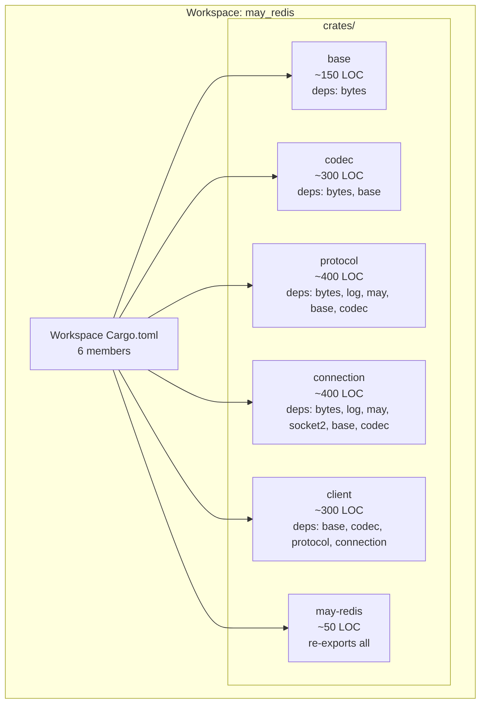
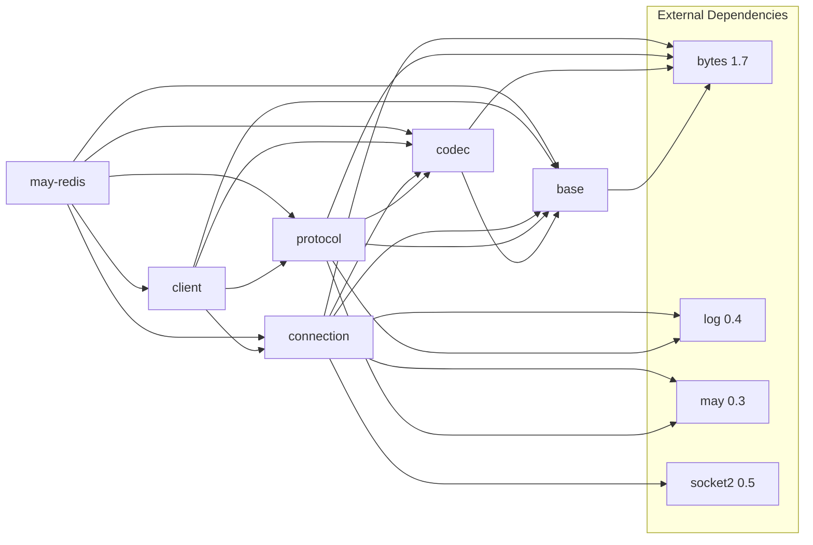
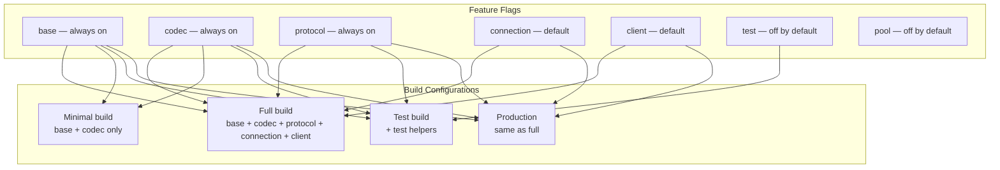

# Epic 0 — Scaffolding

**Objective:** Set up the workspace structure, Cargo.toml configuration, lint tooling, and documentation layout. This is the foundation that every subsequent epic depends on.

**Dependencies:** None (first epic)

**Source docs:** `docs/08-module-structure.md`, `docs/11-dependencies.md`, `docs/09-migration-guide.md`

## Workspace Goal

## Dependency Graph

## Feature Flag Matrix

