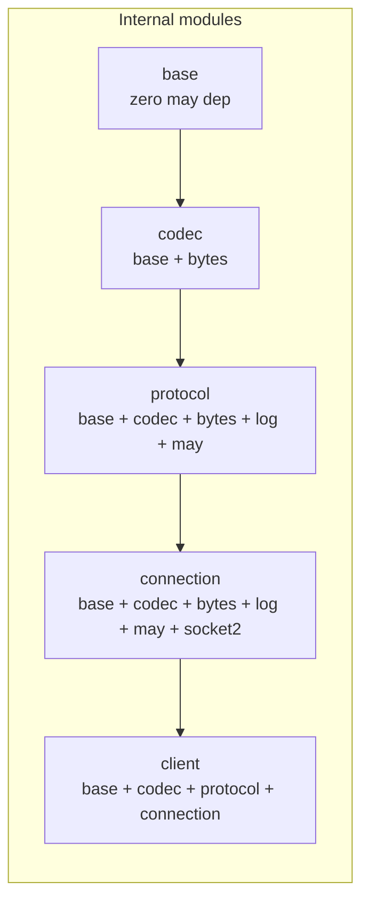

# Epic 0 — Architecture & Module Structure

**Objective:** Define the single-crate module layout. The codebase is one `may-redis` crate with five internal modules (`base`, `codec`, `protocol`, `connection`, `client`) — all under `src/`. No workspace split.

**Dependencies:** None (first epic — architectural foundation)

**Source docs:** `docs/adr-001-single-crate-structure.md`

## Architecture Decision

Per **ADR 001**, the workspace split (6 crates) was rejected in favor of a single crate with module folders. The rationale:

- 3.7K lines across 21 files — no meaningful compile-time benefit from splitting
- No crates.io publish target — consumed via path deps in sibling repos
- Feature flags not needed for v1 (all modules always compiled)
- Import syntax is identical (`base::`, `codec::`, etc.) whether crate or module
- Easier to navigate, modify, and maintain

## Module Structure

```
may_redis/
├── Cargo.toml           # Single manifest
├── src/
│   ├── lib.rs           # pub mod base, codec, protocol, connection, client;
│   ├── base/            # RedisValue, RedisError, FromRedisValue, ToRedisArgs
│   │   ├── mod.rs       # pub mod redis_value; redis_error; from_redis_value; to_redis_args;
│   │   ├── redis_value.rs
│   │   ├── redis_error.rs
│   │   ├── from_redis_value.rs
│   │   └── to_redis_args.rs
│   ├── codec/           # RESPWriter, RESPReader — encode/decode
│   │   ├── mod.rs       # pub mod writer; reader; roundtrip;
│   │   ├── writer.rs
│   │   ├── reader.rs
│   │   └── roundtrip.rs
│   ├── protocol/        # CommandBuilder, Commands trait
│   │   ├── mod.rs       # pub mod builder; commands;
│   │   ├── builder.rs
│   │   └── commands.rs
│   ├── connection/      # Epoll connection loop, TCP, may primitives
│   │   ├── mod.rs       # pub mod connection; tcp;
│   │   ├── connection.rs
│   │   └── tcp.rs
│   └── client/          # RedisClient, Pipeline, InMemoryClient
│       ├── mod.rs       # pub mod client; pipeline; in_memory;
│       ├── client.rs
│       ├── pipeline.rs
│       └── in_memory.rs
└── docs/Epics/          # Epic 0-6 story definitions
```

## Dependency Graph



## Module Responsibility Matrix

| Module | May Dep? | Network Dep? | Purpose |
|--------|----------|-------------|---------|
| `base` | No | No | `RedisValue` enum, `RedisError`, `FromRedisValue`, `ToRedisArgs` |
| `codec` | No | No | `RESPWriter` / `RESPReader` — pure RESP2 encoding/decoding |
| `protocol` | Yes | No | `CommandBuilder`, `Commands` trait, request/response spsc channels |
| `connection` | Yes | Yes | Epoll loop, `TcpStream`, request queue, response dispatch |
| `client` | Yes | Yes | `RedisClient`, `Pipeline`, `InMemoryClient` (feature `test`) |

## Build & Test Commands

```bash
cargo test --lib                                       # all unit + doc tests
cargo test --lib test_integration_ -- --test-threads=1 # integration tests (needs Redis)
cargo clippy --lib --tests --all-features -D warnings  # lint
cargo fmt --all --check                                # format
```

Integration tests use `--test-threads=1` because they share a `OnceLock<RedisClient>` singleton and Redis state.

## Implementation Verification

- All 147 unit tests pass (`cargo test --lib -- --test-threads=1 --skip test_integration_`)
- All 11 integration tests pass with Redis on localhost:6379
- All 6 doc tests pass (`cargo test --doc`)
- Clippy: zero warnings with pedantic deny
- Format: `cargo fmt --all --check` clean
