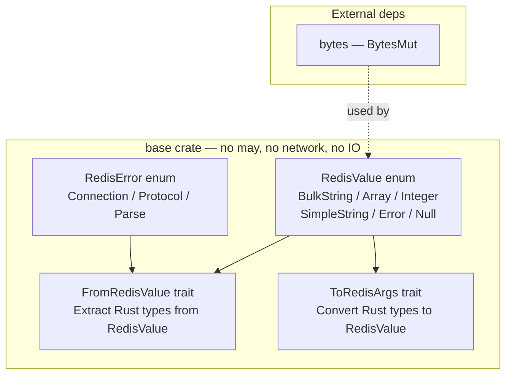

# Epic 1 — Base Crate

**Objective:** Implement the core Redis data types and conversion traits. This crate has **no may dependency**, **no network dependency**, and can be tested with plain `#[test]`. It is the foundation of everything else.

**Dependencies:** Epic 0 (scaffolding)

**Source docs:** `docs/08-module-structure.md`, `docs/11-dependencies.md`

## Crate Overview

## Implementation Order

