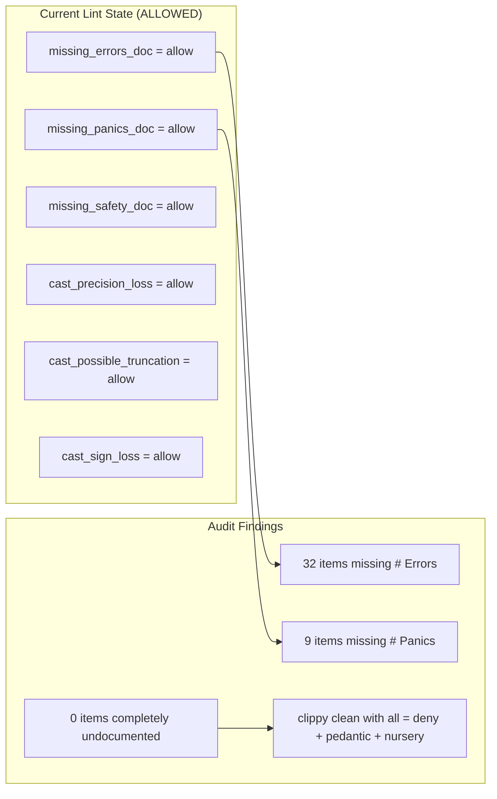

# Epic 10 — Lint Tightening & Mandatory Rustdocs

**Objective:** Tighten `[lints.clippy]` in `Cargo.toml` to enforce stricter rules, and add mandatory `///` rustdocs on all public interfaces with `# Errors`/`# Panics` sections where appropriate.

**Dependencies:** None — purely documentation and lint configuration changes across the entire codebase.

**Source docs:** Current `Cargo.toml`, `clippy.toml`, audit results from `docs/JSF_AUDIT_2026_05_28.md`

## Epic Overview

```mermaid
graph TB
    subgraph "Epic 10 — Lint Tightening & Mandatory Rustdocs"
        subgraph "Lint Tightening"
            L1[Remove allow lists from Cargo.toml]
            L2[Add missing_errors_doc deny]
            L3[Add missing_panics_doc deny]
            L4[Add missing_safety_doc deny]
        end
        
        subgraph "Doc Coverage"
            D1[Add # Errors sections to Result-returning items]
            D2[Add # Panics sections to panicking items]
            D3[Verify all public items have doc comments]
        end
        
        subgraph "Verification"
            V1[cargo clippy --lib --tests --all-features]
            V2[cargo test --workspace]
            V3[cargo doc --no-deps]
        end
        
        L1 --> L2
        L2 --> L3
        L3 --> L4
        L4 --> D1
        D1 --> D2
        D2 --> D3
        D3 --> V1
        V1 --> V2
        V2 --> V3
    end
```

## Current State

## Implementation Order

## Scope

### Lint changes to `Cargo.toml`:
- Change `missing_errors_doc` from `allow` to `deny`
- Change `missing_panics_doc` from `allow` to `deny`
- Change `missing_safety_doc` from `allow` to `deny`
- Keep existing `allow` exceptions (cast_loss, module_name_repetitions, struct_excessive_bools, too_many_lines, doc_markdown, etc.)
- Keep existing `deny` rules (unwrap_used, expect_used, panic)

### Doc additions (32 items need `# Errors`):
- **client crate (23):** RedisClient methods, Pipeline methods, InMemoryClient methods, FromPipelineResponse trait
- **connection crate (5):** TcpConnector methods
- **codec crate (2):** RESPReader::read_value, RESPReader::take_buf
- **core crate (1):** FromRedisValue::from_redis_value
- **protocol crate (1):** FakeConnection::send
- **fake crate (1):** FakeConnection::send

### Doc additions (9 items need `# Panics`):
- **core crate (3):** RedisValue::as_str, as_bytes, as_array — use assert!/unwrap
- **protocol crate (4):** fake.rs test helper functions — use assert!/unwrap
- **client crate (1):** InMemoryClient struct constructor — uses unwrap
- **client crate (1):** InMemoryClient::flushdb — uses unwrap/assert

### Test module exclusions:
Test modules (`#[cfg(test)]`) and `#[allow(clippy::unwrap_used, ...)]` annotated modules should be excluded from panic doc requirements — these are test utilities where panics are intentional.

## Verification

- `cargo clippy --lib --tests --all-features` — zero warnings
- `cargo test --workspace` — all tests pass
- `cargo doc --no-deps` — clean documentation build
- `cargo fmt --all --check` — clean formatting
