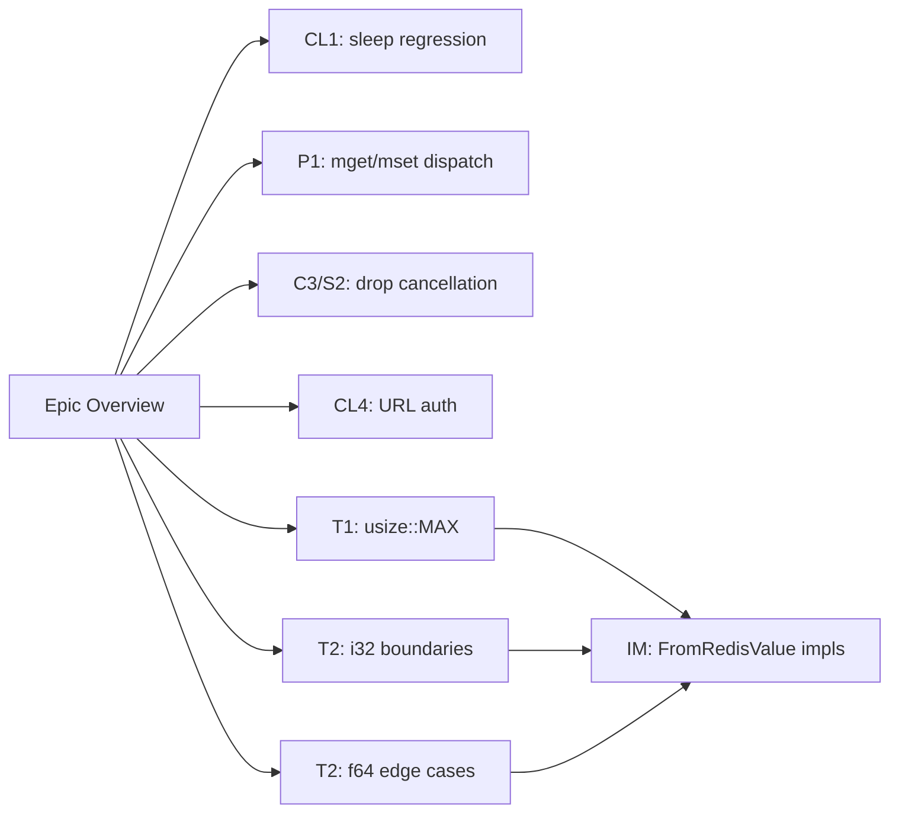

# Epic 12 — Test Gap Remediation

**Objective:** Add regression and edge-case tests for all findings from the Epic 11 QA audit. This epic addresses the systemic pattern of "fix + docs" without tests that was identified in the audit.

**Status:** NEW

## Story Index

| Story | Title | Epic 11 Finding | Audit Severity | Status |
|-------|-------|-----------------|----------------|--------|
| Story 0 | Epic Overview | — | — | NEW |
| Story 1 | CL1 regression: may::coroutine::sleep doesn't block worker threads | CL1 | MEDIUM | NEW |
| Story 2 | mget/mset trait dispatch integration test | P1 | LOW | NEW |
| Story 3 | Connection::drop concurrent cancellation test | C3, S2 | MEDIUM | NEW |
| Story 4 | URL auth edge cases and failure handling | CL4 | LOW-MEDIUM | NEW |
| Story 5 | usize exact boundary tests (usize::MAX) | T1 | LOW | NEW |
| Story 6 | i32 boundary tests (i32::MAX+1, i32::MIN-1) | T2 | LOW-MEDIUM | NEW |
| Story 7 | f64 edge cases (SimpleString, empty, inf/nan, exponents) | T2 | LOW-MEDIUM | NEW |
| Story 8 | In-memory client integration tests for new FromRedisValue impls | T2 | LOW | NEW |

## Findings Summary

This epic addresses 8 QA findings identified during the Epic 11 code review audit. All of these were code-quality or coverage gaps — the underlying code fixes were already committed in Epic 11, but none of them have dedicated regression tests. This is the systemic "fix + docs" gap that the audit flagged as a repeatable anti-pattern.

### Must-Fix (no tests for behavioral changes)

- **CL1 (MEDIUM)** — `may::coroutine::sleep` replacement in `execute_with_timeout` has zero tests. The behavioral change (coroutine sleep vs. blocking thread sleep) is critical to may's concurrency model but unverified by any test. Must confirm that the timeout coroutine yields control back to the scheduler rather than occupying a may worker thread.

### Should-Fix (missing integration tests for API fixes)

- **P1 (LOW)** — `mget`/`mset` trait-dispatch integration test is missing. The fix made these methods take `&self` for consistency, but no test exercises the trait path (`client.mget(...)` via `Commands` trait) end-to-end. Only unit-level RESP encoding is covered.
- **C3/S2 (MEDIUM)** — No test verifies `Connection::drop` behavior when multiple coroutines are concurrently awaiting responses. The audit noted that cancellation leaves in-flight requests ambiguous. A test should create a connection, launch several concurrent command coroutines, then drop the connection mid-flight and verify that all awaiting coroutines receive an error rather than hanging.

### Nice-to-Have (edge-case and boundary coverage)

- **CL4 (LOW-MEDIUM)** — `connect_url` strips `redis://` prefix but doesn't handle `rediss://` (TLS), query-string auth, or DB selection. No tests exercise these URL variants. When the implementation is added, tests must cover: missing host, malformed port, `rediss://` prefix, auth credentials in URL, and connection failure when auth is rejected.
- **T1 (LOW)** — `FromRedisValue for usize` casts `i64` to `usize` with `*n as Self`. On 32-bit platforms, values above `u32::MAX` would silently truncate. While the `*n >= 0` check exists, the exact `usize::MAX` boundary is not tested. A test should confirm `from_redis_value(RedisValue::Int(i64::MAX as i64))` panics or returns an error rather than truncating.
- **T2 (LOW-MEDIUM)** — Two sub-findings:
  - **i32 off-by-one boundary**: `FromRedisValue for i32` (when added) must handle `i32::MAX + 1` (which overflows back to `i32::MIN`) and `i32::MIN - 1` (which overflows to `i32::MAX`). These overflow cases must return an error, not wrap silently.
  - **f64 Redis edge cases**: `FromRedisValue for f64` must handle Redis's unusual wire format for infinity (`+inf`/`-inf`), NaN (`nan`), scientific notation (`1.5e10`), and empty strings. Redis can return `SimpleString("inf")` or bulk strings for these — the parser must handle all variants.

## Dependency Order

All stories are independent and can be worked on in parallel, except Story 8 which depends on Stories 5, 6, and 7 being complete (it tests the `FromRedisValue` impls end-to-end via the in-memory client).

Each story must pass `cargo clippy --lib --tests --all-features -- -D warnings` and `cargo fmt --all --check` before proceeding.

## Source References

- Code review: `docs/code-review-2026-05-28.md`
- QA audit: this epic (Story 0 is the audit summary)
- Connection loop pitfalls: `llmwiki/topics/connection-loop-pitfalls.md`
