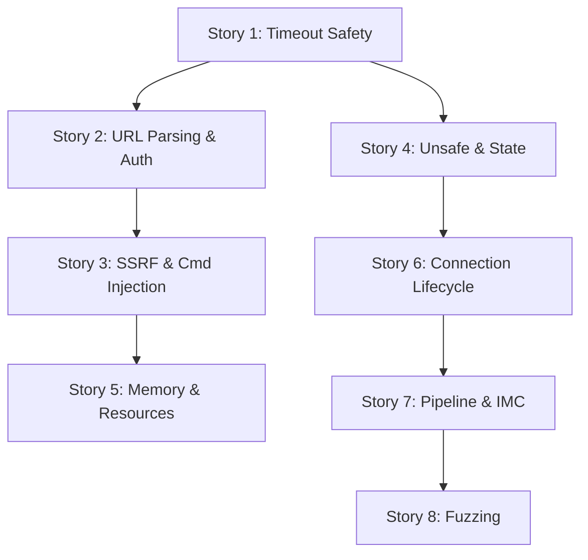

# Epic 13 — Security Audit Remediation

**Objective:** Address all 20 findings from the security audit of may-redis. This epic covers timeout safety, URL parsing, SSRF prevention, command injection, resource limits, memory safety, and response integrity.

**Status:** NEW

## Findings Inventory

| # | Severity | Title | File(s) | Story |
|---|----------|-------|---------|-------|
| 1 | CRITICAL | Timeout does NOT cancel in-flight requests — silent write execution | `client.rs` | Story 1 |
| 2 | CRITICAL | Timeout coroutine spawn is unbounded — resource exhaustion DoS | `client.rs` | Story 1 |
| 3 | CRITICAL | IPv6 URLs not supported — broken host resolution | `client.rs`, `tcp.rs` | Story 2 |
| 4 | CRITICAL | `@` in password breaks URL parsing | `client.rs` | Story 2 |
| 5 | CRITICAL | Password is NOT URL-decoded from URL | `client.rs` | Story 2 |
| 6 | CRITICAL | Unsafe blocks in nonblock_read/write | `connection.rs` | Story 4 |
| 7 | HIGH | Unbounded request queue — memory exhaustion | `connection.rs` | Story 3 |
| 8 | HIGH | DNS-based SSRF — no internal IP restriction | `tcp.rs` | Story 3 |
| 9 | HIGH | No command whitelist/sanitization | `builder.rs`, `commands.rs` | Story 3 |
| 10 | HIGH | InMemoryClient::get() returns "" instead of Null for missing keys | `in_memory.rs` | Story 5 |
| 11 | HIGH | RESPReader depth limit uses mutable state — not re-entrant | `reader.rs` | Story 4 |
| 12 | MEDIUM | Large bulk string default limit is 256 MB | `reader.rs` | Story 5 |
| 13 | MEDIUM | decode_responses silently drops unexpected responses | `connection.rs` | Story 6 |
| 14 | MEDIUM | execute_raw_results silently swallows channel errors | `pipeline.rs` | Story 7 |
| 15 | MEDIUM | No auth brute-force protection | `commands.rs` | Story 6 |
| 16 | MEDIUM | execute_timeout default is 30 seconds — silent command execution | `client.rs` | Story 1 |
| 17 | LOW | ping() rejects custom PONG messages | `client.rs` | Story 7 |
| 18 | LOW | connect_url double-prefix vulnerability | `tcp.rs` | Story 2 |
| 19 | LOW | No response size limit on the read buffer | `connection.rs` | Story 5 |
| 20 | MEDIUM | unsafe { rx.cancel() } has no safety invariants | `connection.rs` | Story 4 |

## Dependency Order

Story 1 (timeout) has no dependencies. Story 2 (URL parsing) depends on Story 1 if changes to connection lifecycle are needed. All others are independent except Story 8 (fuzzing) which depends on everything else being stable.

## Functional Requirements

- Timeout cancellation must prevent in-flight writes (FR-001)
- All URL schemes must support IPv6, password encoding, and standard RFC 3986 (FR-002)
- Connection layer must enforce configurable resource limits (FR-003)
- InMemoryClient must match real Redis Null semantics (FR-004)
- Pipeline error handling must surface channel errors (FR-005)

## Non-Functional Requirements

- No additional unsafe blocks may be introduced without documented invariants (NFR-001)
- Default memory limits must prevent OOM from a single response (NFR-002)
- SSRF protection must deny link-local and RFC 1918 by default (NFR-003)
- All fixes must pass `cargo test --lib --all-features`, `cargo clippy`, and `cargo fmt` (NFR-004)

## Source References

- Security audit: this epic (Story 0)
- Connection loop pitfalls: `llmwiki/topics/connection-loop-pitfalls.md`
- RESP wire format: `docs/01-protocol-analysis.md`
- RFC 3986: URI generic syntax
- RFC 1918: Address allocation for private internets
