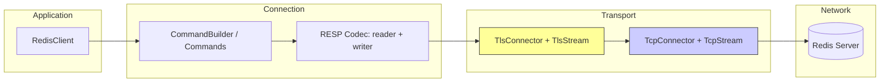

# Epic 14 — TLS and mTLS Support

**Objective:** Add TLS encryption and mutual TLS authentication for Redis connections, feature-gated behind a `tls` Cargo feature.

**Status:** NEW

## Findings Inventory

| # | Title | File(s) | Story |
|---|-------|---------|-------|
| 1 | No TLS support — `rediss://` returns error | `client.rs` | Story 1 |
| 2 | Connection layer operates on raw TCP only | `connection/connection.rs`, `connection/tcp.rs` | Story 1 |
| 3 | No certificate verification — no encryption at rest in transit | N/A | Story 1 |
| 4 | No mTLS — client certificate authentication | N/A | Story 2 |
| 5 | No URL-based TLS configuration | `client.rs` | Story 3 |
| 6 | SSRF checks not applied to TLS connections | `connection/connection.rs` | Story 4 |
| 7 | No TLS version configuration | N/A | Story 5 |
| 8 | TLS handshake uses async-await pattern — incompatible with may runtime | N/A | Story 1 |

## Dependency Order

```mermaid
flowchart LR
    S1[Story 1: TLS Foundation<br/>TlsConfig, TlsConnector,<br/>polling handshake, connect_tls()] --> S2[Story 2: mTLS<br/>ClientCerts, PEM loading,<br/>with_client_auth_cert()]
    S1 --> S3[Story 3: URL Parsing<br/>rediss://, query params,<br/>TlsConfig builder from URL]
    S3 --> S4[Story 4: SSRF for TLS<br/>connect_tls_with_ssrf(),<br/>SSRF check before handshake]
    S2 --> S5[Story 5: TLS Config<br/>min/max version,<br/>cipher suite, handshake timeout]
    S4 --> S5
    S5 --> V1[All stories: cargo test + clippy]
    S2 --> V1
    S3 --> V1
    
    classDef story fill:#e8f4f8,stroke:#333,stroke-width:2px
    class S1,S2,S3,S4,S5 story
```

**Story 1** has no dependencies — it introduces the TLS layer from scratch: `TlsConfig`, `TlsConnector`, polling handshake, `connect_tls()`.

**Story 2** depends on Story 1 — mTLS builds on the TLS foundation: `ClientCerts`, PEM/DER loading, `with_client_auth_cert()`.

**Story 3** depends on Story 1 — URL parsing needs a working `connect_tls()`: `rediss://` parsing, query parameter handling, `TlsConfig` builder from URL.

**Story 4** depends on Story 3 — SSRF for TLS needs the TLS connection path: `connect_tls_with_ssrf()`, SSRF check before handshake.

**Story 5** depends on Stories 1 and 3 — config options span multiple layers: TLS version bounds, handshake timeout, protocol version validation.

## Architecture



**Key decision:** TLS wraps the raw `may::net::TcpStream` *before* it enters the connection loop. The epoll loop does not change — `nonblock_read`/`nonblock_write` already handle `WouldBlock` correctly.

```mermaid
sequenceDiagram
    participant App as Application Coroutine
    participant Client as RedisClient
    participant TCP as TcpConnector
    participant TLS as TlsConnector
    participant Loop as Connection Loop (epoll)
    participant Redis as Redis Server

    App->>Client: connect_tls(host, port, config)
    Client->>TCP: connect(host, port)
    TCP-->>Client: TcpStream (raw, non-blocking)
    Client->>TLS: handshake(stream, config)
    Note over TLS: Polling loop with yield_now()<br/>instead of .await
    TLS->>Redis: ClientHello
    Redis->>TLS: ServerHello + Certificate
    TLS->>Redis: ClientKeyExchange + Finished
    Redis->>TLS: Finished
    TLS-->>Client: TlsStream (handshake complete)
    Client->>Loop: spawn_connection_loop(tls_stream)
    loop Each iteration
        Loop->>Loop: nonblock_write(tls_stream)
        Loop->>Redis: [TLS records]
        Loop->>Redis: read
        Redis->>Loop: [TLS records]
        Loop->>Loop: nonblock_read(tls_stream)
        Loop->>Loop: decode_responses
    end
```

## Functional Requirements

- **FR-001:** Add `tls` Cargo feature that pulls in `rustls` + `ring` (no system deps)
- **FR-002:** `RedisClient::connect_tls()` establishes TCP → TLS handshake → spawns connection loop
- **FR-003:** TLS handshake uses polling pattern with `may::coroutine::yield_now()` — no async-await
- **FR-004:** `TlsStream` implements `Read`/`Write` so the existing `nonblock_read`/`nonblock_write` work unchanged
- **FR-005:** `TlsStream::inner_mut()` returns the underlying `may::net::TcpStream` for `wait_io()` calls
- **FR-006:** Default TLS minimum version is 1.2, maximum is 1.3
- **FR-007:** Server certificate verification is enabled by default
- **FR-008:** Handshake timeout defaults to 5 seconds
- **FR-009:** `rediss://` URL scheme is recognized and parsed
- **FR-010:** Query parameters in `rediss://` URLs configure TLS: `ca`, `client_cert`, `client_key`, `server_name`, `system_certs`, `verify`, `tls_min_version`, `tls_max_version`
- **FR-011:** mTLS (`tls-auth-clients yes`) supported via `client_certs` in `TlsConfig`
- **FR-012:** SSRF protection applies to TLS connections the same way it applies to plain TCP
- **FR-013:** All `connect_*` methods continue to work for plain TCP (backward compatible)

## Non-Functional Requirements

- **NFR-001:** TLS is optional — `cargo build` without `--features tls` adds zero new dependencies
- **NFR-002:** No blocking I/O — all TLS I/O cooperates with may via cooperative yielding
- **NFR-003:** No new `unsafe` blocks introduced beyond what exists in the connection layer
- **NFR-004:** Binary size impact with `tls` feature: ≤ 2 MB (rustls + ring)
- **NFR-005:** TLS handshake latency: ≤ 200ms on well-connected network (1-2 RTTs)
- **NFR-006:** Per-message TLS overhead: ≤ 30 bytes per record (header + AEAD tag)
- **NFR-007:** `cargo clippy --all-features` passes at deny level
- **NFR-008:** `cargo fmt --all --check` passes
- **NFR-009:** `min_version` defaults to TLS 1.2; `max_version` defaults to TLS 1.3
- **NFR-010:** `verify_server` defaults to `true`; disabling it returns a compile-time warning via `#[must_use]` pattern or docs

## Source References

- TLS/mTLS PRD: `docs/PRD_TLS_mTLS.md`
- Connection loop pitfalls: `llmwiki/topics/connection-loop-pitfalls.md`
- SSRF protection: `src/connection/tcp.rs` (`SsrfConfig`, `ssrf_allowed`)
- URL parsing: `src/client/client.rs` (`connect_url`, `url_decode`)
- Existing `ConnectionScheme` enum: `src/client/client.rs` line 57 (currently unused TLS variant)
