# Epic 14 — TLS and mTLS Support (Revised — 4-deliverable stories)

**Objective:** Add TLS encryption and mutual TLS authentication for Redis connections, feature-gated behind a `tls` Cargo feature.

**Status:** In progress

## Revised Dependency Order (4 deliverables per original story)

```mermaid
flowchart LR
    classDef story fill:#e8f4f8,stroke:#333,stroke-width:2px

    s1a[14.1a: Cargo + types] --> s1b[14.1b: TlsConnector + handshake]
    s1b --> s1c[14.1c: TlsStream + nonblock]
    s1c --> s1d[14.1d: connect_tls wiring]

    s2a[14.2a: ClientCerts from_der] --> s2b[14.2b: ClientCerts from_pem]
    s2b --> s2c[14.2c: with_client_auth_cert]
    s2c --> s2d[14.2d: Re-export + unit tests]

    s1d --> s3a[14.3a: parse_tls_query_params]
    s3a --> s3b[14.3b: build_tls_config]
    s3b --> s3c[14.3c: connect_url rediss:// wiring]
    s3c --> s3d[14.3d: URL unit tests]

    s3c --> s4a[14.4a: Connection::connect_tls_with_ssrf]
    s4a --> s4b[14.4b: from_tls_stream_with_ssrf]
    s4b --> s4c[14.4c: RedisClient::connect_tls_with_ssrf]
    s4c --> s4d[14.4d: ssrf=true URL param]

    s3c --> s5a[14.5a: TlsVersion::from_str]
    s5a --> s5b[14.5b: version bounds validation]
    s5b --> s5c[14.5c: URL version params]
    s5c --> s5d[14.5d: Version unit tests]
```

**Each deliverable is independently compilable and testable.** Every sub-story:
1. Builds with `cargo build --features tls`
2. Passes `cargo test --lib --features tls`
3. Passes `cargo fmt --all --check`
4. Passes `cargo clippy --lib --features tls --all-targets -- -D warnings`

## Original Story Mapping

| Original | New Deliverables |
|----------|-----------------|
| 14.1 TLS Foundation | 14.1a, 14.1b, 14.1c, 14.1d |
| 14.2 mTLS | 14.2a, 14.2b, 14.2c, 14.2d |
| 14.3 URL Parsing | 14.3a, 14.3b, 14.3c, 14.3d |
| 14.4 SSRF for TLS | 14.4a, 14.4b, 14.4c, 14.4d |
| 14.5 TLS Config Options | 14.5a, 14.5b, 14.5c, 14.5d |

## Global Constraints

- Feature-gate all TLS code behind `#[cfg(feature = "tls")]`
- Use `rustls` 0.23 with `ring` as crypto backend
- No `.await`, no `tokio` — all I/O via may coroutines
- Follow may_postgres connection loop patterns
- RESP2 only, no RESP3
- API surface mirrors `redis` crate
