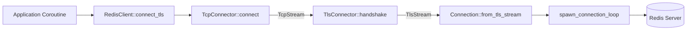
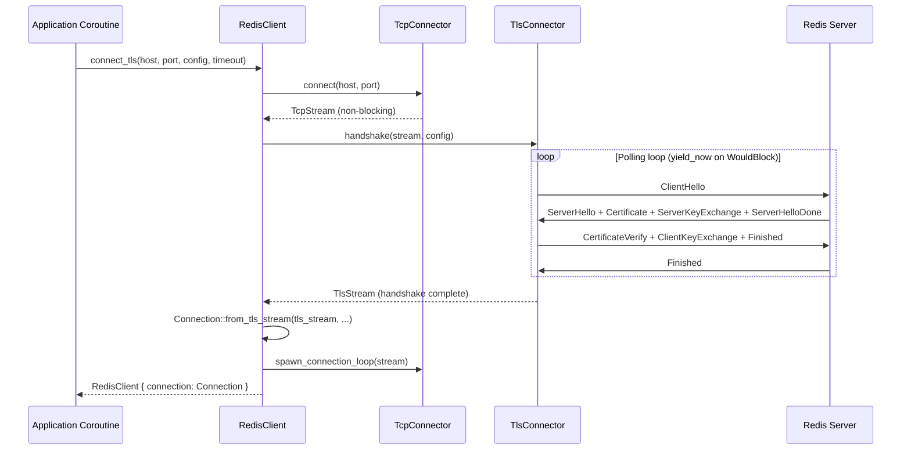

# Story 14.1 — TLS Foundation and Polling Handshake

**Objective:** Introduce the `tls` Cargo feature, implement the `TlsConnector` with a polling-based TLS handshake (no async-await), and wire `RedisClient::connect_tls()` end-to-end.

**Epic:** 14 — TLS and mTLS Support

**Dependencies:** None

**Source docs:** `docs/Epics/Epic_14/Story_0.md`, `docs/PRD_TLS_mTLS.md`

## Architecture





## Functional Requirements

- **FR-001:** Add `tls` Cargo feature that pulls in `rustls 0.23` (with `ring` crypto), `rustls-pemfile 2`, `webpki-roots 0.26`
- **FR-002:** Create `src/tls/mod.rs` with `TlsConfig`, `TlsError`, `RustlsRootCerts`, `TlsVersion` types
- **FR-003:** `TlsConnector::handshake()` performs TLS 1.2/1.3 handshake using a polling loop with `may::coroutine::yield_now()` instead of `.await`
- **FR-004:** `TlsStream` struct wraps `rustls::Stream` and the underlying `may::net::TcpStream`, implementing `std::io::Read` and `std::io::Write` via non-blocking calls
- **FR-005:** `TlsStream::inner_mut()` returns `&mut may::net::TcpStream` for the connection loop's `wait_io()` call
- **FR-006:** `RedisClient::connect_tls(host, port, config, timeout)` chains TCP connect → TLS handshake → Connection spawn
- **FR-007:** Handshake timeout: default 5 seconds, configurable via the `timeout` parameter
- **FR-008:** Server certificate verification enabled by default using the provided root certificates or `webpki-roots`
- **FR-009:** SNI (Server Name Indication) uses the `server_name` field from `TlsConfig`

## Non-Functional Requirements

- **NFR-001:** No new `unsafe` blocks
- **NFR-002:** No blocking syscalls — handshake uses `yield_now()` for cooperation
- **NFR-003:** Feature-gated: `cargo build` without `--features tls` has zero new dependencies
- **NFR-004:** `cargo clippy --all-features` passes at deny level
- **NFR-005:** `cargo fmt --all --check` passes

## Code Anchors

- `Cargo.toml` — Add `[features]` entry `tls = ["dep:rustls", "dep:rustls-pemfile", "dep:webpki-roots"]` and `[dependencies]` entries
- `src/lib.rs` — Add `#[cfg(feature = "tls")] pub mod tls;`
- `src/tls/mod.rs` — NEW: `TlsConfig`, `TlsError`, `RustlsRootCerts`, `TlsVersion`, `TlsConnector`, `TlsStream`
- `src/client/client.rs` — Add `connect_tls()` method to `RedisClient`; enable `rediss://` scheme branch
- `src/connection/connection.rs` — Add `Connection::from_tls_stream()` method
- `src/connection/connection.rs` — Add `TlsStream` type import and `ConnectionError::Tls` variant
- `src/codec/reader.rs` — No changes
- `src/codec/writer.rs` — No changes

## Structs

```rust
// src/tls/mod.rs

/// TLS configuration for connecting to a Redis server.
pub struct TlsConfig {
    /// Root CA certificates for server verification.
    /// Empty means use webpki-roots (Mozilla's trusted CA store).
    pub root_certificates: RustlsRootCerts,
    /// Client certificate and private key for mTLS.
    /// None means server authentication only (standard TLS).
    pub client_certs: Option<ClientCerts>,
    /// Server hostname for SNI and certificate verification.
    /// Must match the CN or SAN in the server's certificate.
    pub server_name: String,
    /// Minimum TLS version (default: 1.2).
    pub min_version: TlsVersion,
    /// Maximum TLS version (default: 1.3).
    pub max_version: TlsVersion,
    /// Whether to verify the server certificate chain (default: true).
    pub verify_server: bool,
}

impl Default for TlsConfig {
    fn default() -> Self {
        Self {
            root_certificates: RustlsRootCerts::WebPkiRoots,
            client_certs: None,
            server_name: String::new(),
            min_version: TlsVersion::Tls12,
            max_version: TlsVersion::Tls13,
            verify_server: true,
        }
    }
}

/// Root certificate source.
pub enum RustlsRootCerts {
    /// Use Mozilla's root certificates from the webpki-roots crate.
    WebPkiRoots,
    /// Load from PEM-formatted certificate files on disk.
    Pem(Vec<PathBuf>),
    /// Load from in-memory DER-encoded certificates.
    Der(Vec<Vec<u8>>),
}

/// Client certificate and private key for mTLS.
pub struct ClientCerts {
    /// PEM-encoded client certificate chain (leaf first, then intermediates).
    pub certificates: Vec<Vec<u8>>,
    /// PEM-encoded private key.
    pub private_key: Vec<u8>,
}

/// TLS version selector.
#[derive(Clone, Copy, PartialEq, Eq)]
pub enum TlsVersion {
    Tls12,
    Tls13,
}

/// Error type for TLS operations.
#[derive(Debug)]
pub enum TlsError {
    /// Failed to build rustls configuration.
    Config(String),
    /// TLS handshake timed out.
    HandshakeTimeout,
    /// TLS handshake failed with a rustls error.
    Handshake(String),
    /// Certificate verification failed.
    Verification(String),
}

impl std::fmt::Display for TlsError {
    fn fmt(&self, f: &mut std::fmt::Formatter<'_>) -> std::fmt::Result {
        match self {
            Self::Config(msg) => write!(f, "TLS config error: {msg}"),
            Self::HandshakeTimeout => write!(f, "TLS handshake timed out"),
            Self::Handshake(msg) => write!(f, "TLS handshake error: {msg}"),
            Self::Verification(msg) => write!(f, "Certificate verification failed: {msg}"),
        }
    }
}

impl std::error::Error for TlsError {}

/// Wraps a rustls stream and the underlying TCP socket.
///
/// Implements `Read` and `Write` to integrate with the existing
/// `nonblock_read` / `nonblock_write` functions in the connection layer.
struct TlsStream {
    /// The rustls connection state machine.
    conn: rustls::StreamOwned<rustls::ClientConnection, may::net::TcpStream>,
    /// Reference to the underlying TCP stream for wait_io().
    inner: std::sync::Arc<may::net::TcpStream>,
}
```

## Tasks

- [ ] Add `tls` feature and dependencies to `Cargo.toml`:
  ```toml
  [features]
  default = []
  tls = ["dep:rustls", "dep:rustls-pemfile", "dep:webpki-roots"]
  
  [dependencies]
  rustls = { version = "0.23", optional = true, default-features = false, features = ["ring"] }
  rustls-pemfile = { version = "2", optional = true }
  webpki-roots = { version = "0.26", optional = true }
  ```
- [ ] Add `pub mod tls;` to `src/lib.rs` gated on `#[cfg(feature = "tls")]`
- [ ] Create `src/tls/mod.rs` with `TlsConfig`, `RustlsRootCerts`, `ClientCerts`, `TlsVersion`, `TlsError` types
- [ ] Implement `RustlsRootCerts::to_config()` — converts to `rustls::RootCertStore`
  - `WebPkiRoots` → inject `webpki_roots::TLS_SERVER_ROOTS`
  - `Pem(paths)` → load PEM files with `rustls_pemfile::certs()`
  - `Der(certs)` → inject DER certs with `certs_from_der()`
- [ ] Implement `TlsConfig::into_config()` → `rustls::ClientConfig`
  - Apply root certificates
  - Apply min/max TLS version from `TlsVersion` enum → `rustls::ProtocolVersion`
  - Apply client certs if `client_certs` is Some → `with_client_auth_cert()`
  - Set `dangerous().set_certificate_verifier()` based on `verify_server` flag
- [ ] Implement `TlsConnector::handshake(stream, config, timeout)` → `Result<TlsStream, TlsError>`
  - Build `rustls::ClientConfig` from `TlsConfig`
  - Create `rustls::ClientConnection` with `ServerName::try_from(host)`
  - Create `rustls::StreamOwned`
  - Poll handshake loop:
    ```rust
    loop {
        match stream.conn.complete_io(tcp_stream) {
            Ok(()) => break, // handshake complete
            Err(e) if e.kind() == io::ErrorKind::WouldBlock => {
                if Instant::now() >= deadline {
                    return Err(TlsError::HandshakeTimeout);
                }
                may::coroutine::yield_now();
            }
            Err(e) => return Err(TlsError::Handshake(e.to_string())),
        }
    }
    ```
  - Use `complete_io` from `rustls::Connection` which handles both read and write
- [ ] Implement `TlsStream::inner_mut()` → `&mut may::net::TcpStream`
  - Extract from `StreamOwned.stream_mut()`
- [ ] Add `ConnectionError::Tls(String)` variant (feature-gated)
- [ ] Implement `Connection::from_tls_stream(tls_stream, ...)` → `Result<Connection, ConnectionError>`
  - Same as `Connection::connect()` but takes `TlsStream` instead of `TcpStream`
  - Calls `spawn_connection_loop(tls_stream)` instead of `spawn_connection_loop(stream)`
  - Note: `spawn_connection_loop` must accept a type that implements `Read`/`Write` + has `wait_io()`/`waker()`/`as_raw_fd()`
  - This means `TlsStream` must implement the same trait interface that `may::net::TcpStream` provides
- [ ] Wire `RedisClient::connect_tls()` in `src/client/client.rs`:
  ```rust
  #[cfg(feature = "tls")]
  pub fn connect_tls(
      host: &str,
      port: u16,
      config: &TlsConfig,
      timeout: Duration,
  ) -> Result<Self, RedisError> {
      let tcp_stream = TcpConnector::connect_with_timeout(host, port, timeout)
          .map_err(|e| RedisError::Parse(format!("TCP connect failed: {e}")))?;
      
      let tls_stream = TlsConnector::handshake(tcp_stream, config, timeout)
          .map_err(|e| RedisError::Parse(format!("TLS handshake failed: {e}")))?;
      
      let connection = Connection::from_tls_stream(tls_stream, host, timeout, 1024, 65536, None)
          .map_err(|e| RedisError::Parse(format!("Connection failed: {e}")))?;
      
      Ok(Self {
          inner: Arc::new(InnerClient {
              connection,
              default_timeout: timeout,
              command_policy: CommandPolicy::AllowAll,
          }),
      })
  }
  ```
- [ ] Add `ConnectionError::Tls` display implementation
- [ ] Enable `rediss://` scheme handling in `connect_url()` — when `rediss://` is detected, parse the URL and call `connect_tls()` instead of returning an error
- [ ] Run `cargo build --features tls` and verify it compiles
- [ ] Run `cargo test --lib --features tls` and verify unit tests pass

## Verification

- `cargo build --features tls` — compiles with zero errors
- `cargo build` (no features) — compiles with zero new dependencies
- `cargo test --lib --features tls` — all existing tests pass
- `cargo clippy --lib --features tls --all-targets -- -D warnings` — zero warnings
- `cargo fmt --all --check` — formatting passes
- Manual test: `cargo run --features tls --example tls_test` connects to a local Redis with `--tls-port` and runs PING
