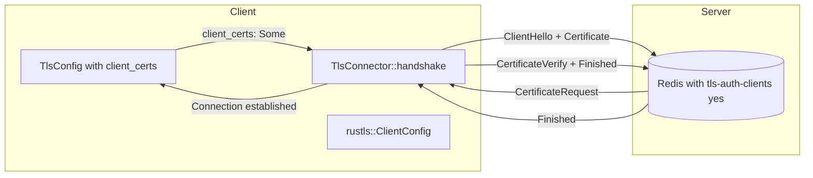
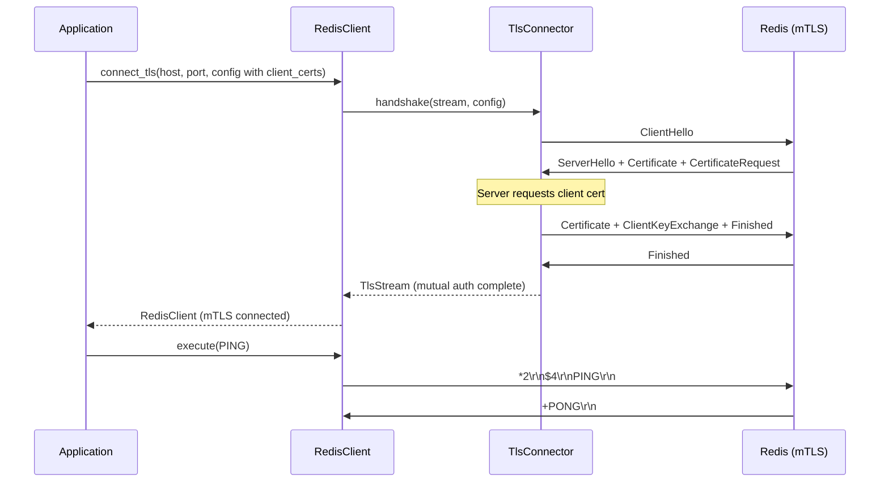

# Story 14.2 — Mutual TLS (mTLS)

**Objective:** Add client certificate authentication for mTLS, enabling `tls-auth-clients yes` Redis configurations.

**Epic:** 14 — TLS and mTLS Support

**Dependencies:** Story 14.1 (TLS Foundation)

**Source docs:** `docs/Epics/Epic_14/Story_0.md`, `docs/PRD_TLS_mTLS.md`

## Architecture





## Functional Requirements

- **FR-001:** `TlsConfig.client_certs: Option<ClientCerts>` — when Some, enables mTLS
- **FR-002:** `ClientCerts` holds DER-encoded certificate chain and private key
- **FR-003:** `TlsConfig::into_config()` builds `rustls::ClientConfig` with `with_client_auth_cert()` when `client_certs` is Some
- **FR-004:** PEM loading support: `ClientCerts::from_pem(certs_pem, key_pem)` creates `ClientCerts` from PEM-encoded data
- **FR-005:** Certificate chain validation: leaf certificate first, then intermediates
- **FR-006:** Private key format supports both PEM and DER (via `ClientCerts::from_der()`)
- **FR-007:** If server requests a client certificate but none is provided, return `TlsError::ClientCertRequired`
- **FR-008:** If server does not request a client certificate but one is configured, ignore it gracefully (no error)

## Non-Functional Requirements

- **NFR-001:** No new `unsafe` blocks
- **NFR-002:** `cargo clippy --all-features` passes at deny level
- **NFR-003:** `cargo fmt --all --check` passes
- **NFR-004:** PEM loading is O(n) where n is the file size, with no backtracking
- **NFR-005:** Private keys are never logged or serialized to strings in error messages

## Code Anchors

- `src/tls/mod.rs` — Add `ClientCerts` struct, `from_pem()`, `from_der()` methods
- `src/tls/mod.rs` — Extend `TlsConfig::into_config()` to call `with_client_auth_cert()` when `client_certs` is Some
- `src/tls/mod.rs` — Add `TlsError::ClientCertRequired(String)` variant
- `src/lib.rs` — Re-export `ClientCerts` under `#[cfg(feature = "tls")]`
- `src/client/client.rs` — No changes (uses `TlsConfig` which already has `client_certs` field)

## Structs

```rust
// src/tls/mod.rs — additions to existing types

/// Client certificate and private key for mutual TLS.
#[derive(Clone)]
pub struct ClientCerts {
    /// DER-encoded client certificate chain (leaf first, then intermediates).
    pub certificates: Vec<Vec<u8>>,
    /// DER-encoded private key.
    pub private_key: Vec<u8>,
}

impl ClientCerts {
    /// Create from PEM-encoded certificate chain and private key.
    ///
    /// The cert_pem should contain the leaf certificate followed by any
    /// intermediate certificates. The key_pem should contain the private key.
    ///
    /// # Errors
    /// Returns `TlsError::Config` if PEM parsing fails.
    pub fn from_pem(
        cert_pem: &[u8],
        key_pem: &[u8],
    ) -> Result<Self, TlsError> {
        let certs: Vec<Vec<u8>> = rustls_pemfile::certs(&mut &cert_pem[..])
            .collect::<Result<Vec<_>, _>>()
            .map_err(|e| TlsError::Config(format!("failed to parse client certificate PEM: {e}")))?;
        
        let key: Vec<u8> = rustls_pemfile::pkcs8_private_keys(&mut &key_pem[..])
            .next()
            .transpose()
            .map_err(|e| TlsError::Config(format!("failed to parse private key PEM: {e}")))?
            .ok_or_else(|| TlsError::Config("no private key found in PEM data".to_string()))?;
        
        Ok(Self { certificates: certs, private_key: key })
    }
    
    /// Create from DER-encoded certificate chain and private key.
    pub fn from_der(
        certificates: Vec<Vec<u8>>,
        private_key: Vec<u8>,
    ) -> Self {
        Self { certificates, private_key }
    }
}
```

## Tasks

- [ ] Add `ClientCerts` struct to `src/tls/mod.rs` with `certificates` and `private_key` fields
- [ ] Implement `ClientCerts::from_pem()` — parse PEM certs and PKCS8 private key
- [ ] Implement `ClientCerts::from_der()` — accept DER-encoded data directly
- [ ] Extend `TlsConfig::into_config()` to handle `client_certs`:
  ```rust
  let config = if let Some(client_certs) = self.client_certs {
      config.with_client_auth_cert(
          client_certs.certificates,
          rustls::pki_types::PrivateKeyDer::try_from(client_certs.private_key)
              .map_err(|e| TlsError::Config(format!("invalid private key: {e}")))?,
      )
  } else {
      config
  };
  ```
- [ ] Add `TlsError::ClientCertRequired(String)` variant for when server requests cert but none provided
- [ ] Handle `rustls::ConfigBuilder` error when `with_client_auth_cert()` fails (e.g., invalid certificate format)
- [ ] Wire mTLS path in `connect_tls()` — if `client_certs` is Some, `TlsConfig::into_config()` builds mTLS config
- [ ] Re-export `ClientCerts` in `src/lib.rs`:
  ```rust
  #[cfg(feature = "tls")]
  pub use tls::ClientCerts;
  ```
- [ ] Run `cargo build --features tls` and verify it compiles
- [ ] Run `cargo test --lib --features tls` and verify unit tests pass
- [ ] Run `cargo clippy --lib --features tls --all-targets -- -D warnings` — zero warnings

## Verification

- `cargo test --lib --features tls` — all existing tests pass
- Unit test: `test_tls_config_mtls_from_pem` — creates `ClientCerts` from PEM and builds `rustls::ClientConfig`
- Unit test: `test_tls_config_mtls_from_der` — creates `ClientCerts` from DER
- Unit test: `test_tls_config_mtls_invalid_pem` — returns `TlsError::Config` on invalid PEM
- Unit test: `test_tls_config_no_client_certs` — `client_certs: None` builds standard TLS config
- Manual test: Connect to Redis with `tls-auth-clients yes` using mTLS certificates
