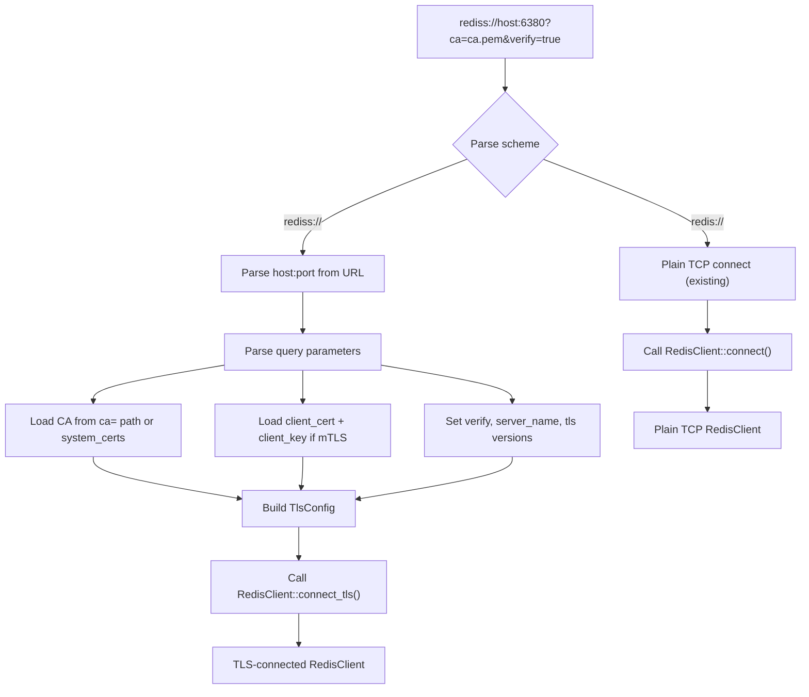
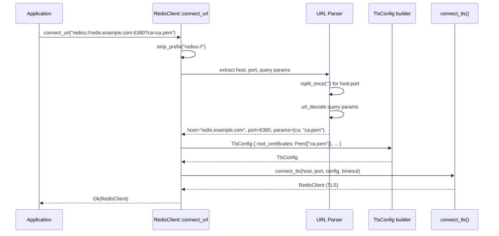

# Story 14.3 — URL Parsing for rediss://

**Objective:** Enable `rediss://` URL scheme with certificate path query parameters, replacing the current `"TLS is not yet supported"` rejection.

**Epic:** 14 — TLS and mTLS Support

**Dependencies:** Story 14.1 (TLS Foundation)

**Source docs:** `docs/Epics/Epic_14/Story_0.md`, `docs/PRD_TLS_mTLS.md`, `src/client/client.rs`

## Architecture

## Functional Requirements

- **FR-001:** `connect_url()` accepts `rediss://` URLs and routes to `connect_tls()` instead of returning an error
- **FR-002:** Query parameters: `ca`, `client_cert`, `client_key`, `server_name`, `system_certs`, `verify`, `tls_min_version`, `tls_max_version`
- **FR-003:** `ca` parameter: path to PEM file containing root CA certificates
- **FR-004:** `system_certs=true`: use `webpki_roots` (Mozilla) instead of `ca` parameter
- **FR-005:** `client_cert` and `client_key` parameters: paths to PEM files for mTLS client authentication
- **FR-006:** `verify=false`: skip server certificate verification (returns warning in docs, not a panic)
- **FR-007:** `tls_min_version` and `tls_max_version`: parse "1.2" or "1.3" string
- **FR-008:** `server_name`: override SNI server name (default: host extracted from URL)
- **FR-009:** All parameter values are URL-decoded before use (consistent with existing password decoding)
- **FR-010:** `redis://` URLs continue to work unchanged (backward compatible)
- **FR-011:** Invalid or unrecognized query parameters return a `Parse` error
- **FR-012:** If neither `ca` nor `system_certs=true` is provided, return a `Parse` error (can't verify server)

## Non-Functional Requirements

- **NFR-001:** URL parameter parsing is O(n) where n is URL length, no backtracking
- **NFR-002:** Parameter names are case-insensitive (URLs may be typed by humans)
- **NFR-003:** No new `unsafe` blocks
- **NFR-004:** `cargo clippy --all-features` passes at deny level
- **NFR-005:** `cargo fmt --all --check` passes

## Code Anchors

- `src/client/client.rs` — Modify `connect_url()` to handle `rediss://` scheme
- `src/client/client.rs` — Add `parse_tls_query_params()` function
- `src/client/client.rs` — Add `TlsConfig` construction from parsed parameters
- `src/client/client.rs` — Wire `rediss://` path to call `connect_tls()`
- `src/lib.rs` — Re-export `ClientCerts` under `#[cfg(feature = "tls")]`

## Structs

No new structs. Uses existing `TlsConfig`, `ClientCerts`, `RustlsRootCerts` from `tls` module.

## Tasks

- [ ] In `connect_url()`, modify the `rediss://` branch:
  - Replace `"TLS is not yet supported"` error with actual TLS connection logic
  - Parse query string after `?`
  - Build `TlsConfig` from parsed parameters
  - Call `connect_tls()` with the built config
- [ ] Implement `parse_tls_query_params(query: &str) -> Result<HashMap<String, String>, RedisError>`:
  - Split on `&` to get key=value pairs
  - URL-decode each key and value
  - Return HashMap of parameter names to values
- [ ] Implement `build_tls_config(host: &str, params: &HashMap<String, String>, default_port: u16) -> Result<TlsConfig, RedisError>`:
  - Parse `ca` → `RustlsRootCerts::Pem(vec![PathBuf])`
  - Parse `system_certs` → if "true", use `RustlsRootCerts::WebPkiRoots`
  - Parse `client_cert` + `client_key` → `ClientCerts::from_pem()`
  - Parse `verify` → `bool` (default true)
  - Parse `tls_min_version` → `TlsVersion` (default 1.2)
  - Parse `tls_max_version` → `TlsVersion` (default 1.3)
  - Parse `server_name` → override host for SNI
  - Error if neither `ca` nor `system_certs=true` is set
- [ ] Handle file loading:
  - `ca` param: read file at path, return `RustlsRootCerts::Pem(vec![PathBuf])`
  - `client_cert` + `client_key` params: read files and call `ClientCerts::from_pem()`
- [ ] Update URL parsing documentation in `connect_url()` docstring
- [ ] Handle double-prefix check: `rediss://rediss://...` should still be rejected (existing check in current code)
- [ ] Add unit tests for URL parsing:
  - `test_url_parse_rediss_basic` — `rediss://host:6380` with system_certs
  - `test_url_parse_rediss_mtls` — with client_cert and client_key
  - `test_url_parse_rediss_custom_version` — tls_min_version=1.3
  - `test_url_parse_rediss_no_ca_fails` — error when no ca or system_certs
  - `test_url_parse_rediss_verify_false` — verify=false accepted
  - `test_url_parse_rediss_special_chars` — URL-encoded path characters
- [ ] Run `cargo build --features tls` and verify it compiles
- [ ] Run `cargo test --lib --features tls` and verify unit tests pass
- [ ] Run `cargo clippy --lib --features tls --all-targets -- -D warnings` — zero warnings

## Verification

- `cargo test --lib --features tls` — all URL parsing tests pass:
  - `test_url_parse_rediss_basic` — `rediss://localhost:6380` → TlsConfig with system_certs
  - `test_url_parse_rediss_mtls` — `rediss://host:6380?ca=ca.pem&client_cert=cert.pem&client_key=key.pem` → TlsConfig with mTLS
  - `test_url_parse_rediss_query_encoding` — `rediss://host:6380?ca=%2Fpath%2Fwith%20spaces.pem` → decoded path
  - `test_url_parse_rediss_no_ca` — error when neither ca nor system_certs
  - `test_url_parse_redis_plain` — `redis://host:6379` still works (backward compat)
- `cargo test --lib` (no features) — `rediss://` returns "TLS is not yet supported" error (or is gated behind tls feature)
- `cargo clippy --all-features -- -D warnings` — zero warnings
- `cargo fmt --all --check` — formatting passes
