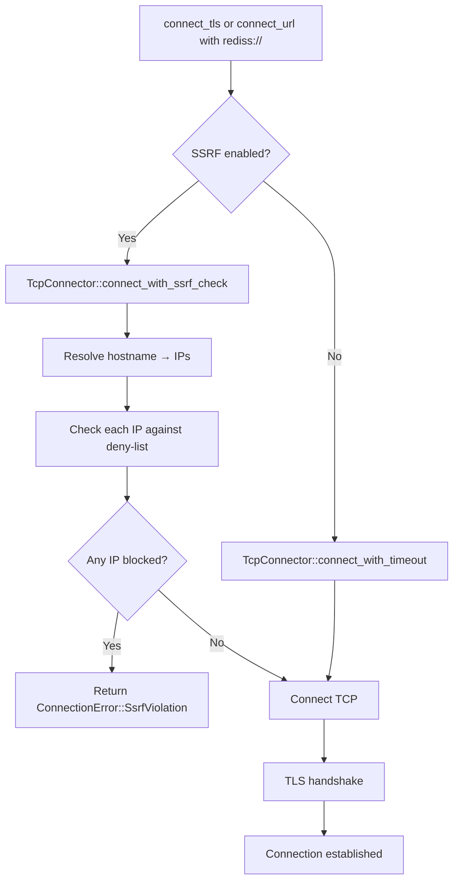
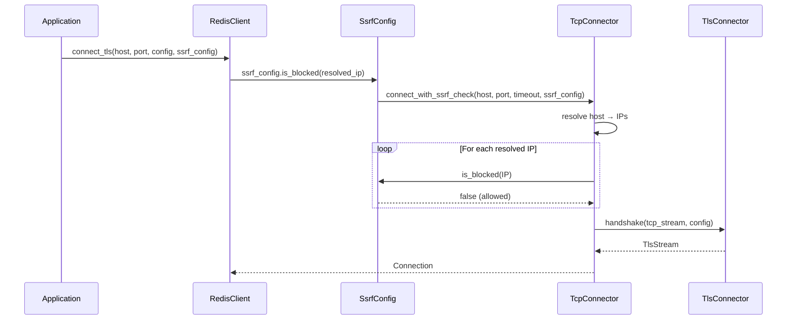

# Story 14.4 — SSRF Protection for TLS Connections

**Objective:** Ensure SSRF protection (deny-listed IP ranges) applies to TLS connections the same way it applies to plain TCP connections.

**Epic:** 14 — TLS and mTLS Support

**Dependencies:** Story 14.1 (TLS Foundation), Story 14.3 (URL Parsing)

**Source docs:** `docs/Epics/Epic_14/Story_0.md`, `src/connection/tcp.rs`, `src/connection/connection.rs`

## Architecture





## Functional Requirements

- **FR-001:** `Connection::connect_tls_with_ssrf()` accepts an `SsrfConfig` parameter
- **FR-002:** SSRF check runs on DNS-resolved IPs BEFORE the TLS handshake begins
- **FR-003:** Same deny-list applies: RFC 1918 private, link-local, reserved ranges
- **FR-004:** If ANY resolved IP is blocked, return `ConnectionError::SsrfViolation` — no TCP connect is attempted for that IP
- **FR-005:** SSRF config is stored on the `Connection` struct (same as plain TCP)
- **FR-006:** `Connection::ssrf_config()` getter returns the config for TLS connections
- **FR-007:** `RedisClient::connect_tls_with_ssrf()` chains SSRF → TCP → TLS → Connection
- **FR-008:** `connect_url()` with `rediss://` supports an `ssrf=true` query parameter

## Non-Functional Requirements

- **NFR-001:** SSRF check is O(1) per IP — same bitwise range checks as existing code
- **NFR-002:** No new `unsafe` blocks
- **NFR-003:** `cargo clippy --all-features` passes at deny level
- **NFR-004:** `cargo fmt --all --check` passes

## Code Anchors

- `src/connection/tcp.rs` — No changes (SSRF logic already exists in `connect_with_ssrf_check`)
- `src/connection/connection.rs` — Add `Connection::connect_tls_with_ssrf()` method
- `src/connection/connection.rs` — Add `Connection::from_tls_stream_with_ssrf()` method
- `src/client/client.rs` — Add `connect_tls_with_ssrf()` method
- `src/client/client.rs` — Wire `ssrf=true` query parameter in `connect_url()` for `rediss://`

## Structs

No new structs. Reuses existing `SsrfConfig` from `src/connection/tcp.rs`.

## Tasks

- [ ] In `connection.rs`, add `Connection::connect_tls_with_ssrf()`:
  ```rust
  #[cfg(feature = "tls")]
  pub fn connect_tls_with_ssrf(
      host: &str,
      port: u16,
      tls_config: &tls::TlsConfig,
      timeout: std::time::Duration,
      ssrf_config: tcp::SsrfConfig,
  ) -> Result<Self, ConnectionError> {
      // 1. SSRF check (runs before any TCP connect)
      let stream = tcp::TcpConnector::connect_with_ssrf_check(
          host, port, timeout, ssrf_config,
      )?;
      
      // 2. TLS handshake
      let tls_stream = tls::TlsConnector::handshake(stream, tls_config, timeout)
          .map_err(|e| ConnectionError::Tls(e.to_string()))?;
      
      // 3. Build Connection
      Self::from_tls_stream_with_ssrf(tls_stream, ssrf_config)
  }
  ```
- [ ] Add `Connection::from_tls_stream_with_ssrf()` — same as `from_tls_stream()` but stores `ssrf_config`
- [ ] In `client.rs`, add `RedisClient::connect_tls_with_ssrf()` that chains to `Connection::connect_tls_with_ssrf()`
- [ ] In `connect_url()`, parse `ssrf` query parameter for `rediss://` URLs:
  - `ssrf=true` → enable SSRF with default `SsrfConfig`
  - `ssrf=false` → disable SSRF
  - Default: SSRF enabled (same as plain TCP with SSRF)
- [ ] Run `cargo build --features tls` and verify it compiles
- [ ] Run `cargo test --lib --features tls` and verify unit tests pass
- [ ] Run `cargo clippy --lib --features tls --all-targets -- -D warnings` — zero warnings

## Verification

- `cargo test --lib --features tls` — all existing tests pass
- Unit test: `test_tls_ssrf_blocked_private_ip` — connecting to `redis://10.0.0.1:6379` with SSRF enabled returns `SsrfViolation`
- Unit test: `test_tls_ssrf_allowed_public_ip` — connecting to `redis://8.8.8.8:6379` with SSRF enabled succeeds (TCP connect, but may fail on network — test just verifies no SSRF error)
- Unit test: `test_tls_ssrf_disabled` — connecting to `redis://10.0.0.1:6379` with SSRF disabled proceeds to TCP connect
- Manual test: `redis://127.0.0.1:6380` with `ssrf=true` and `deny_loopback=true` → `SsrfViolation`
- Manual test: `redis://localhost:6380` with `ssrf=true` and `deny_loopback=true` → DNS resolves to `127.0.0.1` → `SsrfViolation`
