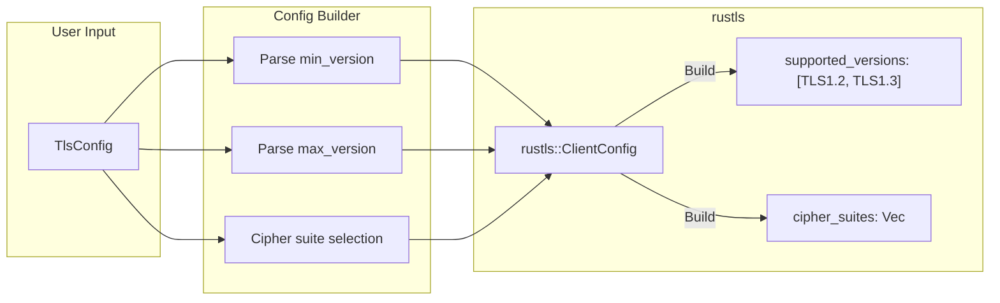

# Story 14.5 — TLS Configuration Options

**Objective:** Add configurable TLS version bounds (min/max), cipher suite selection, and connection-specific timeout for TLS handshakes.

**Epic:** 14 — TLS and mTLS Support

**Dependencies:** Story 14.1 (TLS Foundation), Story 14.3 (URL Parsing)

**Source docs:** `docs/Epics/Epic_14/Story_0.md`, `docs/PRD_TLS_mTLS.md`

## Architecture



```mermaid
flowchart TD
    A["TlsConfig defaults"] --> B{"min_version?"}
    B -->|1.2 (default)| C["Supported: [TLS1.2, TLS1.3]"]
    B -->|1.3| D["Supported: [TLS1.3]"]
    
    E{"max_version?"}
    E -->|1.3 (default)| C
    E -->|1.2| F["Supported: [TLS1.2]"]
    
    C --> G["rustls::ConfigBuilder::with_safe_defaults()"]
    D --> G
    F --> G
    G --> H["with_min_protocol_version()"]
    H --> I["with_max_protocol_version()"]
    I --> J["rustls::ClientConfig ready"]
```

## Functional Requirements

- **FR-001:** `TlsConfig.min_version` defaults to `TLS 1.2` — rejects servers that only support 1.0/1.1
- **FR-002:** `TlsConfig.max_version` defaults to `TLS 1.3` — allows the latest protocol
- **FR-003:** Setting `min_version` to `TLS 1.3` forces TLS 1.3 only (no fallback to 1.2)
- **FR-004:** Setting `max_version` to `TLS 1.2` forces TLS 1.2 only (no upgrade to 1.3)
- **FR-005:** Cipher suites are selected by rustls defaults — no user override needed for v1
- **FR-006:** TLS handshake timeout defaults to 5 seconds (same as TCP connect timeout)
- **FR-007:** Handshake timeout is configurable separately from command execution timeout
- **FR-008:** Query parameters `tls_min_version` and `tls_max_version` parse "1.2" and "1.3" strings
- **FR-009:** Invalid TLS version strings return a `Parse` error
- **FR-010:** `TlsVersion::Tls12` maps to `rustls::ProtocolVersion::V12`
- **FR-011:** `TlsVersion::Tls13` maps to `rustls::ProtocolVersion::V13`

## Non-Functional Requirements

- **NFR-001:** No new `unsafe` blocks
- **NFR-002:** `cargo clippy --all-features` passes at deny level
- **NFR-003:** `cargo fmt --all --check` passes
- **NFR-004:** TLS version configuration is validated at build time — invalid versions are caught before handshake
- **NFR-005:** Handshake timeout does not affect the command execution timeout (they are independent)

## Code Anchors

- `src/tls/mod.rs` — Implement `TlsVersion::to_protocol()` conversion to `rustls::ProtocolVersion`
- `src/tls/mod.rs` — Extend `TlsConfig::into_config()` to set `with_min_protocol_version()` and `with_max_protocol_version()`
- `src/tls/mod.rs` — Add `TlsError::InvalidTlsVersion(String)` variant
- `src/client/client.rs` — Update `connect_tls()` to accept a separate `handshake_timeout` parameter
- `src/client/client.rs` — Update URL parsing in `connect_url()` to handle `tls_min_version` and `tls_max_version` query params
- `src/lib.rs` — No changes (types already exported)

## Structs

```rust
// src/tls/mod.rs — additions

impl TlsVersion {
    /// Convert to rustls protocol version.
    pub fn to_protocol(&self) -> rustls::SupportedProtocolVersion {
        match self {
            Self::Tls12 => rustls::version::TLS12,
            Self::Tls13 => rustls::version::TLS13,
        }
    }
    
    /// Parse from string ("1.2" or "1.3").
    pub fn from_str(s: &str) -> Result<Self, TlsError> {
        match s.trim() {
            "1.2" => Ok(Self::Tls12),
            "1.3" => Ok(Self::Tls13),
            _ => Err(TlsError::InvalidTlsVersion(format!(
                "unsupported TLS version: {s} (expected '1.2' or '1.3')"
            ))),
        }
    }
}

impl TlsConfig {
    /// Build a rustls::ClientConfig from this TlsConfig.
    pub fn into_config(self) -> Result<rustls::ClientConfig, TlsError> {
        let builder = rustls::ClientConfig::builder()
            .with_safe_defaults();
        
        // Set protocol version bounds
        let config = builder
            .with_min_protocol_version(&self.min_version.to_protocol())
            .with_max_protocol_version(&self.max_version.to_protocol())
            .with_root_certificates(self.root_certificates.to_root_store())
            .map_err(|e| TlsError::Config(e.to_string()))?;
        
        // Apply client certs for mTLS
        let config = if let Some(client_certs) = self.client_certs {
            config.with_client_auth_cert(
                client_certs.certificates,
                rustls::pki_types::PrivateKeyDer::try_from(client_certs.private_key)
                    .map_err(|e| TlsError::Config(format!("invalid private key: {e}")))?,
            )
            .map_err(|e| TlsError::Config(e.to_string()))?
        } else {
            config
        };
        
        // Set SNI
        let server_name = rustls::pki_types::ServerName::try_from(&self.server_name)
            .map_err(|e| TlsError::Config(format!("invalid server name: {e}")))?;
        
        Ok(config.for_client(server_name))
    }
}
```

## Tasks

- [ ] Implement `TlsVersion::from_str()` — parse "1.2" or "1.3" strings, return `TlsError::InvalidTlsVersion` on invalid
- [ ] Implement `TlsVersion::to_protocol()` — convert to `rustls::version::TLS12` or `TLS13`
- [ ] Add `TlsError::InvalidTlsVersion(String)` variant with `Display` impl
- [ ] In `TlsConfig::into_config()`, set protocol version bounds:
  ```rust
  rustls::ClientConfig::builder()
      .with_safe_defaults()
      .with_min_protocol_version(&self.min_version.to_protocol())
      .with_max_protocol_version(&self.max_version.to_protocol())
  ```
- [ ] Validate: `min_version <= max_version` — return error if `min_version > max_version`
- [ ] Wire `tls_min_version` and `tls_max_version` query params in `connect_url()`:
  ```rust
  let min_ver = params.get("tls_min_version")
      .map(|s| TlsVersion::from_str(s))
      .transpose()?
      .unwrap_or(TlsVersion::Tls12);
  
  let max_ver = params.get("tls_max_version")
      .map(|s| TlsVersion::from_str(s))
      .transpose()?
      .unwrap_or(TlsVersion::Tls13);
  ```
- [ ] Run `cargo build --features tls` and verify it compiles
- [ ] Run `cargo test --lib --features tls` and verify unit tests pass
- [ ] Run `cargo clippy --lib --features tls --all-targets -- -D warnings` — zero warnings

## Verification

- `cargo test --lib --features tls` — all URL parsing and TLS config tests pass:
  - `test_tls_version_from_str_12` — "1.2" → `TlsVersion::Tls12`
  - `test_tls_version_from_str_13` — "1.3" → `TlsVersion::Tls13`
  - `test_tls_version_from_str_invalid` — "1.1" → `TlsError::InvalidTlsVersion`
  - `test_tls_version_from_str_empty` — "" → `TlsError::InvalidTlsVersion`
  - `test_tls_config_default_versions` — defaults are 1.2 min, 1.3 max
  - `test_tls_config_13_only` — min=1.3, max=1.3 builds 1.3-only config
  - `test_tls_config_min_gt_max_fails` — min=1.3, max=1.2 returns error
- `cargo clippy --all-features -- -D warnings` — zero warnings
- `cargo fmt --all --check` — formatting passes
- Manual test: Connect to Redis with `tls_min_version=1.3` — succeeds if Redis supports 1.3, fails if only 1.2
