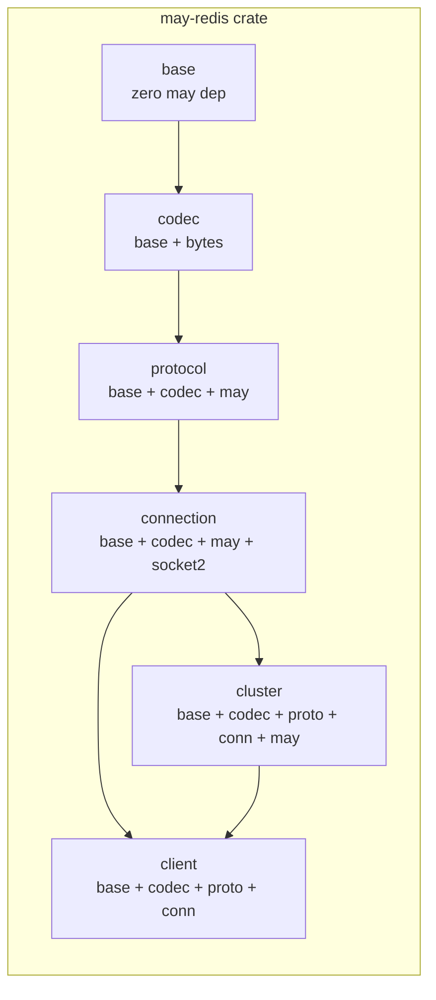
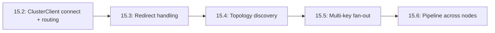

# Epic 15 — Redis Cluster Support

**Objective:** Add Redis Cluster support to may-redis — hash-slot routing, MOVED/ASK redirect handling, topology discovery, multi-key fan-out, and cross-node pipeline support, behind a `cluster` feature flag.

**Status:** Draft

## Problem Statement

The current `RedisClient` uses a single `Connection` per client. This works for single-node Redis but cannot route to the correct node in a Redis Cluster, which partitions keys across N nodes using 16384 hash slots. Additionally, cluster nodes send `MOVED` and `ASK` redirect responses that the client must handle transparently.

## Architecture Decision

**Approach A — Per-Node Connections with `RedisClusterClient`** is the correct design. Each cluster node gets one dedicated `Connection` (one epoll loop, one socket, one request queue). This reuses all existing infrastructure: `Connection`, `epoll_loop`, `dispatch`, `CommandBuilder`, `Pipeline`.

**Implementation order within this epic: 2 → 3 → 4 → 5 → 6** (Phase 1 — CRC16 + SlotMap — is already implemented in existing `src/cluster/crc16.rs` and `src/cluster/slot_map.rs`).

## Architecture Diagram



## Dependency Graph (Epic 15 internal)



## Module Structure

```
may_redis/
├── src/
│   ├── cluster/                    # NEW — cluster-specific modules
│   │   ├── mod.rs                  # pub mod crc16; cluster_client; slot_map; redirect;
│   │   ├── crc16.rs                # CRC16-ANSI hash for slot computation (DONE)
│   │   ├── slot_map.rs             # Slot→Node mapping (DONE)
│   │   ├── cluster_client.rs       # RedisClusterClient — main entry point (15.2)
│   │   ├── redirect.rs             # MOVED/ASK redirect handling (15.3)
│   │   ├── topology.rs             # CLUSTER NODES/SLOTS parsing (15.4)
│   │   └── fanout.rs               # Multi-key fan-out (15.5)
│   ├── connection/
│   │   └── connection.rs           # Existing Connection (reused)
│   └── client/
│       └── mod.rs                  # pub use cluster::RedisClusterClient when feature = cluster
└── docs/
    ├── PRD-redis-cluster.md        # Source PRD
    └── Epics/Epic_15/
        ├── Story_0.md              # This file
        ├── Story_1.md              # Redirect handling (15.3)
        ├── Story_2.md              # ClusterClient connect + routing (15.2)
        ├── Story_3.md              # Topology discovery (15.4)
        ├── Story_4.md              # Multi-key fan-out (15.5)
        └── Story_5.md              # Pipeline across nodes (15.6)
```

## Feature Flag

```toml
[features]
default = []
cluster = []
```

When `cluster` is not enabled, `RedisClusterClient` and cluster-specific types are not compiled.

## Existing vs. New Code

| Module | Status | Notes |
|--------|--------|-------|
| `cluster/crc16.rs` | **DONE** | CRC16-ANSI + compute_slot with tests |
| `cluster/slot_map.rs` | **DONE** | NodeId, NodeInfo, SlotMap with tests |
| `cluster/redirect.rs` | **NEW** | MOVED/ASK parsing (15.3) |
| `cluster/cluster_client.rs` | **NEW** | RedisClusterClient (15.2) |
| `cluster/topology.rs` | **NEW** | CLUSTER NODES/SLOTS parsing (15.4) |
| `cluster/fanout.rs` | **NEW** | Cross-slot fan-out (15.5) |

## Execution Order

1. **Story 15.2** — ClusterClient connect + basic routing (foundational, no redirects yet)
2. **Story 15.3** — Redirect handling (MOVED/ASK)
3. **Story 15.4** — Topology discovery (seed nodes, CLUSTER NODES/SLOTS)
4. **Story 15.5** — Multi-key fan-out
5. **Story 15.6** — Pipeline across nodes

Each story must pass `cargo test --lib --features cluster -- --test-threads=1` and `cargo clippy` before proceeding.

## Out of Scope (v1)

- Redis Cluster Bus (Gossip protocol)
- Redis Cluster Pub/Sub (subscribe/unsubscribe across nodes)
- Redis Cluster Streams (XREADGROUP with consumer groups)
- Redis Cluster Lua Scripts (EVAL/SHA1 routing)
- Connection pool per node (one connection per node is sufficient)
- Read-from-replica routing
