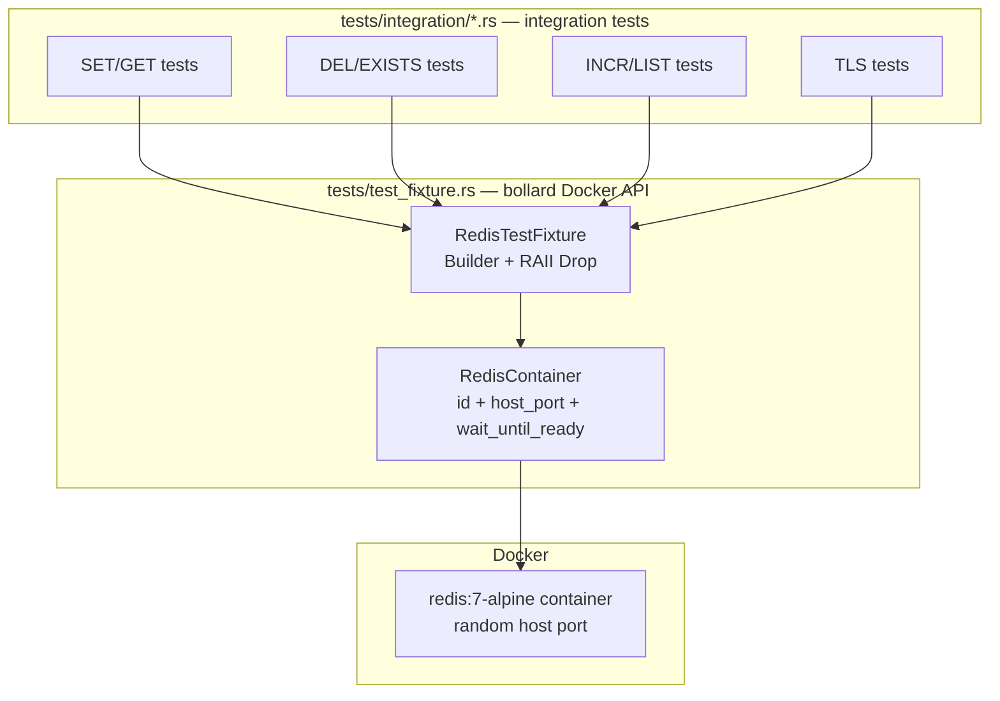
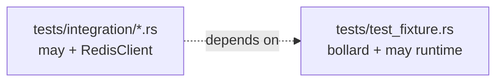
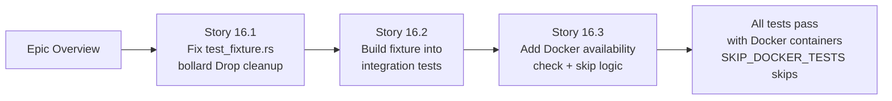

# Epic 16 — Docker-Managed Test Fixtures

**Objective:** Replace the hardcoded `localhost:6379` dependency in integration tests with a bollard-managed Docker fixture that spins up isolated Redis containers per test (or per test run), cleans them up automatically via RAII, and skips gracefully when Docker is unavailable.

**Dependencies:** Epic 0 (scaffolding), existing `tests/test_fixture.rs` stub

**Source docs:** `docs/10-test-strategy.md`, `tests/test_fixture.rs`, BRRTRouter `tests/curl_harness.rs`, `tests/docker_integration_tests.rs`

## Status

NEW

## Problem

Integration tests currently require a Redis server running on `localhost:6379` before they execute. This creates several issues:

1. **Environment dependency** — tests fail on CI runners, developer machines, or sandboxes without a pre-installed Redis
2. **State leakage** — tests share a single Redis instance; `FLUSHDB` before/after is a bandaid, not a fix
3. **No CI parity** — CI and local dev have different test outcomes because one spins up a container and the other doesn't
4. **Dead code** — `tests/test_fixture.rs` exists but is never wired into any test
5. **Wrong runtime** — the existing fixture uses `tokio::spawn` in its `Drop` impl, violating the no-tokio rule

## Functional Requirements

| # | ID | Requirement | Story |
|---|----|-------------|-------|
| 1 | FR-001 | `RedisTestFixture` creates Redis containers via bollard Docker API on `build()` | 16.1 |
| 2 | FR-002 | `RedisTestFixture` exposes `host(i)` returning the mapped host port for container `i` | 16.1 |
| 3 | FR-003 | `RedisTestFixture` implements `Drop` to remove containers automatically when the fixture goes out of scope | 16.1 |
| 4 | FR-004 | Container names are unique per process (using PID) to avoid conflicts with parallel test runs | 16.1 |
| 5 | FR-005 | Fixture supports plain Redis (port 6379) and Redis-TLS (port 6380) variants via builder pattern | 16.1 |
| 6 | FR-006 | `build()` returns `Result` — fails gracefully with descriptive error when Docker is unavailable | 16.1 |
| 7 | FR-007 | `is_docker_available()` provides a cached, thread-safe check for Docker daemon availability | 16.3 |
| 8 | FR-008 | Integration tests use `shared_client_with_fixture()` that creates fixture + client, passing the fixture's port to the client | 16.2 |
| 9 | FR-009 | `SKIP_DOCKER_TESTS=1` env var causes all integration tests to skip with a clear message | 16.3 |
| 10 | FR-010 | `RedisTestFixture` uses `redis:7-alpine` image for containers | 16.1 |
| 11 | FR-011 | Each test creates its own fixture — no shared state between tests | 16.2 |

## Non-Functional Requirements

| # | ID | Requirement | Story |
|---|----|-------------|-------|
| 1 | NFR-001 | No `tokio` in production code — `tokio::runtime::Builder` may only appear in test `Drop` impl for cleanup | 16.1 |
| 2 | NFR-002 | Container cleanup must happen even on test panic (RAII via `Drop`) | 16.1 |
| 3 | NFR-003 | Container startup + readiness must complete within 10 seconds | 16.1 |
| 4 | NFR-004 | Test skip (no Docker) must complete in under 1 second — no blocking on unavailable Docker | 16.3 |
| 5 | NFR-005 | `Docker::connect_with_socket_defaults()` must be cached via `OnceLock` — called at most once per test process | 16.3 |
| 6 | NFR-006 | No new crate dependencies required — bollard is already a dev-dependency | 16.1 |
| 7 | NFR-007 | All integration tests must compile without Docker running (no panics at import time) | 16.2 |
| 8 | NFR-008 | Container port bindings must use `127.0.0.1` (localhost only, not `0.0.0.0`) | 16.1 |

## Acceptance Criteria

### Epic-level

- [ ] `cargo test --lib` — all unit tests pass (unchanged, no Docker needed)
- [ ] `cargo test --lib -- --include-ignored test_integration_` with Docker — all integration tests pass (not ignored)
- [ ] `SKIP_DOCKER_TESTS=1 cargo test --lib -- --include-ignored test_integration_` — all integration tests skip (not fail)
- [ ] `cargo clippy --lib --tests --all-features -- -D warnings` — zero warnings
- [ ] `cargo fmt --all --check` — clean
- [ ] No `tokio` imports in `src/` or non-test files
- [ ] No hardcoded `127.0.0.1:6379` in integration tests (all use `fixture.host(0)`)
- [ ] No orphaned containers after test run (`docker ps -a --filter name=may-redis-` returns empty)

### Story-level

**Story 16.1** (Fix test_fixture.rs):
- [ ] `tests/test_fixture.rs` compiles with `cargo check --tests`
- [ ] `build()` creates a `redis:7-alpine` container, maps a random host port, and returns `host_port`
- [ ] `Drop` removes the container when `RedisTestFixture` goes out of scope
- [ ] `wait_until_ready()` returns `Ok(())` when Redis is accepting connections on the mapped port
- [ ] `build()` returns `Err` (not panic) when Docker is not available

**Story 16.2** (Wire fixture into integration tests):
- [ ] All 10 integration test files use `shared_client_with_fixture()` or equivalent
- [ ] No integration test hardcodes `127.0.0.1:6379`
- [ ] Each test has its own fixture — no shared mutable state between tests

**Story 16.3** (Docker availability check + skip logic):
- [ ] `SKIP_DOCKER_TESTS=1` causes all integration tests to print `SKIPPED` and return
- [ ] `is_docker_available()` is cached — only one Docker connection attempt per test process
- [ ] Integration tests without `--include-ignored` are ignored (not failing)

## Architecture

## Dependency Graph

## Module Responsibility Matrix

| Module | May Dep? | Docker Dep? | Purpose |
|--------|----------|-------------|---------|
| `tests/test_fixture.rs` | No (async via bollard) | Yes (bollard API) | Container lifecycle: create, start, wait, cleanup |
| `tests/integration/*.rs` | Yes | No (uses fixture) | Integration tests for RedisClient, Pipeline |

## Implementation Order

## Verification Checklist

- [ ] `cargo test -p base -p codec -p protocol` — unit tests still pass (unchanged, no Docker needed)
- [ ] Integration tests create their own Redis container per test
- [ ] `SKIP_DOCKER_TESTS=1 cargo test` — integration tests skip cleanly (no errors)
- [ ] Containers auto-removed when tests complete or panic
- [ ] No `tokio` imports anywhere in test fixture
- [ ] No hardcoded `localhost:6379` in integration tests
- [ ] `cargo fmt --all --check` clean
- [ ] `cargo clippy --lib --tests --all-features -- -D warnings` clean
