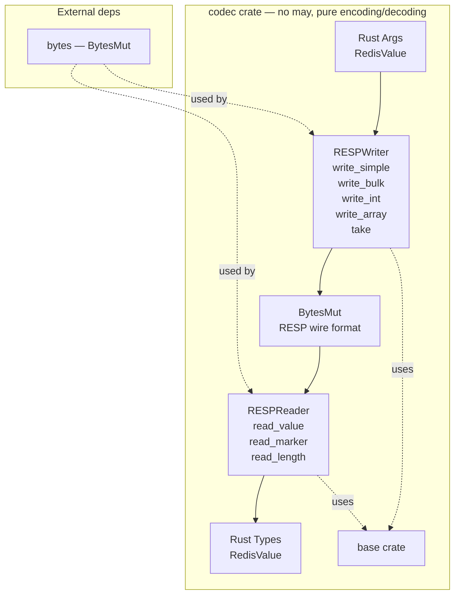

# Epic 2 — Codec Crate

**Objective:** Implement the RESP encoding/decoding codec. This crate depends on `base` + `bytes` but **still has no may dependency**. Pure data transformation — testable with plain `#[test]`.

**Dependencies:** Epic 0 (scaffolding) + Epic 1 (base)

**Source docs:** `docs/01-protocol-analysis.md`, `docs/05-protocol-layer-design.md`

## Crate Overview

## Implementation Order

