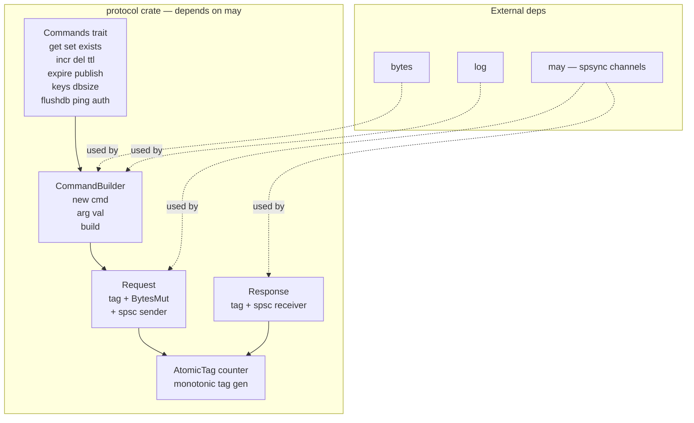
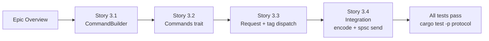

# Epic 3 — Protocol Crate

**Objective:** Implement the command protocol layer — CommandBuilder fluent API, Commands trait, and Request/Response management. This is the first crate that depends on `may` (for spsc channels).

**Dependencies:** Epic 0 (scaffolding) + Epic 1 (base) + Epic 2 (codec)

**Source docs:** `docs/04-system-design.md`, `docs/05-protocol-layer-design.md`, `docs/07-client-api-design.md`

## Crate Overview

## Implementation Order

