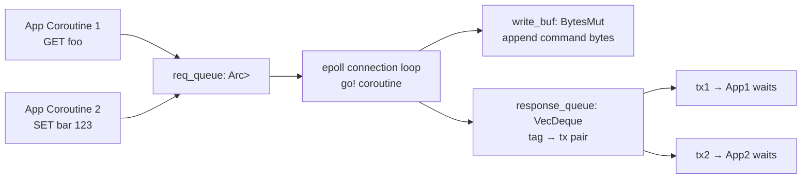

# Story 3.3 — Request + Response tag dispatch

**Objective:** Implement the Request/Response types with monotonically increasing tags for request-response matching.

**Epic:** 3 — Protocol Crate

**Dependencies:** Story 3.2

**Source docs:** `docs/Epics/Epic_3/Story_0.md`

## Code Anchors

- `crates/protocol/src/request.rs` — `pub struct Request { tag, command, tx }`
- `crates/protocol/src/response.rs` — `pub struct Response { tag, rx }`
- `crates/protocol/src/tags.rs` — `pub struct TagCounter`

## Structs

```rust
use may::sync::spsc;

pub struct Request {
    pub tag: usize,
    pub command: BytesMut,
    pub tx: spsc::Sender<RedisValue>,
}

pub struct Response {
    pub tag: usize,
    pub rx: spsc::Receiver<RedisValue>,
}
```

## Tag Dispatch Diagram



## Tasks

1. Define `TagCounter` — wraps `std::sync::atomic::AtomicUsize` with `next()` method
2. Define `Request` struct with tag, command, tx fields
3. Define `Response` struct with tag, rx fields
4. Implement `Request::new(tag, command, tx)` constructor
5. Implement `Response::new(tag, rx)` constructor
6. Implement `TagCounter::new()` — initializes to 0
7. Implement `TagCounter::next()` — returns current value and increments

## Verification

- `cargo test -p protocol` — at least 3 unit tests:
  - `test_tag_counter_monotonic` — counter.next() returns 0, 1, 2, ...
  - `test_request_creation` — create Request with known tag, verify fields
  - `test_response_creation` — create Response with known tag, verify fields
- `cargo clippy -p protocol` — zero warnings
