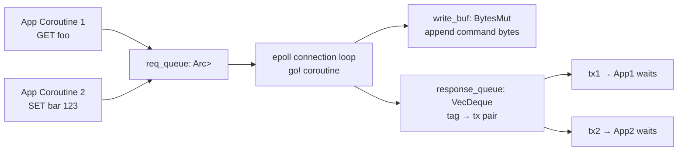

# Story 3.3 — Request + Response tag dispatch

**Objective:** Implement the Request/Response types with monotonically increasing tags for request-response matching.

**Epic:** 3 — Protocol Crate

**Dependencies:** Story 3.2

**Status:** COMPLETE — all tasks implemented and tested.

**Source docs:** `docs/Epics/Epic_3/Story_0.md`

## Code Anchors

- `src/connection/connection.rs` — `Request` struct
- `src/connection/connection.rs` — `TagCounter` (AtomicUsize)
- `src/protocol/mod.rs` — `Response` struct with spsc channel

## Structs

```rust
use may::sync::spsc;

pub struct Request {
    pub tag: usize,
    pub command: BytesMut,
    pub tx: spsc::Sender<RedisValue>,
}

pub struct Response {
    pub tag: usize,
    pub rx: spsc::Receiver<RedisValue>,
}
```

## Tag Dispatch Diagram



## Tasks

- [x] Define `TagCounter` — wraps `std::sync::atomic::AtomicUsize` with `next()` method
- [x] Define `Request` struct with tag, command, tx fields
- [x] Define `Response` struct with tag, rx fields
- [x] Implement `Request::new(tag, command, tx)` constructor
- [x] Implement `Response::new(tag, rx)` constructor
- [x] Implement `TagCounter::new()` — initializes to 0
- [x] Implement `TagCounter::next()` — returns current value and increments

## Verification

- All protocol tests pass:
  - `test_tag_counter_monotonic` — counter.next() returns 0, 1, 2, ...
  - `test_request_creation` — create Request with known tag, verify fields
  - `test_response_creation` — create Response with known tag, verify fields
- `cargo clippy` — zero warnings
