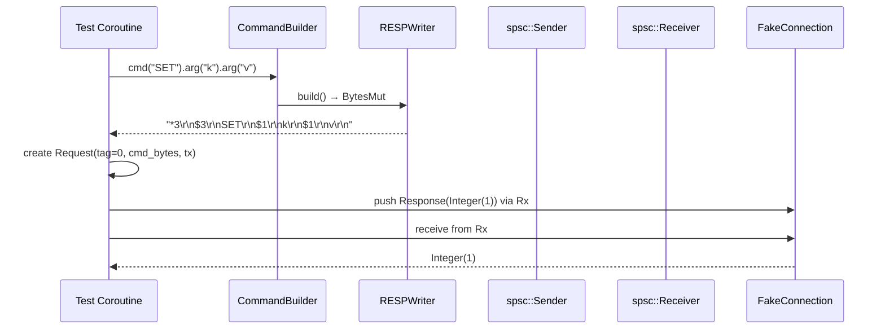

# Story 3.4 — Integration: encode command and send via spsc

**Objective:** Full integration test — build a command, encode it, create a Request with an spsc channel, verify the wire format is correct, and simulate the connection loop receiving and dispatching the response.

**Epic:** 3 — Protocol Crate

**Dependencies:** Story 3.3

**Source docs:** `docs/05-protocol-layer-design.md`, `docs/Epics/Epic_3/Story_0.md`

## Code Anchors

- `crates/protocol/src/integration.rs` — integration tests
- `crates/protocol/src/fake.rs` — FakeConnection test helper

## Integration Flow

## Tasks

1. Create `FakeConnection` test helper that:
   - Captures sent commands (BytesMut)
   - Provides canned responses via spsc
2. Test: Build SET key value command → encode → verify BytesMut matches wire format
3. Test: Build GET key command → encode → verify bytes → simulate response `:42\r\n` → verify receiver gets Integer(42)
4. Test: Pipeline ordering — build 3 commands, verify they are encoded in declaration order
5. Test: Tag uniqueness — 100 sequential requests, all tags are unique and monotonic

## Verification

- `cargo test -p protocol` — at least 18 total tests (14 trait + 3 dispatch + 3 integration)
- `cargo clippy -p protocol` — zero warnings
- `cargo doc -p protocol` — all public items documented
