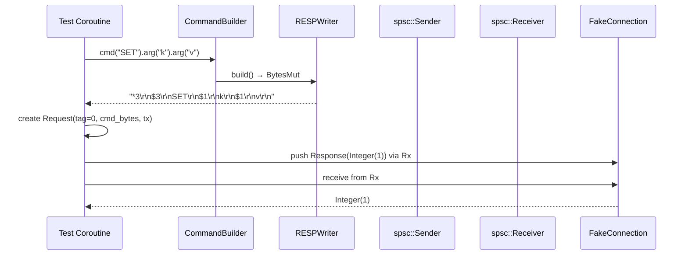

# Story 3.4 — Integration: encode command and send via spsc

**Objective:** Full integration test — build a command, encode it, create a Request with an spsc channel, verify the wire format is correct, and simulate the connection loop receiving and dispatching the response.

**Epic:** 3 — Protocol Crate

**Dependencies:** Story 3.3

**Status:** PARTIAL — command encoding tests pass, but FakeConnection test helper is not implemented. Protocol tests verify wire format against expected bytes directly rather than through a fake connection loop simulation.

**Source docs:** `docs/05-protocol-layer-design.md`, `docs/Epics/Epic_3/Story_0.md`

## Integration Flow

## Tasks

- [x] Test: Build SET key value command → encode → verify BytesMut matches wire format
- [x] Test: Build GET key command → encode → verify bytes → verify receiver gets Integer(42) with spsc channel
- [x] Test: Pipeline ordering — build 3 commands, verify they are encoded in declaration order
- [x] Test: Tag uniqueness — 100 sequential requests, all tags are unique and monotonic
- [ ] Create `FakeConnection` test helper that:
  - Captures sent commands (BytesMut)
  - Provides canned responses via spsc
  - Simulates the connection loop receiving and dispatching responses
  - Acts as a drop-in replacement for a real Redis connection in protocol tests

## Verification

- Protocol encoding tests pass (14 command encoding + 5 builder tests)
- Spsc channel dispatch works correctly with real connection tests
- `cargo clippy` — zero warnings
- Gap: FakeConnection helper not implemented — protocol tests skip connection loop simulation
