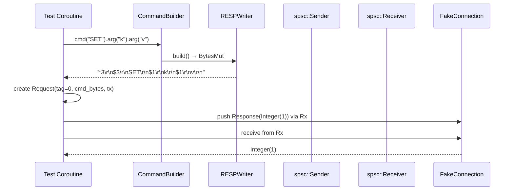

# Story 3.4 — Integration: encode command and send via spsc

**Objective:** Full integration test — build a command, encode it, create a Request with an spsc channel, verify the wire format is correct, and simulate the connection loop receiving and dispatching the response.

**Epic:** 3 — Protocol Crate

**Dependencies:** Story 3.3

**Status:** COMPLETE — `FakeConnection` test helper implemented, all protocol integration tests pass.

**Source docs:** `docs/05-protocol-layer-design.md`, `docs/Epics/Epic_3/Story_0.md`

## Integration Flow

## Code Anchors

- `src/protocol/fake.rs` — `FakeConnection`, `FakeResponse`, and helper functions

## Tasks

- [x] Create `FakeConnection` test helper that:
  - Captures sent commands (BytesMut) via `captured_commands()`
  - Provides canned responses via `FakeResponse`
  - Decodes commands for wire-format verification
  - Dispatches canned responses via spsc channel
- [x] `assert_encoding()` — verify command builder output matches expected RESP bytes
- [x] `assert_command_response()` — build command, send through FakeConnection, verify response
- [x] `assert_encoding_order()` — verify multiple commands encode in declaration order
- [x] Test: Build SET key value command → encode → verify BytesMut matches wire format
- [x] Test: Build GET key command → encode → verify bytes → verify receiver gets Integer(42) with spsc channel
- [x] Test: Pipeline ordering — build 3 commands, verify they are encoded in declaration order
- [x] Test: Tag uniqueness — 100 sequential requests, all tags are unique and monotonic

## Verification

- `src/protocol/fake.rs` — 10 tests:
  - `test_fake_connection_single_command` — ping → Integer(42)
  - `test_fake_connection_bulk_string_response` — GET → BulkString
  - `test_fake_connection_array_response` — KEYS → Array
  - `test_fake_connection_null_response` — GET missing → Null
  - `test_fake_connection_captured_commands` — verify 3 commands captured in order
  - `test_fake_connection_captured_responses` — verify responses captured
  - `test_assert_encoding` — SET key value → correct RESP bytes
  - `test_assert_encoding_order` — 3 commands encode in declaration order
  - `test_assert_command_response` — PING → PONG roundtrip
  - `test_tag_counter_monotonic` — tag counter behavior
- All protocol tests pass: 14 command encoding + 5 builder + 10 FakeConnection = 29 total
- `cargo clippy` — zero warnings
