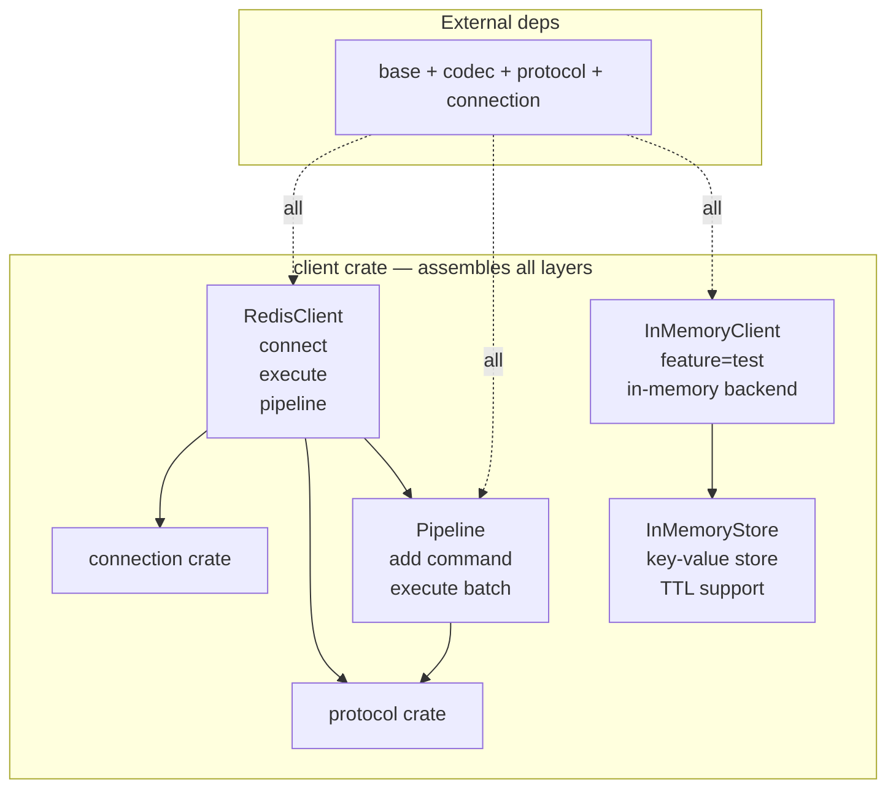
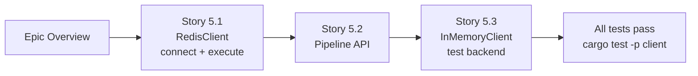

# Epic 5 — Client Crate

**Objective:** Implement the user-facing API — `RedisClient` for single commands, `Pipeline` for batch commands, and `InMemoryClient` for test isolation.

**Dependencies:** Epic 0 (scaffolding) + Epic 1 (base) + Epic 2 (codec) + Epic 3 (protocol) + Epic 4 (connection)

**Source docs:** `docs/07-client-api-design.md`

## Crate Overview

## Implementation Order

