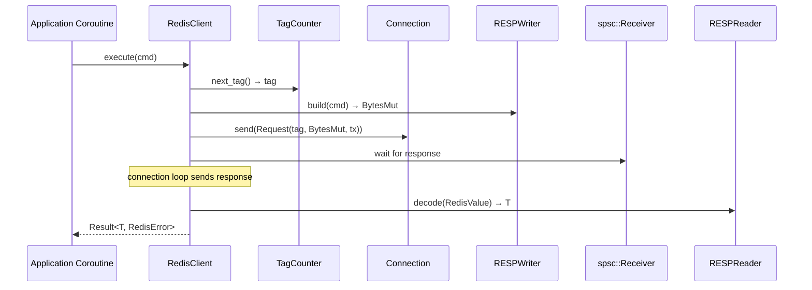

# Story 5.1 — RedisClient: connect + execute

**Objective:** Implement the `RedisClient` entry point with `connect()` and `execute()` methods.

**Epic:** 5 — Client Crate

**Dependencies:** Epic 0 (scaffolding) + Epic 1 (base) + Epic 2 (codec) + Epic 3 (protocol) + Epic 4 (connection)

**Source docs:** `docs/07-client-api-design.md`

## Code Anchors

- `crates/client/src/lib.rs` — `pub struct RedisClient`
- `crates/client/src/client.rs` — implementation

## Structs

```rust
pub struct RedisClient {
    inner: Arc<InnerClient>,
}

struct InnerClient {
    connection: Arc<Connection>,
    tag_counter: Arc<TagCounter>,
}
```

## Methods

```rust
impl RedisClient {
    pub fn connect(url: &str) -> Result<Self, ConnectionError>;
    pub fn execute<T: FromRedisValue>(&self, cmd: CommandBuilder) -> Result<T, RedisError>;
}
```

## Execute Flow



## Tasks

1. Define `RedisClient` wrapping `Arc<InnerClient>`
2. Define `InnerClient` with connection + tag_counter
3. Implement `connect(url: &str)` — parses URL, calls `TcpConnector::connect`, wraps in RedisClient
4. Implement `execute<T: FromRedisValue>(&self, cmd: CommandBuilder)` — the full flow:
   - Create Request with next tag
   - Use codec to encode CommandBuilder into BytesMut
   - Push Request to connection's mpsc queue
   - Wait on spsc receiver for response
   - Decode RedisValue → T via FromRedisValue
   - Return Result<T, RedisError>
5. Implement `Commands` trait impl for `&RedisClient` — all 14 methods from Epic 3
6. Add `ping(&self)` convenience method → execute `PING` → expect SimpleString "PONG"

## Verification

- `cargo test -p client` — at least 4 unit tests:
  - `test_redis_client_struct` — RedisClient is constructible from mock
  - `test_execute_builds_command` — verify CommandBuilder is built correctly
  - `test_from_redis_value_extraction` — simulate response, verify type extraction
  - `test_commands_trait_methods_exist` — all 14 trait methods are callable
- `cargo clippy -p client` — zero warnings
- No may import at crate level (may is only used transitively through connection crate)
