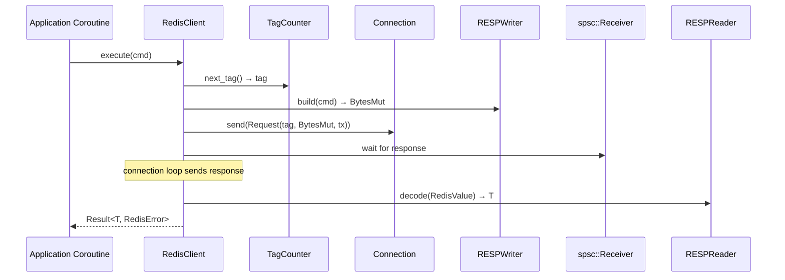

# Story 5.1 — RedisClient: connect + execute

**Objective:** Implement the `RedisClient` entry point with `connect()` and `execute()` methods.

**Epic:** 5 — Client Crate

**Dependencies:** Epic 0 (scaffolding) + Epic 1 (base) + Epic 2 (codec) + Epic 3 (protocol) + Epic 4 (connection)

**Source docs:** `docs/07-client-api-design.md`

## Requirements

### Functional Requirements

| # | Requirement | Priority |
|---|---|---|
| FR-1 | `RedisClient::connect(url: &str)` parses redis:// URL and establishes TCP connection to Redis server | P0 |
| FR-2 | `RedisClient::execute<T: FromRedisValue>(&self, cmd: CommandBuilder)` sends a command and waits for response | P0 |
| FR-3 | `execute()` uses the connection's request queue to push the serialized command | P0 |
| FR-4 | `execute()` waits on an spsc channel receiver for the response | P0 |
| FR-5 | `execute()` decodes the `RedisValue` response using `FromRedisValue` trait | P0 |
| FR-6 | `execute()` returns `Result<T, RedisError>` — typed success or parse/wire error | P0 |
| FR-7 | `RedisClient` wraps internal state in `Arc<InnerClient>` for shared ownership across coroutines | P0 |
| FR-8 | Monotonically increasing tags are assigned to each request for response matching | P1 |
| FR-9 | `Commands` trait is implemented on `&RedisClient` — all 14 methods from Epic 3 | P1 |
| FR-10 | `ping(&self)` convenience method sends PING and expects "PONG" response | P2 |

### Non-Functional Requirements

| # | Requirement | Priority |
|---|---|---|
| NFR-1 | No direct `may` import at crate level — may is used transitively through the connection crate only | P0 |
| NFR-2 | `RedisClient` is `Clone` — multiple coroutines can share the same client | P1 |
| NFR-3 | Thread-safe: `RedisClient` must be `Send + Sync` for cross-coroutine use | P1 |
| NFR-4 | No blocking waits on spsc channels without timeout — must use may-aware yielding | P0 |
| NFR-5 | Zero `unwrap()`/`expect()` in production code — use `?` and `Result` propagation | P1 |

## Code Anchors

- `crates/client/src/lib.rs` — `pub struct RedisClient`
- `crates/client/src/client.rs` — implementation

## Structs

```rust
pub struct RedisClient {
    inner: Arc<InnerClient>,
}

struct InnerClient {
    connection: Arc<Connection>,
    tag_counter: Arc<AtomicUsize>,
}
```

## Methods

```rust
impl RedisClient {
    pub fn connect(url: &str) -> Result<Self, ConnectionError>;
    pub fn execute<T: FromRedisValue>(&self, cmd: CommandBuilder) -> Result<T, RedisError>;
}
```

## Execute Flow



## Implementation Tasks

- [ ] Define `RedisClient` struct wrapping `Arc<InnerClient>`
- [ ] Define `InnerClient` struct with `Arc<Connection>` + `Arc<AtomicUsize>` tag counter
- [ ] Implement `connect(url: &str)` — parses URL, calls `TcpConnector::connect`, wraps in `RedisClient`
- [ ] Implement `execute<T: FromRedisValue>(&self, cmd: CommandBuilder)`:
  - [ ] Create Request with next tag from `tag_counter`
  - [ ] Use `RESPWriter` to encode `CommandBuilder` into `BytesMut`
  - [ ] Push `Request` to connection's mpsc queue
  - [ ] Wait on spsc receiver for response `RedisValue`
  - [ ] Decode `RedisValue` → `T` via `FromRedisValue`
  - [ ] Return `Result<T, RedisError>`
- [ ] Implement `Commands` trait impl for `&RedisClient` — all 14 methods from Epic 3
- [ ] Implement `ping(&self)` convenience method → executes `PING` → expects `SimpleString("PONG")`
- [ ] Implement `Clone` for `RedisClient`
- [ ] Implement `Send + Sync` bounds on `RedisClient`

## Verification

### Unit Tests (minimum 4)

- [ ] `test_redis_client_struct` — RedisClient is constructible
- [ ] `test_execute_builds_command` — verify CommandBuilder is encoded correctly
- [ ] `test_from_redis_value_extraction` — simulate response, verify type extraction
- [ ] `test_commands_trait_methods_exist` — all 14 trait methods are callable
- [ ] `test_client_clone` — cloned client shares underlying connection
- [ ] `test_ping` — sends PING, receives PONG

### Lint & Build

- [ ] `cargo test -p client` — all tests pass
- [ ] `cargo clippy -p client` — zero warnings
- [ ] `cargo fmt -p client` — formatted
- [ ] No direct `may` import in `crates/client/src/` (may is only used transitively through connection crate)
