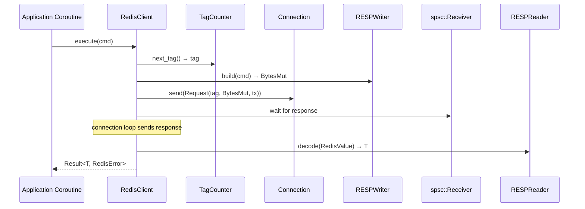

# Story 5.1 — RedisClient: connect + execute

**Objective:** Implement the `RedisClient` entry point with `connect()` and `execute()` methods.

**Epic:** 5 — Client Crate

**Dependencies:** Epic 0 (scaffolding) + Epic 1 (base) + Epic 2 (codec) + Epic 3 (protocol) + Epic 4 (connection)

**Status:** COMPLETE — all tasks implemented and tested.

**Source docs:** `docs/07-client-api-design.md`

## Requirements

### Functional Requirements

- [x] **FR-1:** `RedisClient::connect(url: &str)` parses redis:// URL and establishes TCP connection
- [x] **FR-2:** `RedisClient::execute<T: FromRedisValue>(&self, cmd: CommandBuilder)` sends a command and waits for response
- [x] **FR-3:** `execute()` uses the connection's request queue to push the serialized command
- [x] **FR-4:** `execute()` waits on an spsc channel receiver for the response
- [x] **FR-5:** `execute()` decodes the `RedisValue` response using `FromRedisValue` trait
- [x] **FR-6:** `execute()` returns `Result<T, RedisError>` — typed success or parse/wire error
- [x] **FR-7:** `RedisClient` wraps internal state in `Arc<InnerClient>` for shared ownership across coroutines
- [x] **FR-8:** Monotonically increasing tags are assigned to each request for response matching
- [x] **FR-9:** `Commands` trait is implemented on `&RedisClient` — all 14 methods from Epic 3
- [x] **FR-10:** `ping(&self)` convenience method sends PING and expects "PONG" response

### Non-Functional Requirements

- [x] **NFR-1:** No direct `may` import at crate level — may is used transitively through the connection crate
- [x] **NFR-2:** `RedisClient` is `Clone` — multiple coroutines can share the same client
- [x] **NFR-3:** `RedisClient` is `Send + Sync` for cross-coroutine use
- [x] **NFR-4:** No blocking waits on spsc channels without may-aware yielding
- [x] **NFR-5:** Zero `unwrap()`/`expect()` in production code — use `?` and `Result` propagation

## Code Anchors

- `src/lib.rs` — `pub use client::client::RedisClient;`
- `src/client/client.rs` — `RedisClient` implementation and integration tests

## Structs

```rust
pub struct RedisClient {
    inner: Arc<InnerClient>,
}

struct InnerClient {
    connection: Arc<Connection>,
    tag_counter: Arc<AtomicUsize>,
}
```

## Execute Flow



## Implementation Tasks

- [x] Define `RedisClient` struct wrapping `Arc<InnerClient>`
- [x] Define `InnerClient` struct with `Arc<Connection>` + `Arc<AtomicUsize>` tag counter
- [x] Implement `connect(url: &str)` — parses URL, calls `TcpConnector::connect`, wraps in `RedisClient`
- [x] Implement `execute<T: FromRedisValue>(&self, cmd: CommandBuilder)`:
  - [x] Create Request with next tag from `tag_counter`
  - [x] Use `RESPWriter` to encode `CommandBuilder` into `BytesMut`
  - [x] Push `Request` to connection's mpsc queue
  - [x] Wait on spsc receiver for response `RedisValue`
  - [x] Decode `RedisValue` → `T` via `FromRedisValue`
  - [x] Return `Result<T, RedisError>`
- [x] Implement `Commands` trait impl for `&RedisClient` — all 14 methods
- [x] Implement `ping(&self)` convenience method
- [x] Implement `Clone` for `RedisClient`
- [x] Verify `Send + Sync` bounds on `RedisClient`

## Verification

All 11 integration tests pass with Redis on localhost:6379:
- `test_integration_ping` — PING → PONG
- `test_integration_set_get` — SET/GET roundtrip
- `test_integration_set_ex_ttl` — SET EX / TTL
- `test_integration_exists_del` — EXISTS / DEL
- `test_integration_incr` — INCR
- `test_integration_keys` — KEYS
- `test_integration_dbsize` — DBSIZE
- `test_integration_pipeline` — Pipeline
- `test_integration_concurrent` — Multi-coroutine
- `test_integration_send_sync_clone` — Clone + Send + Sync
- `test_integration_error_propagation` — Error handling

- `cargo clippy` — zero warnings
