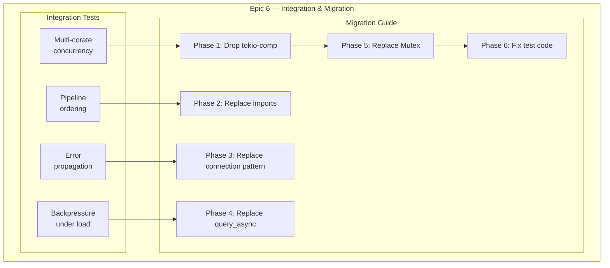
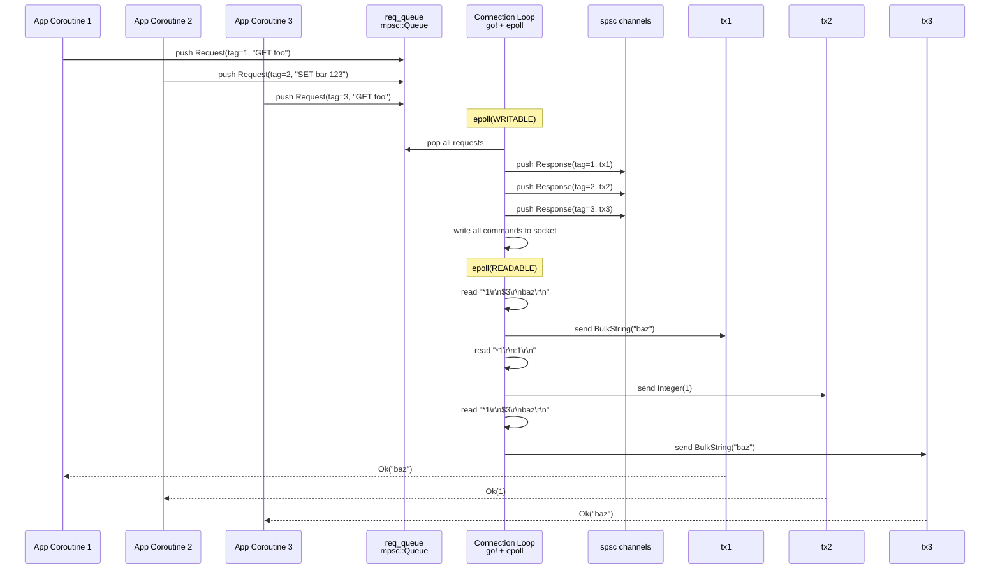

# Epic 6 — Integration & Migration

**Objective:** Full integration testing across all crates, multi-coroutine concurrency testing, and the migration guide from the `redis` crate to `may-redis` for Sesame-IDAM.

**Dependencies:** All previous epics (0-5)

**Source docs:** `docs/09-migration-guide.md`, `docs/10-test-strategy.md`

## Epic Overview

## Concurrency Model

## Implementation Order

