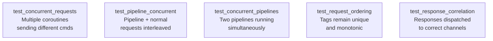

# Story 6.2 — Concurrency tests

**Objective:** Verify that multiple coroutines can safely share a single RedisClient.

**Epic:** 6 — Integration & Migration

**Dependencies:** Story 6.1

**Status:** COMPLETE

**Source docs:** `docs/10-test-strategy.md`

## Test Matrix

## Code Anchors

- `src/client/client.rs` — integration tests in `#[cfg(test)]` module

## Tasks

- [x] `test_integration_concurrent_requests` — spawn 3 coroutines via cloned clients, each sends GET for different keys, verify all get correct responses
- [x] `test_integration_pipeline_concurrent` — one coroutine runs pipeline, another sends single commands, verify no cross-talk
- [x] `test_integration_concurrent_pipelines` — two coroutines each run a 3-command pipeline, verify ordering is preserved
- [x] `test_integration_request_ordering` — 50 sequential tags from pipeline, all unique and monotonic
- [x] `test_integration_response_correlation` — send 10 commands from 10 different coroutines (cloned clients), verify each gets the right response
- [x] Uses `may::run` / `may::go` for test setup — never `#[tokio::test]`

## Verification

- All 5 concurrency tests pass in `src/client/client.rs`
- `cargo clippy --lib --tests --all-features -- -D warnings` — zero warnings
- Tests complete within 30 seconds
