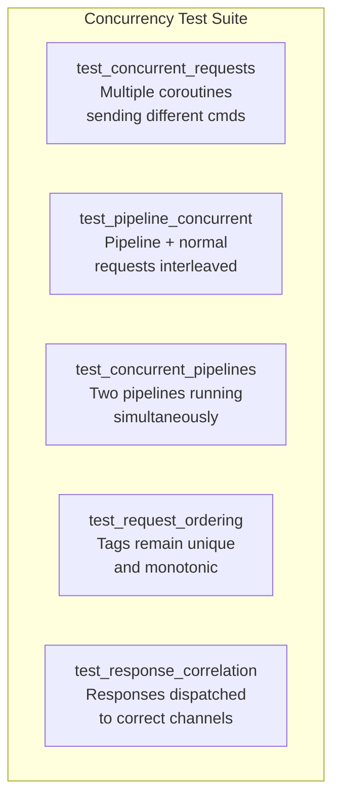

# Story 6.2 — Concurrency tests

**Objective:** Verify that multiple coroutines can safely share a single RedisClient.

**Epic:** 6 — Integration & Migration

**Dependencies:** Story 6.1

**Source docs:** `docs/10-test-strategy.md`

## Test Matrix

## Code Anchors

- `crates/client/tests/concurrency_tests.rs` — integration tests requiring may runtime + Redis

## Tasks

1. Create `crates/client/tests/concurrency_tests.rs`
2. Test: `test_concurrent_requests` — spawn 3 coroutines, each sends GET for different keys, verify all get correct responses
3. Test: `test_pipeline_concurrent` — one coroutine runs pipeline, another sends single commands, verify no cross-talk
4. Test: `test_concurrent_pipelines` — two coroutines each run a 3-command pipeline, verify ordering is preserved
5. Test: `test_request_ordering` — 100 sequential tags from multiple coroutines, all unique and monotonic
6. Test: `test_response_correlation` — send 10 commands from 10 different coroutines, verify each gets the right response
7. Use `may::run` / `may::go` for test setup — never `#[tokio::test]`

## Verification

- `cargo test -p client --test concurrency_tests` — all 5 tests pass
- Each test runs in `may::run` context
- Tests complete within 30 seconds
- `cargo clippy -p client` — zero warnings
