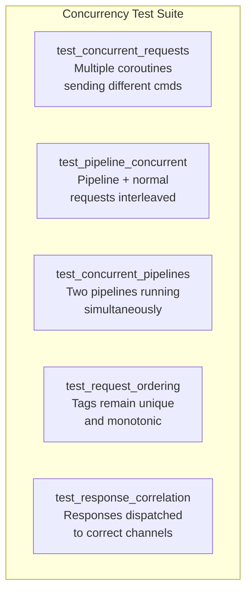

# Story 6.2 — Concurrency tests

**Objective:** Verify that multiple coroutines can safely share a single RedisClient.

**Epic:** 6 — Integration & Migration

**Dependencies:** Story 6.1

**Status:** PARTIAL — one concurrent test exists but the full test matrix from the story is not implemented.

**Source docs:** `docs/10-test-strategy.md`

## Test Matrix

## Code Anchors

- `src/client/client.rs` — integration tests in `#[cfg(test)]` module

## Tasks

- [x] `test_integration_concurrent` exists — verifies multiple coroutines can share one client
- [ ] `test_concurrent_requests` — spawn 3 coroutines, each sends GET for different keys, verify all get correct responses
- [ ] `test_pipeline_concurrent` — one coroutine runs pipeline, another sends single commands, verify no cross-talk
- [ ] `test_concurrent_pipelines` — two coroutines each run a 3-command pipeline, verify ordering is preserved
- [ ] `test_request_ordering` — 100 sequential tags from multiple coroutines, all unique and monotonic
- [ ] `test_response_correlation` — send 10 commands from 10 different coroutines, verify each gets the right response
- [x] Uses `may::run` / `may::go` for test setup — never `#[tokio::test]`

## Verification

- `test_integration_concurrent` passes — one concurrency test exists
- **Gap:** Full 5-test concurrency suite not implemented:
  - Missing: concurrent requests, pipeline + normal interleaving, concurrent pipelines, tag ordering verification, response correlation
- Tests complete within 30 seconds
- `cargo clippy` — zero warnings
