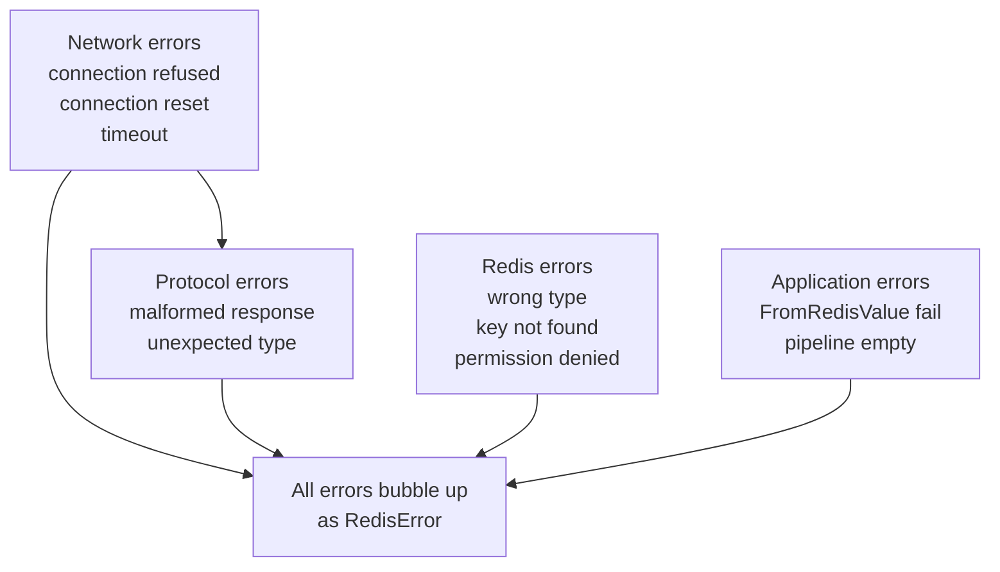

# Story 6.3 — Error handling and edge cases

**Objective:** Comprehensive error handling tests covering all failure modes.

**Epic:** 6 — Integration & Migration

**Dependencies:** Story 6.2

**Source docs:** `docs/10-test-strategy.md`

## Error Scenarios

## Code Anchors

- `crates/client/tests/error_tests.rs` — error handling integration tests

## Tasks

1. Create `crates/client/tests/error_tests.rs`
2. Test: Connection refused — attempt to connect to non-existent server, verify ConnectionError
3. Test: Protocol error — simulate malformed RESP response, verify Parse error
4. Test: Wrong type extraction — response is Integer but caller expects String, verify FromRedisValue error
5. Test: Empty pipeline — execute pipeline with no commands, verify error
6. Test: Server returns error — Redis returns "-ERR msg\r\n", verify RedisError bubbles up with correct message
7. Test: Null response — response is `$-1\r\n`, verify Null → appropriate FromRedisValue result

## Verification

- `cargo test -p client --test error_tests` — all 7 tests pass
- Each test produces a RedisError (not a panic or unwrap failure)
- Error messages are descriptive and include the operation context
