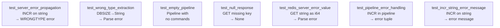

# Story 6.3 — Error handling tests

**Objective:** Verify error propagation from the server through the client layer.

**Epic:** 6 — Integration & Migration

**Dependencies:** Story 6.2

**Status:** COMPLETE

**Source docs:** `docs/10-test-strategy.md`

## Test Matrix

## Code Anchors

- `src/client/client.rs` — error handling tests at end of `tests` module

## Tasks

- [x] `test_integration_server_error_propagation` — INCR on string value → WRONGTYPE server error propagates as `Err`
- [x] `test_integration_wrong_type_extraction` — DBSIZE (Integer) extracted as String → Parse error
- [x] `test_integration_empty_pipeline` — Pipeline with no commands added → returns `Ok(vec![])`
- [x] `test_integration_null_response_handling` — GET missing key → `None`; GET existing key → `Some("val")`
- [x] `test_integration_redis_server_error_value` — GET string value as `i64` → Parse error
- [x] `test_integration_pipeline_error_handling` — Pipeline with INCR on string → `(i64, Option<String>)` tuple errors
- [x] `test_integration_incr_string_error_message` — INCR on string → non-empty error message

## Verification

- All 7 error handling tests pass in `src/client/client.rs`
- `cargo clippy --lib --tests --all-features -- -D warnings` — zero warnings
- Tests verify both happy-path and error-path behavior
