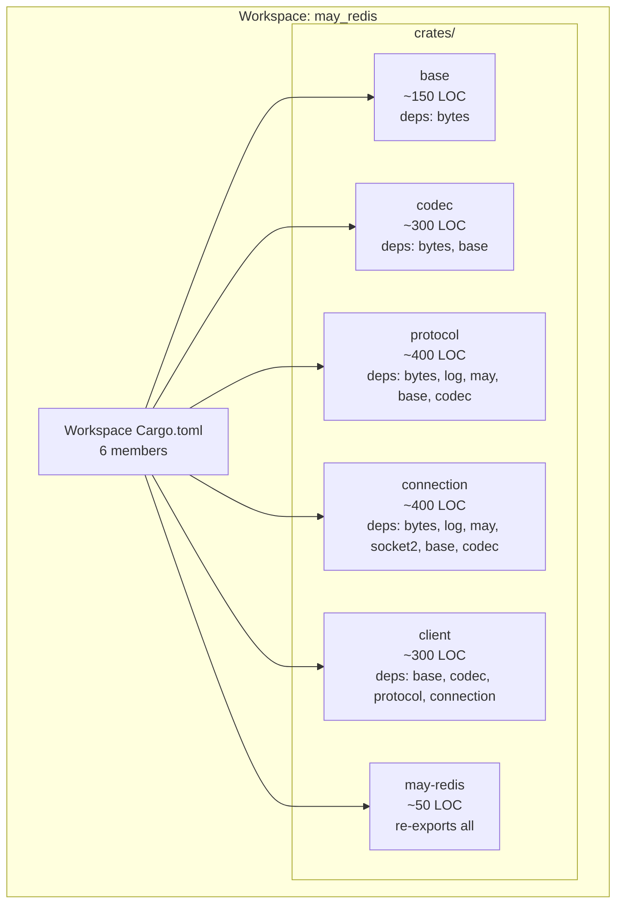
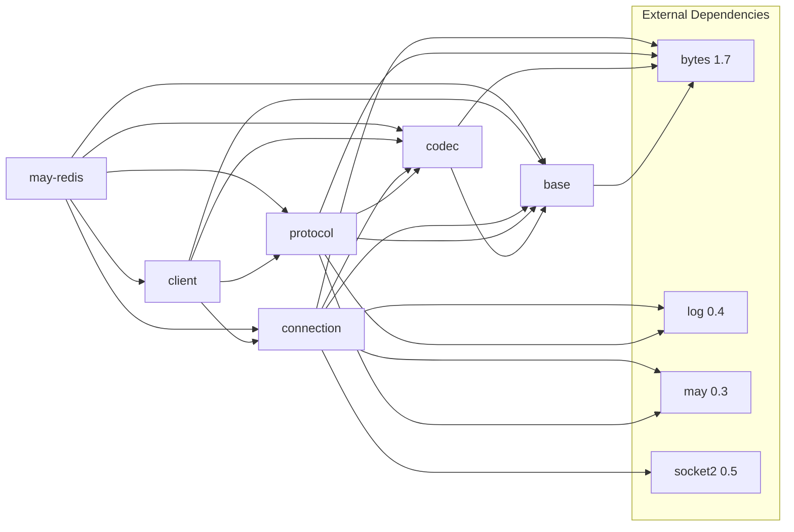
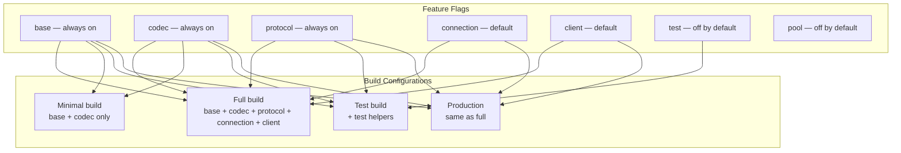

# Epic 0 — Scaffolding

**Objective:** Set up the workspace structure, Cargo.toml configuration, CI tooling, and developer workflow. This is the foundation that every subsequent epic depends on.

**Dependencies:** None (first epic)

**Source docs:** `docs/08-module-structure.md`, `docs/11-dependencies.md`, `docs/09-migration-guide.md`

## Workspace Goal



## Dependency Graph



## Feature Flag Matrix



## Stories

### Story 0.1 — Workspace Cargo.toml

**Goal:** Create the root `Cargo.toml` workspace definition with all 6 crates listed as members.

**Code anchors:**
- `Cargo.toml` — workspace definition
- `crates/base/Cargo.toml`
- `crates/codec/Cargo.toml`
- `crates/protocol/Cargo.toml`
- `crates/connection/Cargo.toml`
- `crates/client/Cargo.toml`
- `crates/may-redis/Cargo.toml`

**Tasks:**
1. Create root `Cargo.toml` with workspace members array containing all 6 crates
2. Define `[workspace.package]` with shared version (0.1.0), edition (2021), license (MIT OR Apache-2.0), repository URL
3. Define `[workspace.dependencies]` with shared dependency versions: bytes = "1.7", log = "0.4", may = { version = "0.3", default-features = false }, socket2 = "0.5"
4. Define internal crate path aliases: base, codec, protocol, connection, client
5. Create each crate's `Cargo.toml` with correct `[dependencies]` referencing workspace deps and internal crates
6. Create `crates/may-redis/Cargo.toml` with feature flags (connection, client, pool, test)

**Verification:**
- `cargo build --workspace` succeeds
- `cargo check -p base` succeeds
- `cargo check -p codec` succeeds
- `cargo check -p protocol` succeeds
- `cargo check -p connection` succeeds
- `cargo check -p client` succeeds
- `cargo check -p may-redis` succeeds
- All 6 crates appear in `cargo metadata --format-version 1 | jq '.packages[].name'`

---

### Story 0.2 — Module structure and lib.rs stubs

**Goal:** Create the `src/` directory structure under each crate with `lib.rs` files containing module declarations and `//!` documentation.

**Code anchors:**
- `crates/base/src/lib.rs` — `//! Core types for may_redis\n//!\n//! This crate provides the fundamental Redis data types and conversion traits.\n//! No external runtime dependency — works with or without may.\n//!\n//! # Examples\n//!\n//! ```rust\n//! use base::{RedisValue, FromRedisValue};\n//! let v = RedisValue::Integer(42);\n//! let n: i64 = FromRedisValue::from_redis_value(&v).unwrap();\n//! assert_eq!(n, 42);\n//! ```\npub mod base;`
- `crates/codec/src/lib.rs` — `//! RESP protocol codec\n//!\n//! Encoding and decoding of the Redis Serialization Protocol (RESP).\n//! Pure data transformation — no network, no coroutine runtime.\n//!\n//! # Architecture\n//!\n//! ```mermaid\n//! graph LR\n//!     Args[Rust Args] --> Write[RESPWriter]\n//!     Write --> Wire[BytesMut]\n//!     Wire --> Read[RESPReader]\n//!     Read --> Native[Rust Types]\n//! ```\npub mod codec;`
- `crates/protocol/src/lib.rs` — `//! Redis command protocol\n//!\n//! Command building and request/response management.\n//! Depends on may for coroutine channel support.\n//!\n//! # Architecture\n//!\n//! ```mermaid\n//! graph TB\n//!     Builder[CommandBuilder] --> Encode[encode to BytesMut]\n//!     Commands[Commands trait] --> Builder\n//!     Request[Request + spsc channel] --> Dispatch[connection loop dispatch]\n//! ```\npub mod protocol;`
- `crates/connection/src/lib.rs` — `//! Connection loop and TCP transport\n//!\n//! epoll-based coroutine that manages a single TCP socket.\n//! Receives commands from multiple coroutines via mpsc queue,\n//! dispatches responses via spsc channels.\n//!\n//! # Architecture\n//!\n//! ```mermaid\n//! graph TB\n//!     Apps[App Coroutines] --> Queue[Arc<Queue<Request>>]\n//!     Queue --> Loop[epoll connection_loop go!]\n//!     Loop --> Socket[TcpStream]\n//!     Loop --> Codec[RESP decode]\n//!     Codec --> RespQueue[response_queue VecDeque]\n//!     RespQueue --> Apps\n//! ```\npub mod connection;`
- `crates/client/src/lib.rs` — `//! Public client API\n//!\n//! RedisClient entry point, Pipeline support, and user-facing API.\n//! Assembles base + codec + protocol + connection into a usable client.\n//!\n//! # Architecture\n//!\n//! ```mermaid\n//! graph TB\n//!     User[User Code] --> Client[RedisClient]\n//!     Client --> Connect[connect]\n//!     Client --> Execute[execute]\n//!     Client --> Pipeline[pipeline]\n//!     Connect --> Conn[connection crate]\n//!     Execute --> Proto[protocol crate]\n//!     Pipeline --> Proto\n//! ```\npub mod client;`
- `crates/may-redis/src/lib.rs` — `//! may-redis — A coroutine-native Redis client for the may runtime\n//!\n//! Zero tokio. Zero async-await. Only may coroutines.\n//!\n//! # Re-exports\n//!\n//! ```rust\n//! // Connect to Redis\n//! use may_redis::RedisClient;\n//! let client = RedisClient::connect("redis://localhost:6379")?;\n//! ```\npub use base;`

**Tasks:**
1. Create `crates/*/src/lib.rs` for all 6 crates with module declarations and `//!` doc comments
2. Create `crates/*/src/base.rs`, `crates/*/src/codec.rs`, etc. for each module (flat structure within crate)
3. Each `lib.rs` should include the architecture mermaid diagram and example usage
4. Verify all modules resolve (no circular deps)

**Verification:**
- `cargo build --workspace` succeeds with all 6 crates
- `cargo doc --workspace --no-deps` builds without errors
- All `lib.rs` files contain `//!` module-level documentation
- All `lib.rs` files contain mermaid architecture diagrams

---

### Story 0.3 — Lint configuration and CI tooling

**Goal:** Configure clippy deny-lints, format configuration, and ensure the codebase enforces quality standards from day one.

**Code anchors:**
- `Cargo.toml` — workspace lint configuration
- `.cargo/config.toml` — optional build config
- `crates/base/Cargo.toml` — crate-level lint config
- `crates/codec/Cargo.toml` — crate-level lint config
- `crates/protocol/Cargo.toml` — crate-level lint config
- `crates/connection/Cargo.toml` — crate-level lint config
- `crates/client/Cargo.toml` — crate-level lint config
- `crates/may-redis/Cargo.toml` — crate-level lint config

**Tasks:**
1. Add `[lints.clippy]` section to root `Cargo.toml`:
   - `all = { level = "deny", priority = -1 }`
   - `pedantic = { level = "deny", priority = -1 }`
   - `nursery = { level = "deny", priority = -1 }`
   - Allow rules for library code: `cast_precision_loss`, `cast_possible_truncation`, `cast_sign_loss`, `module_name_repetitions`, `struct_excessive_bools`, `too_many_lines`, `missing_errors_doc`, `missing_panics_doc`, `missing_safety_doc`
2. Add `[lints.clippy]` to each crate's `Cargo.toml` with inherited workspace config
3. Ensure `cargo fmt` and `cargo clippy --workspace --all-targets --all-features` pass on empty stubs

**Verification:**
- `cargo fmt --check` succeeds (all files formatted)
- `cargo clippy --workspace --all-targets --all-features` succeeds (no deny-level warnings)
- All allow-listed rules are documented with comments explaining why they are allowed

---

### Story 0.4 — Documentation structure

**Goal:** Organize the reference documentation and create the initial project README.

**Code anchors:**
- `README.md` — project overview, architecture summary, getting started
- `docs/01-protocol-analysis.md` — reference: RESP wire format (moved from root)
- `docs/02-may_postgres_comparison.md` — reference: may_postgres patterns (moved from root)
- `docs/03-sesame-idam-redis-usage.md` — reference: Sesame-IDAM usage (moved from root)
- `docs/Epics/` — epic definitions
- `docs/Epics/00-epic-overview.md` — epic overview (this file)

**Tasks:**
1. Create `README.md` with:
   - Project title and description
   - Architecture diagram (mermaid) showing the 5-phase dependency chain
   - "How it works" section explaining may coroutines vs tokio
   - "Workspace structure" listing all crates
   - "Reference docs" linking to the 3 reference documents in `docs/`
   - "Epic plan" linking to `docs/Epics/00-epic-overview.md`
2. Move `08-module-structure.md`, `09-migration-guide.md`, `11-dependencies.md` into `docs/Epics/epic-0-scaffolding/docs/`
3. Keep `01-protocol-analysis.md`, `02-may_postgres_comparison.md`, `03-sesame-idam-redis-usage.md` in `docs/` as read-only references
4. Add `docs/Epics/00-epic-overview.md` as the epic index

**Verification:**
- `README.md` renders correctly and contains architecture mermaid diagram
- All reference docs are accessible from README
- All epics are listed in README with links
