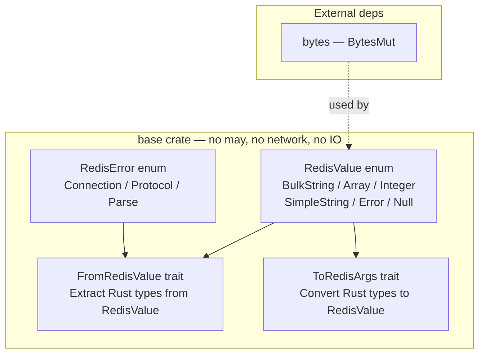
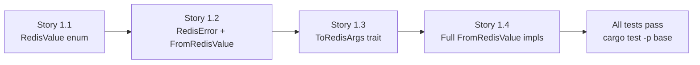

# Epic 1 — Base Crate

**Objective:** Implement the core Redis data types and conversion traits. This crate has **no may dependency**, **no network dependency**, and can be tested with plain `#[test]`. It is the foundation of everything else.

**Dependencies:** Epic 0 (scaffolding)

**Source docs:** `docs/Epics/epic-0-scaffolding/docs/08-module-structure.md`, `docs/Epics/epic-0-scaffolding/docs/11-dependencies.md`

## Crate Overview



## Implementation Order (Within Epic)



---

### Story 1.1 — RedisValue enum

**Goal:** Implement the `RedisValue` enum representing all Redis data types. This is the single most important type in the crate.

**Code anchors:**
- `crates/base/src/lib.rs` — `pub enum RedisValue { ... }`
- `crates/base/src/redis_value.rs` — `impl RedisValue` blocks

**Struct:**

```rust
pub enum RedisValue {
    BulkString(Vec<u8>),
    Array(Vec<RedisValue>),
    Integer(i64),
    SimpleString(String),
    Error(String),
    Null,
}
```

**Tasks:**
1. Define `RedisValue` enum with all 6 variants
2. Implement `Clone`, `Debug`, `Eq`, `PartialEq`, `Hash` for `RedisValue`
3. Implement `Default` (return `Null`)
4. Add `is_null()`, `is_error()`, `is_integer()` accessor methods
5. Add `as_integer()`, `as_str()`, `as_bytes()`, `as_array()` accessor methods returning `Option<T>`

**Verification:**
- `cargo test -p base` — at least 5 unit tests:
  - `test_redis_value_integer_variant` — create Integer, verify variant
  - `test_redis_value_bulk_string_variant` — create BulkString, verify bytes
  - `test_redis_value_array_variant` — create nested array, verify structure
  - `test_redis_value_is_null` — Null returns true from is_null()
  - `test_redis_value_clone` — clone and verify equality
- `cargo clippy -p base` — zero warnings

---

### Story 1.2 — RedisError + FromRedisValue trait

**Goal:** Implement the `RedisError` enum and the `FromRedisValue` trait.

**Code anchors:**
- `crates/base/src/redis_error.rs` — `pub enum RedisError { ... }`
- `crates/base/src/from_redis_value.rs` — `pub trait FromRedisValue`

**Struct:**

```rust
pub enum RedisError {
    Connection(String),
    Protocol(String),
    Parse(String),
    Other(String),
}

pub trait FromRedisValue: Sized {
    fn from_redis_value(value: &RedisValue) -> Result<Self, RedisError>;
}
```

**Tasks:**
1. Define `RedisError` enum with Connection, Protocol, Parse, Other variants
2. Implement `std::error::Error`, `std::fmt::Display`, `std::fmt::Debug`, `From<String>` for `RedisError`
3. Define `pub type RedisResult<T> = Result<T, RedisError>;`
4. Define `FromRedisValue` trait with `from_redis_value` method
5. Implement `FromRedisValue` for `i64` (extract from Integer variant, error from others)
6. Implement `FromRedisValue` for `String` (extract from BulkString/SimpleString, error from others)
7. Implement `FromRedisValue` for `()` (extract from SimpleString "OK" or Integer 1)
8. Implement `FromRedisValue` for `bool` (extract from Integer 0 or 1)

**Verification:**
- `cargo test -p base` — at least 8 unit tests:
  - `test_from_redis_value_integer_to_i64` — Integer(42) → 42
  - `test_from_redis_value_integer_to_i64_wrong_type` — BulkString → Error
  - `test_from_redis_value_bulk_string_to_string` — BulkString(b"hello") → "hello"
  - `test_from_redis_value_simple_string_to_string` — SimpleString("OK") → "OK"
  - `test_from_redis_value_to_unit` — Integer(1) → ()
  - `test_from_redis_value_to_bool_true` — Integer(1) → true
  - `test_from_redis_value_to_bool_false` — Integer(0) → false
  - `test_from_redis_value_null_to_string` — Null → Parse error
- `test_redis_error_display` — error formatting
- `test_redis_error_from_string` — From<String> impl
- `cargo clippy -p base` — zero warnings

---

### Story 1.3 — ToRedisArgs trait

**Goal:** Implement the `ToRedisArgs` trait for converting Rust types to Redis command arguments.

**Code anchors:**
- `crates/base/src/to_redis_args.rs` — `pub trait ToRedisArgs` + impls

**Struct:**

```rust
pub trait ToRedisArgs {
    fn write_redis_args(&self, buf: &mut Vec<u8>);
    fn is_simple_arg(&self) -> bool;  // true if single bulk string, false if multi-part
}
```

**Tasks:**
1. Define `ToRedisArgs` trait with `write_redis_args` and `is_simple_arg` methods
2. Implement `ToRedisArgs` for `String` — writes raw bytes
3. Implement `ToRedisArgs` for `&str` — writes as bulk string
4. Implement `ToRedisArgs` for `i64` — writes decimal representation
5. Implement `ToRedisArgs` for `u32` — writes decimal representation
6. Implement `ToRedisArgs` for `&[u8]` — writes raw bytes
7. Implement `ToRedisArgs` for `Vec<String>` — writes each element as bulk string
8. Implement `ToRedisArgs` for `&[String]` — writes each element as bulk string

**Verification:**
- `cargo test -p base` — at least 6 unit tests:
  - `test_to_redis_args_string` — "SET" → writes "SET" bytes
  - `test_to_redis_args_i64` — 42i64 → writes "42" bytes
  - `test_to_redis_args_u32` — 60u32 → writes "60" bytes
  - `test_to_redis_args_str` — &str writes same as String
  - `test_to_redis_args_bytes` — &[u8] writes raw bytes
  - `test_to_redis_args_vec_string` — vec!["A","B"] writes both
- `cargo clippy -p base` — zero warnings

---

### Story 1.4 — Full FromRedisValue type coverage

**Goal:** Complete the `FromRedisValue` implementation for all types used by the Sesame-IDAM command set.

**Code anchors:**
- `crates/base/src/from_redis_value.rs` — additional impls

**Task types:**
1. Implement `FromRedisValue` for `Vec<String>` — extract from Array variant, each element from RedisValue → String
2. Implement `FromRedisValue` for `Vec<i64>` — extract from Array variant, each element from RedisValue → i64
3. Implement `FromRedisValue` for `Option<String>` — Null → None, BulkString → Some(string)
4. Implement `FromRedisValue` for `usize` — extract from Integer, handle negative (return error or 0)
5. Implement `FromRedisValue` for `Vec<RedisValue>` — direct from Array variant

**Verification:**
- `cargo test -p base` — at least 5 additional unit tests:
  - `test_from_redis_value_array_to_vec_string` — Array of 2 BulkStrings → Vec<String>
  - `test_from_redis_value_array_to_vec_i64` — Array of 2 Integers → Vec<i64>
  - `test_from_redis_value_null_to_option_string_none` — Null → None
  - `test_from_redis_value_bulk_string_to_option_string_some` — BulkString → Some("hello")
  - `test_from_redis_value_array_to_vec_redis_value` — Array → Vec<RedisValue>
- `cargo test -p base` total should be 18+ tests
- `cargo clippy -p base` — zero warnings
- `cargo doc -p base` — all public items documented
