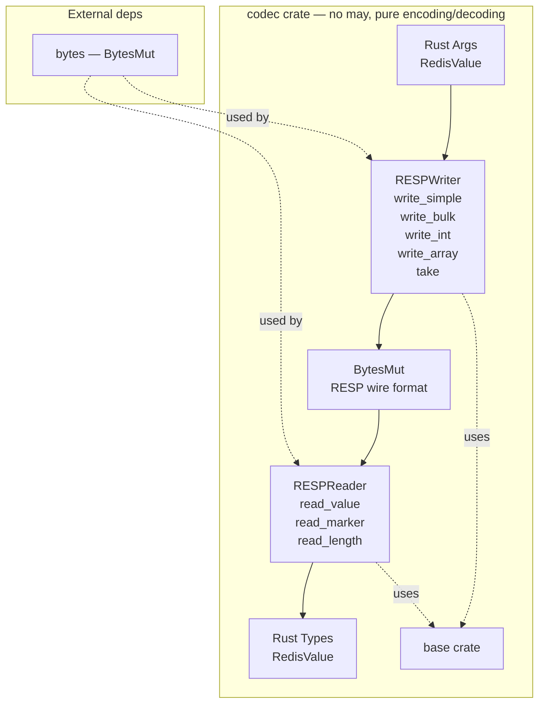
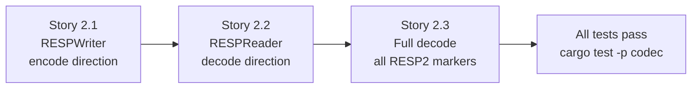

# Epic 2 — Codec Crate

**Objective:** Implement the RESP encoding/decoding codec. This crate depends on `base` + `bytes` but **still has no may dependency**. Pure data transformation — testable with plain `#[test]`.

**Dependencies:** Epic 0 (scaffolding) + Epic 1 (base)

**Source docs:** `docs/01-protocol-analysis.md`, `docs/Epics/epic-0-scaffolding/docs/05-protocol-layer-design.md`

## Crate Overview



## Implementation Order (Within Epic)



---

### Story 2.1 — RESPWriter (encode direction)

**Goal:** Implement the RESPWriter for encoding commands into RESP wire format.

**Code anchors:**
- `crates/codec/src/lib.rs` — `pub struct RESPWriter { buf: BytesMut }`
- `crates/codec/src/writer.rs` — implementation

**Struct:**

```rust
pub struct RESPWriter {
    buf: BytesMut,
}
```

**Methods:**
```rust
impl RESPWriter {
    pub fn new() -> Self;
    pub fn with_capacity(cap: usize) -> Self;
    pub fn write_simple(&mut self, s: &str);
    pub fn write_bulk(&mut self, data: &[u8]);
    pub fn write_int(&mut self, n: i64);
    pub fn write_array_header(&mut self, len: usize);
    pub fn write_array_value(&mut self, v: &RedisValue);
    pub fn write_null_bulk(&mut self);
    pub fn write_empty_array(&mut self);
    pub fn write_error(&mut self, msg: &str);
    pub fn take(&mut self) -> BytesMut;
}
```

**Tasks:**
1. Define `RESPWriter` with `buf: BytesMut`
2. Implement `new()` and `with_capacity()` constructors
3. Implement `write_simple(s: &str)` — writes `+{s}\r\n`
4. Implement `write_bulk(data: &[u8])` — writes `${len}\r\n{data}\r\n`
5. Implement `write_int(n: i64)` — writes `:{n}\r\n`
6. Implement `write_array_header(len: usize)` — writes `*{len}\r\n`
7. Implement `write_array_value(v: &RedisValue)` — dispatches to correct write_* method
8. Implement `write_null_bulk()` — writes `$-1\r\n`
9. Implement `write_empty_array()` — writes `*0\r\n`
10. Implement `write_error(msg: &str)` — writes `-{msg}\r\n`
11. Implement `take()` — returns the buffer and starts a new empty one

**Verification:**
- `cargo test -p codec` — at least 8 unit tests:
  - `test_write_simple_ok` — "OK" → "+OK\r\n"
  - `test_write_bulk_hello` — b"hello" → "$5\r\nhello\r\n"
  - `test_write_int_42` — 42 → ":42\r\n"
  - `test_write_array_header_3` — 3 → "*3\r\n"
  - `test_write_null_bulk` — `$-1\r\n`
  - `test_write_empty_array` — `*0\r\n`
  - `test_write_error_err_msg` — "ERR msg" → "-ERR msg\r\n"
  - `test_take_returns_and_resets` — take empty, write again, take again
- `cargo clippy -p codec` — zero warnings
- No may import anywhere in the crate

---

### Story 2.2 — RESPReader (decode direction)

**Goal:** Implement the RESPReader for decoding RESP wire format into RedisValue.

**Code anchors:**
- `crates/codec/src/lib.rs` — `pub struct RESPReader { buf: BytesMut }`
- `crates/codec/src/reader.rs` — implementation

**Struct:**

```rust
pub struct RESPReader {
    buf: BytesMut,
    pos: usize,
}
```

**Methods:**
```rust
impl RESPReader {
    pub fn new(buf: BytesMut) -> Self;
    pub fn read_value(&mut self) -> Result<RedisValue, RedisError>;
    fn read_line(&mut self) -> Result<&[u8], RedisError>;
    fn read_bytes(&mut self, n: usize) -> Result<&[u8], RedisError>;
    fn read_simple(&mut self) -> Result<RedisValue, RedisError>;
    fn read_error(&mut self) -> Result<RedisValue, RedisError>;
    fn read_integer(&mut self) -> Result<RedisValue, RedisError>;
    fn read_bulk(&mut self) -> Result<RedisValue, RedisError>;
    fn read_array(&mut self) -> Result<RedisValue, RedisError>;
}
```

**Tasks:**
1. Define `RESPReader` with `buf: BytesMut` and `pos: usize`
2. Implement `new(buf)` constructor
3. Implement `read_line()` — reads until `\r\n`, returns the line content
4. Implement `read_bytes(n)` — reads exactly N bytes
5. Implement `read_value()` — reads marker char, dispatches to correct read_* method
6. Implement `read_simple()` — reads `+{line}\r\n` → `SimpleString(line)`
7. Implement `read_error()` — reads `-{line}\r\n` → `Error(line)`
8. Implement `read_integer()` — reads `:{n}\r\n` → `Integer(n)`
9. Implement `read_bulk()` — reads `$-1\r\n` → `Null`, or `$N\r\n{N bytes}\r\n` → `BulkString(N bytes)`
10. Implement `read_array()` — reads `*N\r\n` → recursively decode N values → `Array(vec)`

**Verification:**
- `cargo test -p codec` — at least 8 unit tests:
  - `test_read_simple_ok` — "+OK\r\n" → SimpleString("OK")
  - `test_read_error_msg` — "-ERR msg\r\n" → Error("ERR msg")
  - `test_read_integer_42` — ":42\r\n" → Integer(42)
  - `test_read_bulk_string` — "$5\r\nhello\r\n" → BulkString(b"hello")
  - `test_read_null_bulk` — "$-1\r\n" → Null
  - `test_read_array_two_strings` — "*2\r\n$3\r\nfoo\r\n$3\r\nbar\r\n" → Array([BulkString("foo"), BulkString("bar")])
  - `test_read_empty_array` — "*0\r\n" → Array([])
  - `test_read_nested_array` — `*1\r\n*2\r\n$3\r\na\r\n$3\r\nb\r\n` → Array([Array([...])])
- `cargo clippy -p codec` — zero warnings

---

### Story 2.3 — Full RESP2 coverage and roundtrip tests

**Goal:** Complete coverage of all RESP2 type markers and add roundtrip encode→decode tests.

**Code anchors:**
- `crates/codec/src/reader.rs` — additional edge cases
- `crates/codec/src/roundtrip.rs` — encode→decode verification

**Tasks:**
1. Add `read_value()` test for empty bulk string `$0\r\n\r\n` → `BulkString(b"")`
2. Add roundtrip test for simple string: `write_simple("OK") → read_value() == SimpleString("OK")`
3. Add roundtrip test for bulk string: `write_bulk(b"hello") → read_value() == BulkString(b"hello")`
4. Add roundtrip test for integer: `write_int(42) → read_value() == Integer(42)`
5. Add roundtrip test for array: `write_array_value(SET, key, value) → read_value() == Array([BulkString("SET"), BulkString("key"), BulkString("value")])`
6. Add roundtrip test for SET command encoding: `cmd SET key value EX 60 → wire bytes → decode → verify Array(["SET", "key", "value", "EX", "60"])`
7. Add roundtrip test for KEYS response: decode `*2\r\n$8\r\nuser:1\r\n$8\r\nuser:2\r\n` → verify `Array([BulkString("user:1"), BulkString("user:2")])`
8. Add edge case: large payload (64KB) encoding and decoding

**Verification:**
- `cargo test -p codec` — at least 15 total unit tests
- All roundtrip tests pass: encode → decode → compare
- `cargo clippy -p codec` — zero warnings
- `cargo doc -p codec` — all public items documented
