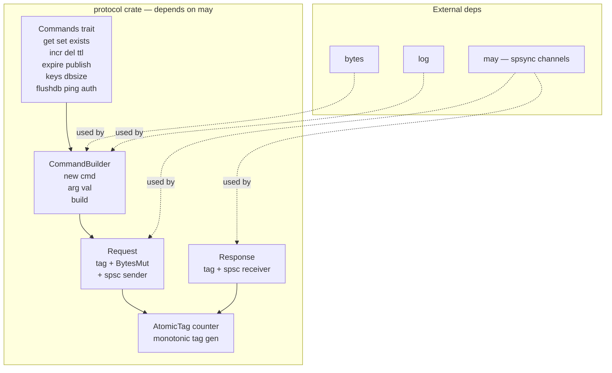
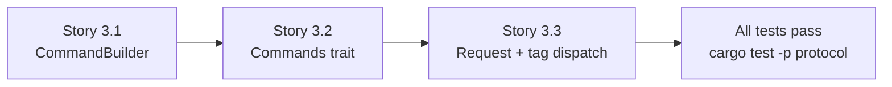

# Epic 3 — Protocol Crate

**Objective:** Implement the command protocol layer — CommandBuilder fluent API, Commands trait, and Request/Response management. This is the first crate that depends on `may` (for spsc channels).

**Dependencies:** Epic 0 (scaffolding) + Epic 1 (base) + Epic 2 (codec)

**Source docs:** `docs/Epics/epic-0-scaffolding/docs/05-protocol-layer-design.md`, `docs/Epics/epic-0-scaffolding/docs/07-client-api-design.md`

## Crate Overview



## Implementation Order (Within Epic)



---

### Story 3.1 — CommandBuilder

**Goal:** Implement the fluent `CommandBuilder` for building Redis commands.

**Code anchors:**
- `crates/protocol/src/lib.rs` — `pub struct CommandBuilder { args: Vec<RedisValue> }`
- `crates/protocol/src/builder.rs` — implementation

**Struct:**

```rust
pub struct CommandBuilder {
    args: Vec<RedisValue>,
}
```

**Methods:**
```rust
impl CommandBuilder {
    pub fn new(cmd: &str) -> Self;
    pub fn arg<V: ToRedisArgs>(mut self, val: V) -> Self;
    pub fn args<V: ToRedisArgs>(mut self, vals: &[V]) -> Self;
    pub fn build(self) -> BytesMut;
}

pub fn cmd(cmd: &str) -> CommandBuilder;
```

**Tasks:**
1. Define `CommandBuilder` with `args: Vec<RedisValue>`
2. Implement `new(cmd)` — converts command name to RedisValue::BulkString
3. Implement `arg(val)` — converts via ToRedisArgs → RedisValue, appends to args
4. Implement `args(vals)` — batch append multiple args
5. Implement `build()` — uses codec crate's RESPWriter to encode args into BytesMut
6. Implement `cmd()` convenience function — creates CommandBuilder and calls new()
7. Add `len()` method returning number of arguments (useful for testing)

**Verification:**
- `cargo test -p protocol` — at least 5 unit tests:
  - `test_cmd_set_key_value` — cmd("SET").arg("k").arg("v").build() → correct RESP bytes
  - `test_cmd_get_key` — cmd("GET").arg("key").build() → correct RESP bytes
  - `test_cmd_with_multiple_args` — cmd("MSET").args(&["k1","v1","k2","v2"]) → correct bytes
  - `test_cmd_len` — cmd("PING").len() == 1
  - `test_cmd_len_with_args` — cmd("SET").arg("k").arg("v").len() == 3
- `cargo clippy -p protocol` — zero warnings
- `cargo doc -p protocol` — all public items documented

---

### Story 3.2 — Commands trait

**Goal:** Implement the `Commands` trait with methods for every Redis command used by Sesame-IDAM.

**Code anchors:**
- `crates/protocol/src/lib.rs` — `pub trait Commands`
- `crates/protocol/src/commands.rs` — trait impls

**Struct:**

```rust
pub trait Commands: Sized {
    fn get<K: ToRedisArgs, V: FromRedisValue>(&self, key: K) -> CommandBuilder;
    fn set<K: ToRedisArgs, V: ToRedisArgs>(&self, key: K, value: V) -> CommandBuilder;
    fn set_ex<K: ToRedisArgs, V: ToRedisArgs>(&self, key: K, value: V, seconds: u32) -> CommandBuilder;
    fn exists<K: ToRedisArgs>(&self, key: K) -> CommandBuilder;
    fn del<K: ToRedisArgs>(&self, key: K) -> CommandBuilder;
    fn incr<K: ToRedisArgs>(&self, key: K) -> CommandBuilder;
    fn ttl<K: ToRedisArgs>(&self, key: K) -> CommandBuilder;
    fn expire<K: ToRedisArgs>(&self, key: K, seconds: u32) -> CommandBuilder;
    fn publish<K: ToRedisArgs, M: ToRedisArgs>(&self, channel: K, message: M) -> CommandBuilder;
    fn keys<K: ToRedisArgs>(&self, pattern: K) -> CommandBuilder;
    fn dbsize(&self) -> CommandBuilder;
    fn flushdb(&self) -> CommandBuilder;
    fn ping(&self) -> CommandBuilder;
    fn auth(&self, password: &str) -> CommandBuilder;
}
```

**Tasks:**
1. Define `Commands` trait with all 14 methods listed above
2. Implement `get(key)` → `cmd("GET").arg(key)`
3. Implement `set(key, value)` → `cmd("SET").arg(key).arg(value)`
4. Implement `set_ex(key, value, seconds)` → `cmd("SET").arg(key).arg(value).arg("EX").arg(seconds)`
5. Implement `exists(key)` → `cmd("EXISTS").arg(key)`
6. Implement `del(key)` → `cmd("DEL").arg(key)`
7. Implement `incr(key)` → `cmd("INCR").arg(key)`
8. Implement `ttl(key)` → `cmd("TTL").arg(key)`
9. Implement `expire(key, seconds)` → `cmd("EXPIRE").arg(key).arg(seconds)`
10. Implement `publish(channel, message)` → `cmd("PUBLISH").arg(channel).arg(message)`
11. Implement `keys(pattern)` → `cmd("KEYS").arg(pattern)`
12. Implement `dbsize()` → `cmd("DBSIZE")`
13. Implement `flushdb()` → `cmd("FLUSHDB")`
14. Implement `ping()` → `cmd("PING")`
15. Implement `auth(password)` → `cmd("AUTH").arg(password)`

**Verification:**
- `cargo test -p protocol` — at least 14 unit tests (one per method):
  - Each test verifies the encoded BytesMut matches expected RESP format
  - `test_command_get_encoding` — GET key → `*2\r\n$3\r\nGET\r\n$3\r\nkey\r\n`
  - `test_command_set_encoding` — SET key val → `*3\r\n$3\r\nSET\r\n$3\r\nkey\r\n$3\r\nval\r\n`
  - `test_command_set_ex_encoding` — SET key val EX 60 → correct bytes
  - `test_command_exists_encoding` — EXISTS key → correct bytes
  - `test_command_del_encoding` — DEL key → correct bytes
  - `test_command_incr_encoding` — INCR key → correct bytes
  - `test_command_ttl_encoding` — TTL key → correct bytes
  - `test_command_expire_encoding` — EXPIRE key 60 → correct bytes
  - `test_command_publish_encoding` — PUBLISH ch msg → correct bytes
  - `test_command_keys_encoding` — KEYS pat → correct bytes
  - `test_command_dbsize_encoding` — DBSIZE → `*1\r\n$6\r\nDBSIZE\r\n`
  - `test_command_flushdb_encoding` — FLUSHDB → `*1\r\n$7\r\nFLUSHDB\r\n`
  - `test_command_ping_encoding` — PING → `*1\r\n$4\r\nPING\r\n`
  - `test_command_auth_encoding` — AUTH pass → correct bytes
- `cargo clippy -p protocol` — zero warnings

---

### Story 3.3 — Request + Response tag dispatch

**Goal:** Implement the Request/Response types with monotonically increasing tags for request-response matching.

**Code anchors:**
- `crates/protocol/src/request.rs` — `pub struct Request { tag, command, tx }`
- `crates/protocol/src/response.rs` — `pub struct Response { tag, rx }`
- `crates/protocol/src/tags.rs` — `pub struct TagCounter`

**Structs:**

```rust
use may::sync::spsc;

pub struct Request {
    pub tag: usize,
    pub command: BytesMut,
    pub tx: spsc::Sender<RedisValue>,
}

pub struct Response {
    pub tag: usize,
    pub rx: spsc::Receiver<RedisValue>,
}
```

**Tasks:**
1. Define `TagCounter` — wraps `std::sync::atomic::AtomicUsize` with `next()` method
2. Define `Request` struct with tag, command, tx fields
3. Define `Response` struct with tag, rx fields
4. Implement `Request::new(tag, command, tx)` constructor
5. Implement `Response::new(tag, rx)` constructor
6. Implement `TagCounter::new()` — initializes to 0
7. Implement `TagCounter::next()` — returns current value and increments

**Verification:**
- `cargo test -p protocol` — at least 3 unit tests:
  - `test_tag_counter_monotonic` — counter.next() returns 0, 1, 2, ...
  - `test_request_creation` — create Request with known tag, verify fields
  - `test_response_creation` — create Response with known tag, verify fields
- `cargo clippy -p protocol` — zero warnings

---

### Story 3.4 — Integration: encode command and send via spsc

**Goal:** Full integration test — build a command, encode it, create a Request with an spsc channel, verify the wire format is correct, and simulate the connection loop receiving and dispatching the response.

**Code anchors:**
- `crates/protocol/src/integration.rs` — integration tests

**Tasks:**
1. Create a FakeConnection test helper that:
   - Captures sent commands (BytesMut)
   - Provides canned responses via spsc
2. Test: Build SET key value command → encode → verify BytesMut matches `*3\r\n$3\r\nSET\r\n$3\r\nkey\r\n$5\r\nvalue\r\n`
3. Test: Build GET key command → encode → verify bytes → simulate response `:42\r\n` → verify receiver gets Integer(42)
4. Test: Pipeline ordering — build 3 commands, verify they are encoded in declaration order
5. Test: Tag uniqueness — 100 sequential requests, all tags are unique and monotonic

**Verification:**
- `cargo test -p protocol` — at least 18 total tests (14 trait + 3 dispatch + 3 integration)
- `cargo clippy -p protocol` — zero warnings
- `cargo doc -p protocol` — all public items documented
