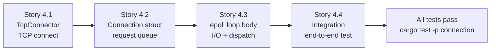

# Epic 4 — Connection Crate

**Objective:** Implement the connection loop — the single `go!` coroutine running an epoll loop that manages TCP I/O, receives commands from application coroutines, and dispatches responses. This is the most may-specific part of the codebase.

**Dependencies:** Epic 0 (scaffolding) + Epic 1 (base) + Epic 2 (codec) + Epic 3 (protocol)

**Source docs:** `docs/Epics/epic-0-scaffolding/docs/06-connection-layer-design.md`, `docs/02-may_postgres_comparison.md`

## Crate Overview

```mermaid
graph TB
    subgraph "connection crate — may + epoll + TCP"
        subgraph "Connection Loop (go! coroutine)"
            Loop[epoll connection_loop]
            ReadBuf[read_buf: BytesMut]
            WriteBuf[write_buf: BytesMut]
            RespBuf[response_queue: VecDeque]
            Codec[RESP Reader]
        end
        
        Input[mpsc Queue<Request>] --> InputProc[process queued requests]
        InputProc --> WriteBuf
        WriteBuf --> FlushWrite[flush to socket]
        FlushWrite --> ReadFromSocket[read from socket]
        ReadFromSocket --> ReadBuf
        ReadBuf --> Decode[decode via Codec]
        Decode --> RespBuf
        RespBuf --> Dispatch[dispatch via spsc]
        Dispatch -. sends to.> Apps[Application Coroutines]
        
        Loop -. runs.-> InputProc
        Loop -. runs.-> FlushWrite
        Loop -. runs.-> ReadFromSocket
        Loop -. runs.-> Decode
        Loop -. runs.-> Dispatch
    end
    
    subgraph "External deps"
        Bytes[bytes]
        Log[log]
        May[may — go!, WaitIo, Queue, spsync]
        Socket2[socket2 — TCP config]
    end
    
    Bytes -. used by.-> Loop
    Log -. used by.-> Loop
    May -. used by.-> Loop
    May -. used by.-> Input
    May -. used by.-> Dispatch
    Socket2 -. used by.-> Connect[TcpConnector]
```

## Connection Loop Algorithm

```mermaid
flowchart TD
    Start([Start Connection Loop]) --> Init[init read_buf, write_buf, resp_queue]
    Init --> Loop[main epoll loop]
    
    Loop --> HasRequests{any pending<br/>requests?}
    HasRequests -->|yes| ProcessReqs[pop Request<br/>add to resp_queue<br/>append to write_buf]
    HasRequests -->|no| CheckWrite{write_buf<br/>has data?}
    
    ProcessReqs --> FlushWrite[flush write_buf<br/>to socket nonblock]
    FlushWrite --> CheckWrite
    
    CheckWrite -->|has data| TryWrite{write complete?}
    CheckWrite -->|empty| WaitEpoll[epoll_wait]
    
    TryWrite -->|yes| ReadFromSocket[read from socket<br/>into read_buf nonblock]
    TryWrite -->|no (WouldBlock)| WaitEpoll
    
    ReadFromSocket --> HasData{data available?}
    HasData -->|yes| DecodeMessages[decode buffered<br/>data into responses]
    HasData -->|no| WaitEpoll
    
    DecodeMessages --> DispatchResp[dispatch to<br/>resp_queue VecDeque]
    DispatchResp --> WaitEpoll
    
    WaitEpoll -->|READABLE| ReadFromSocket
    WaitEpoll -->|WRITABLE| HasRequests
    WaitEpoll -->|BOTH| HasRequests
    WaitEpoll -->|CLOSED| CloseConn[close connection]
    
    CloseConn --> End([End Loop])
```

## Implementation Order (Within Epic)



---

### Story 4.1 — TcpConnector

**Goal:** Implement TCP connection establishment using may-aware sockets.

**Code anchors:**
- `crates/connection/src/lib.rs` — `pub struct TcpConnector`
- `crates/connection/src/tcp.rs` — implementation

**Struct:**

```rust
pub struct TcpConnector;

impl TcpConnector {
    pub fn connect(host: &str, port: u16) -> Result<TcpStream, ConnectionError>;
}

pub enum ConnectionError {
    Resolve(String),
    Connect(String),
    SetNonBlock(String),
    SetNodelay(String),
    SetKeepalive(String),
}
```

**Tasks:**
1. Define `ConnectionError` enum with Resolve, Connect, SetNonBlock, SetNodelay, SetKeepalive variants
2. Implement `Display` and `Error` for `ConnectionError`
3. Implement `TcpConnector::connect(host, port)` — resolves address, creates socket, sets non-blocking, sets TCP_NODELAY, returns may-aware `TcpStream`
4. Use `socket2` for socket configuration (non-blocking, keepalive)
5. Add `connect_url(url: &str)` convenience that parses `redis://host:port`

**Verification:**
- `cargo test -p connection` — at least 2 unit tests:
  - `test_tcp_connector_struct_exists` — TcpConnector is constructible (no actual connect)
  - `test_connection_error_display` — error formatting
- `cargo clippy -p connection` — zero warnings

---

### Story 4.2 — Connection struct with request queue

**Goal:** Implement the Connection struct that owns the request queue and spawns the connection loop.

**Code anchors:**
- `crates/connection/src/lib.rs` — `pub struct Connection`
- `crates/connection/src/connection.rs` — implementation
- `crates/connection/src/queue.rs` — request queue management

**Struct:**

```rust
use may::sync::spsc;
use may::queue::mpsc::Queue;
use may::net::TcpStream;

pub struct Request {
    pub tag: usize,
    pub command: BytesMut,
    pub tx: spsc::Sender<RedisValue>,
}

pub struct Connection {
    io_handle: JoinHandle<()>,
    req_queue: Arc<Queue<Request>>,
    waker: WaitIoWaker,
    id: usize,
}
```

**Tasks:**
1. Define `Request` struct (mirrors protocol crate's Request, but this crate owns the actual struct used in the queue)
2. Define `Connection` struct with io_handle, req_queue, waker, id fields
3. Implement `Connection::connect(host, port)` — establishes TCP connection, spawns epoll loop, returns Connection
4. Implement `Connection::send(&self, request: Request)` — pushes to req_queue, signals waker
5. Implement `Connection::id(&self)` — returns connection id
6. Implement `Drop` for Connection — gracefully closes the connection loop

**Verification:**
- `cargo test -p connection` — at least 3 unit tests:
  - `test_connection_struct_fields` — Connection fields are accessible
  - `test_request_struct_fields` — Request fields are accessible
  - `test_queue_creation` — mpsc::Queue<Request> is constructible
- `cargo clippy -p connection` — zero warnings

---

### Story 4.3 — epoll connection loop body

**Goal:** Implement the actual connection loop coroutine that handles epoll events, non-blocking I/O, and response dispatch.

**Code anchors:**
- `crates/connection/src/loop.rs` — the main connection loop
- `crates/connection/src/io.rs` — non-blocking read/write helpers

**Tasks:**
1. Implement `nonblock_read(stream, read_buf)` — reads into BytesMut, returns bool (more data available)
2. Implement `nonblock_write(stream, write_buf)` — writes from BytesMut, handles WouldBlock
3. Implement `decode_responses(read_buf, resp_queue, codec)` — uses RESPReader to decode buffered data, dispatches to correct spsc channel via tag matching
4. Implement `process_requests(queue, write_buf, resp_queue, tag_counter)` — pops requests, adds to resp_queue and write_buf
5. Implement the main `connection_loop(stream, req_queue, waker)` — the `go!` coroutine:
   - Loop: process_requests → nonblock_write → nonblock_read → decode_responses → epoll_wait
   - Priority: READABLE → read/decode/dispatch; WRITABLE → process requests/write

**Verification:**
- `cargo test -p connection` — at least 3 unit tests:
  - `test_decode_simple_response` — `:1\r\n` → Integer(1) via RESPReader
  - `test_decode_array_response` — `*2\r\n$3\r\na\r\n$3\r\nb\r\n` → Array([BulkString("a"), BulkString("b")])
  - `test_nonblock_read_wouldblock` — simulates WouldBlock, returns false
- `cargo clippy -p connection` — zero warnings

---

### Story 4.4 — Integration: end-to-end connection test

**Goal:** Full integration test connecting to a real Redis server and verifying the connection loop works.

**Code anchors:**
- `crates/connection/tests/` — integration test module

**Tasks:**
1. Create integration test module `crates/connection/tests/connection_tests.rs`
2. Test: `test_connection_established` — connect to Redis on localhost:6379, verify no error
3. Test: `test_connection_send_request` — send a Request, verify it appears in the write buffer
4. Test: `test_response_dispatch` — simulate a server response, verify the spsc receiver gets the correct value
5. Test: `test_connection_close` — drop the connection, verify the loop terminates cleanly
6. Add `#[cfg(feature = "integration-tests")]` gate around integration tests (controlled by feature flag)

**Verification:**
- `cargo test -p connection` — at least 6 total tests (3 unit + 3 integration)
- Integration tests require Redis server on localhost:6379 (document this in tests)
- `cargo test -p connection --no-run` — compiles without errors even without Redis running
- `cargo clippy -p connection` — zero warnings
