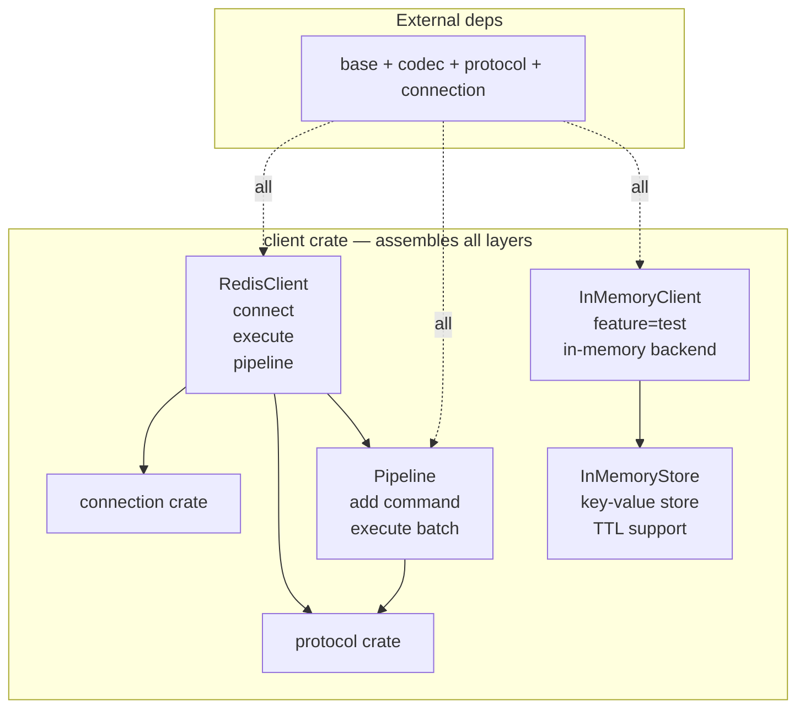
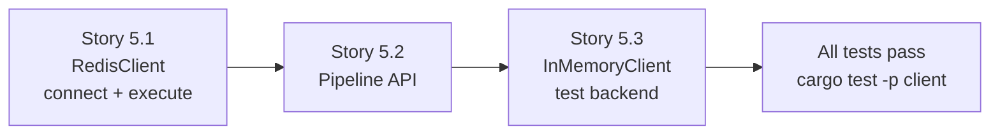

# Epic 5 — Client Crate

**Objective:** Implement the user-facing API — `RedisClient` for single commands, `Pipeline` for batch commands, and `InMemoryClient` for test isolation.

**Dependencies:** Epic 0 (scaffolding) + Epic 1 (base) + Epic 2 (codec) + Epic 3 (protocol) + Epic 4 (connection)

**Source docs:** `docs/Epics/epic-0-scaffolding/docs/07-client-api-design.md`

## Crate Overview



## Implementation Order (Within Epic)



---

### Story 5.1 — RedisClient: connect + execute

**Goal:** Implement the `RedisClient` entry point with `connect()` and `execute()` methods.

**Code anchors:**
- `crates/client/src/lib.rs` — `pub struct RedisClient`
- `crates/client/src/client.rs` — implementation

**Struct:**

```rust
pub struct RedisClient {
    inner: Arc<InnerClient>,
}

struct InnerClient {
    connection: Arc<Connection>,
    tag_counter: Arc<TagCounter>,
}
```

**Methods:**
```rust
impl RedisClient {
    pub fn connect(url: &str) -> Result<Self, ConnectionError>;
    pub fn execute<T: FromRedisValue>(&self, cmd: CommandBuilder) -> Result<T, RedisError>;
}
```

**Tasks:**
1. Define `RedisClient` wrapping `Arc<InnerClient>`
2. Define `InnerClient` with connection + tag_counter
3. Implement `connect(url: &str)` — parses URL, calls `TcpConnector::connect`, wraps in RedisClient
4. Implement `execute<T: FromRedisValue>(&self, cmd: CommandBuilder)` — the full flow:
   - Create Request with next tag
   - Use codec to encode CommandBuilder into BytesMut
   - Push Request to connection's mpsc queue
   - Wait on spsc receiver for response
   - Decode RedisValue → T via FromRedisValue
   - Return Result<T, RedisError>
5. Implement `Commands` trait impl for `&RedisClient` — all 14 methods from Epic 3
6. Add `ping(&self)` convenience method → execute `PING` → expect SimpleString "PONG"

**Verification:**
- `cargo test -p client` — at least 4 unit tests:
  - `test_redis_client_struct` — RedisClient is constructible from mock
  - `test_execute_builds_command` — verify CommandBuilder is built correctly
  - `test_from_redis_value_extraction` — simulate response, verify type extraction
  - `test_commands_trait_methods_exist` — all 14 trait methods are callable
- `cargo clippy -p client` — zero warnings
- No may import at crate level (may is only used transitively through connection crate)

---

### Story 5.2 — Pipeline API

**Goal:** Implement the `Pipeline` struct for batch command execution.

**Code anchors:**
- `crates/client/src/lib.rs` — `pub struct Pipeline`
- `crates/client/src/pipeline.rs` — implementation

**Struct:**

```rust
pub struct Pipeline<'a> {
    client: &'a RedisClient,
    commands: Vec<BytesMut>,
    senders: Vec<spsc::Receiver<RedisValue>>,
}
```

**Methods:**
```rust
impl<'a> Pipeline<'a> {
    pub fn new(client: &'a RedisClient) -> Self;
    pub fn add(&mut self, cmd: CommandBuilder);
    pub fn execute<T: FromPipelineResponse>(&self) -> Result<T, RedisError>;
}
```

**Tasks:**
1. Define `Pipeline<'a>` with commands vec and senders vec
2. Define `FromPipelineResponse` trait for extracting multiple responses
3. Implement `Pipeline::new(client)` — creates empty pipeline
4. Implement `add(cmd)` — encodes command, pushes to commands vec, creates spsc pair for response
5. Implement `execute<T: FromPipelineResponse>()` — the full pipeline flow:
   - Send all commands to connection queue (no waiting)
   - Read responses in order from spsc channels
   - Decode each response using FromPipelineResponse
   - Return typed result tuple
6. Implement `FromPipelineResponse` for `(T1,)` — single response
7. Implement `FromPipelineResponse` for `(T1, T2)` — two responses
8. Implement `FromPipelineResponse` for `(T1, T2, T3)` — three responses
9. Implement `FromPipelineResponse` for `Vec<T>` — all responses extracted as Vec

**Verification:**
- `cargo test -p client` — at least 5 unit tests:
  - `test_pipeline_creation` — Pipeline::new() creates empty pipeline
  - `test_pipeline_add_command` — add command, verify commands vec has 1 element
  - `test_pipeline_add_multiple` — add 3 commands, verify ordering preserved
  - `test_pipeline_execute_single` — execute 1 command, verify response
  - `test_pipeline_execute_multiple` — execute 3 commands, verify 3 responses in order
- `cargo clippy -p client` — zero warnings

---

### Story 5.3 — InMemoryClient (feature=test)

**Goal:** Implement an in-memory Redis backend for test isolation.

**Code anchors:**
- `crates/client/src/lib.rs` — conditional: `#[cfg(feature = "test")] pub mod in_memory;`
- `crates/client/src/in_memory.rs` — InMemoryClient + InMemoryStore
- `crates/may-redis/Cargo.toml` — `test = []` feature flag

**Struct:**

```rust
pub struct InMemoryStore {
    data: HashMap<String, (String, Option<Instant>)>,
}

pub struct InMemoryClient {
    store: Arc<Mutex<InMemoryStore>>,
}
```

**Methods:**
```rust
impl InMemoryClient {
    pub fn new() -> Self;
    pub fn get<V: FromRedisValue>(&mut self, key: &str) -> Result<V, RedisError>;
    pub fn set(&mut self, key: &str, value: &str);
    pub fn set_ex(&mut self, key: &str, value: &str, seconds: u32);
    pub fn del(&mut self, key: &str) -> usize;
    pub fn exists(&mut self, key: &str) -> bool;
    pub fn incr(&mut self, key: &str) -> i64;
    pub fn ttl(&mut self, key: &str) -> i64;
    pub fn expire(&mut self, key: &str, seconds: u32) -> bool;
    pub fn keys(&mut self, pattern: &str) -> Vec<String>;
    pub fn dbsize(&mut self) -> usize;
    pub fn flushdb(&mut self);
}
```

**Tasks:**
1. Define `InMemoryStore` with HashMap<String, (value, Option<TTL>)>
2. Define `InMemoryClient` wrapping `Arc<Mutex<InMemoryStore>>`
3. Implement all 11 methods above
4. TTL expiration — check TTL on GET/EXISTS/TTL, remove expired entries
5. EXPIRE — set TTL on existing key
6. KEYS — support `*` and `?*` glob patterns
7. INCR — atomic increment of string-to-i64, error on non-integer values
8. Gate all of this behind `#[cfg(feature = "test")]`
9. Re-export from umbrella crate: `may_redis::InMemoryClient` when test feature is enabled

**Verification:**
- `cargo test -p may-redis --features test` — at least 8 unit tests:
  - `test_inmemory_set_get` — set "key" "value", get returns "value"
  - `test_inmemory_set_ex_get` — set_ex "key" "value" 60, get returns "value"
  - `test_inmemory_del` — del returns 1 for existing key, 0 for missing
  - `test_inmemory_exists` — exists returns true for existing, false for missing
  - `test_inmemory_incr` — incr on non-existent returns 1, next incr returns 2
  - `test_inmemory_ttl` — ttl returns seconds for set_ex key
  - `test_inmemory_expire` — expire sets TTL, subsequent ttl reflects new TTL
  - `test_inmemory_keys_pattern` — keys "user:*" returns matching keys
  - `test_inmemory_flushdb` — flushdb clears all data, dbsize returns 0
- `cargo test -p may-redis --features test` — must pass without a running Redis server
- `cargo clippy -p may-redis --features test` — zero warnings
