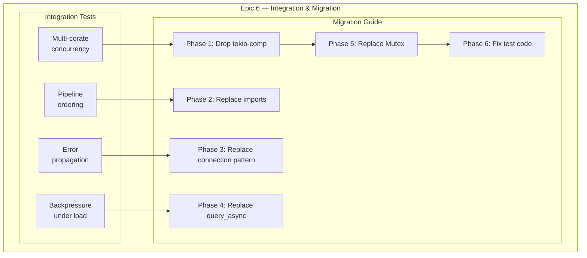
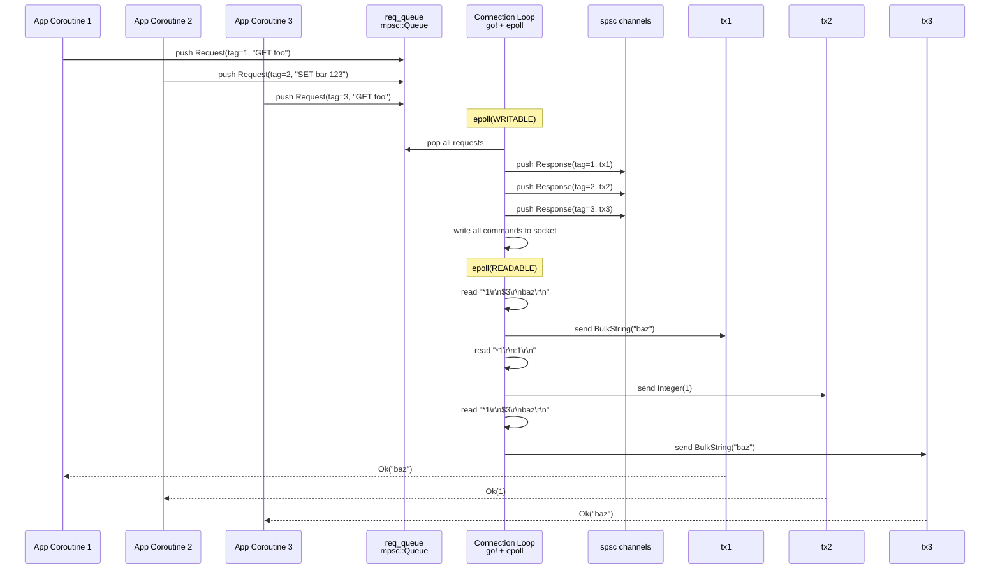
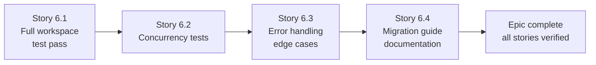
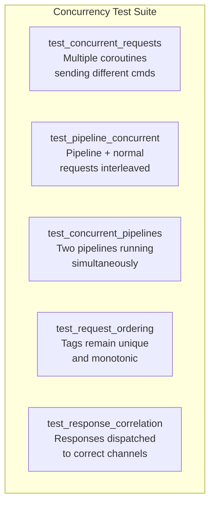
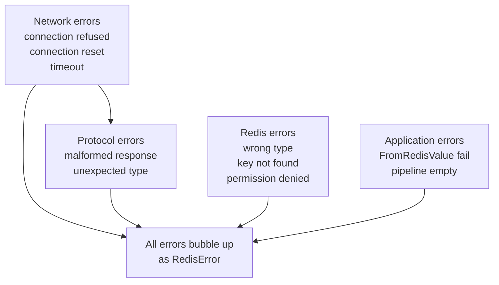

# Epic 6 — Integration & Migration

**Objective:** Full integration testing across all crates, multi-coroutine concurrency testing, and the migration guide from the `redis` crate to `may-redis` for Sesame-IDAM.

**Dependencies:** All previous epics (0-5)

**Source docs:** `docs/Epics/epic-0-scaffolding/docs/09-migration-guide.md`, `docs/10-test-strategy.md`

## Epic Overview

## Concurrency Model

## Implementation Order (Within Epic)

---

### Story 6.1 — Full workspace test pass

**Goal:** Ensure all crates pass `cargo test --workspace` with all features enabled.

**Code anchors:**
- `Cargo.toml` — test configuration
- All crate test files

**Tasks:**
1. Run `cargo test --workspace` — verify every crate compiles and tests pass
2. Run `cargo test --workspace --features test` — verify InMemoryClient tests pass
3. Fix any clippy deny-level warnings across all crates
4. Verify `cargo doc --workspace --no-deps` builds without errors
5. Verify `cargo fmt --check` passes on all files
6. Add `#[cfg(test)]` module to each crate with doctests where applicable

**Verification:**
- `cargo test --workspace` — 100% pass rate
- `cargo test --workspace --features test` — 100% pass rate
- `cargo clippy --workspace --all-targets --all-features` — zero deny-level warnings
- `cargo fmt --check` — all files formatted
- `cargo doc --workspace --no-deps` — builds without warnings

---

### Story 6.2 — Concurrency tests

**Goal:** Verify that multiple coroutines can safely share a single RedisClient.

**Code anchors:**
- `crates/client/tests/concurrency_tests.rs` — integration tests requiring may runtime + Redis

**Test matrix:**

**Tasks:**
1. Create `crates/client/tests/concurrency_tests.rs`
2. Test: `test_concurrent_requests` — spawn 3 coroutines, each sends GET for different keys, verify all get correct responses
3. Test: `test_pipeline_concurrent` — one coroutine runs pipeline, another sends single commands, verify no cross-talk
4. Test: `test_concurrent_pipelines` — two coroutines each run a 3-command pipeline, verify ordering is preserved
5. Test: `test_request_ordering` — 100 sequential tags from multiple coroutines, all unique and monotonic
6. Test: `test_response_correlation` — send 10 commands from 10 different coroutines, verify each gets the right response
7. Use `may::run` / `may::go` for test setup — never `#[tokio::test]`

**Verification:**
- `cargo test -p client --test concurrency_tests` — all 5 tests pass
- Each test runs in `may::run` context
- Tests complete within 30 seconds
- `cargo clippy -p client` — zero warnings

---

### Story 6.3 — Error handling and edge cases

**Goal:** Comprehensive error handling tests covering all failure modes.

**Code anchors:**
- `crates/client/tests/error_tests.rs` — error handling integration tests

**Error scenarios:**

**Tasks:**
1. Create `crates/client/tests/error_tests.rs`
2. Test: Connection refused — attempt to connect to non-existent server, verify ConnectionError
3. Test: Protocol error — simulate malformed RESP response, verify Parse error
4. Test: Wrong type extraction — response is Integer but caller expects String, verify FromRedisValue error
5. Test: Empty pipeline — execute pipeline with no commands, verify error
6. Test: Server returns error — Redis returns "-ERR msg\r\n", verify RedisError bubbles up with correct message
7. Test: Null response — response is `$-1\r\n`, verify Null → appropriate FromRedisValue result

**Verification:**
- `cargo test -p client --test error_tests` — all 7 tests pass
- Each test produces a RedisError (not a panic or unwrap failure)
- Error messages are descriptive and include the operation context

---

### Story 6.4 — Migration guide documentation

**Goal:** Finalize and verify the migration guide from `redis` crate to `may-redis`.

**Code anchors:**
- `docs/Epics/epic-0-scaffolding/docs/09-migration-guide.md` — migration guide
- `docs/Epics/00-epic-overview.md` — update epic overview to reflect completed epic 6

**Tasks:**
1. Review and update `09-migration-guide.md` against actual may-redis API
2. Verify all code examples in the migration guide are syntactically correct (copy-paste testable)
3. Add a "Verification checklist" section — exact steps to validate migration in sesame-idam
4. Add "Known differences" section — what works differently between redis and may-redis
5. Update `00-epic-overview.md` to mark Epic 6 as complete
6. Update `llmwiki/docs-catalog.md` with the new Epics structure

**Verification:**
- Migration guide code examples compile against actual may-redis crate
- No placeholders or "TBD" sections remain
- All Sesame-IDAM modules listed in `03-sesame-idam-redis-usage.md` have a migration path documented
