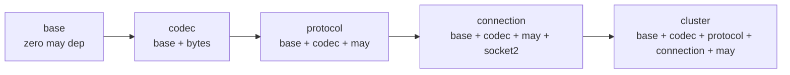

# PRD: Redis Cluster Support

## Overview

This document designs Redis Cluster support for `may-redis`. It introduces
a multi-connection architecture where `RedisClusterClient` manages one
connection per cluster node, routes commands by hash slot, and handles
MOVED/ASK redirects transparently.

**Status:** Draft — awaiting review
**Author:** [agent]
**Date:** 2025-01-15
**Scope:** RESP2 protocol only (cluster protocol, not RESP3)

## 1. Problem Statement

The current `may-redis` design uses a single `Connection` per
`RedisClient`. This works for single-node Redis, Redis Sentinel (failover
at application level), or connection-pool-backed deployments.

**It does not work for Redis Cluster.** Redis Cluster partitions keys
across N nodes using 16384 hash slots:

- `CRC16(key) mod 16384` determines the slot
- Each slot is owned by exactly one node (master)
- A `GET mykey` must go to the node that owns `slot(CRC16(mykey))`
- A `DEL key1 key2 key3` must go to ONE node — all keys must map to the
  same slot, otherwise the client must fan out

Additionally, cluster nodes send `MOVED` and `ASK` redirect responses
that tell the client the key moved to a different node.

## 2. What Redis Cluster Requires

### 2.1 Hash Slot Routing

Every key-based command must be routed to the correct node:

```
CRC16("mykey") = 12539
Slot 12539 → owned by node A (192.168.1.10:6379)
→ Route SET mykey value to node A
```

Multi-key commands (DEL, MSET, SMOVE, etc.) require all keys to map to
the same slot. If not, the client must:
- **Fan-out:** split into separate commands sent to different nodes
- **Fail:** reject the command as invalid for cluster

### 2.2 MOVED / ASK Redirects

When a key migrates between nodes (during resharding or failover), the
current node returns:

```
MOVED 3999 192.168.1.20:6380
ASK 3999 192.168.1.20:6379
```

The client must:
- **MOVED:** permanent move. Update slot→node map, retry on new node
- **ASK:** temporary move during resharding. Retry immediately on new node,
  then update slot→node map once migration completes

### 2.3 Cluster Topology Discovery

The client must know which node owns which slot range:

```
CLUSTER NODES →
  192.168.1.10:6379 master - 0-5460
  192.168.1.11:6379 master 5461-10922
  192.168.1.12:6379 master 10923-16383
```

This must be refreshed periodically or on cluster errors.

### 2.4 Failover Handling

On `CLUSTERDOWN` or `MOVED` responses, the client must:
- Update its slot→node mapping
- Retry the command on the correct node
- Recover gracefully from node changes without losing in-flight requests

## 3. Current Architecture vs. Cluster Requirements

### 3.1 Current Architecture (Single Node)

```
Coroutine A ─┐
Coroutine B ─┼── RedisClient ──► Connection (1 socket, 1 epoll loop) ──► Redis
Coroutine C ─┘
```

One `Connection` = one TCP socket, one epoll loop, one mpsc request queue,
one spsc response channel per command.

### 3.2 Cluster Architecture (Multiple Nodes)

```
Coroutine A ─┐
Coroutine B ─┼── RedisClusterClient ──► ConnectionPool (N sockets)
Coroutine C ─┘
                 │
                 ├──► Connection → Node 1 (slots 0-5460)
                 ├──► Connection → Node 2 (slots 5461-10922)
                 └──► Connection → Node 3 (slots 10923-16383)
```

`RedisClusterClient` manages N `Connection`s, one per cluster node.
It routes each command to the correct connection based on hash slot.

## 4. Design Options

### Option A: RedisClusterClient with Per-Node Connections (Recommended)

**Approach:** A new `RedisClusterClient` that owns N `Connection`s, one per
cluster node. Each coroutine gets a clone of `RedisClusterClient` (via
`Arc`), and commands are routed to the correct node.

**Pros:**
- Reuses existing `Connection` (epoll loop, dispatch, backpressure)
- Simple routing: slot → connection lookup
- Natural fit for coroutine model: each node gets one dedicated epoll loop
- Per-connection backpressure (each node's queue is independent)
- Redirect handling: just retry on the new node's connection

**Cons:**
- N× overhead: N sockets, N epoll loops, N request queues
- More complex client API (slot management, topology discovery)
- Fan-out for multi-key commands across slots

**Implementation:**

```rust
struct RedisClusterClient {
    inner: Arc<ClusterInner>,
}

struct ClusterInner {
    /// Connection pool: node_id → Connection
    connections: HashMap<NodeId, Connection>,
    /// Slot → node mapping: slot_number → NodeId
    slot_map: SlotMap,
    /// Seed nodes for topology discovery (at least one must be known)
    seed_nodes: Vec<SeedNode>,
    /// Periodic topology refresh (or on-cluster errors)
    refresh_policy: RefreshPolicy,
    /// Redirect cache: MOVED/ASK → updated slot→node mapping
    redirect_cache: RedirectCache,
}
```

**Key components:**

1. **Slot Map** — maps slot number (0-16383) to `NodeId`
   - Built from `CLUSTER NODES` or `CLUSTER SLOTS` responses
   - Thread-safe read access (lock-free via `Arc` swap)
   - Updated on redirect or periodic refresh

2. **CRC16 Hash** — `CRC16(key) mod 16384`
   - Standard CRC16-ANSI polynomial (x^16 + x^15 + x^2 + 1)
   - Same as Redis's implementation

3. **Command Router** — given a `CommandBuilder`, determine the target node
   - Extract key from command
   - Compute slot → look up slot map → return target `Connection`
   - For multi-key commands: verify all keys map to same slot, or fan out

4. **Redirect Handler** — handles `MOVED` and `ASK` responses
   - Parse node address from redirect
   - Get or create connection for target node
   - Update slot map
   - Retry command on new node

5. **Topology Manager** — discovers and maintains slot→node mapping
   - Initial: query seed nodes with `CLUSTER NODES` or `CLUSTER SLOTS`
   - Periodic: refresh every N seconds (configurable)
   - On-demand: refresh on `CLUSTERDOWN`, connection error, or unknown slot

### Option B: Single Connection with Fan-Out (Not Recommended)

**Approach:** Maintain one connection to each node, but use a single
fan-out mechanism to route commands.

**Pros:**
- No single-connection bottleneck (commands spread across nodes)

**Cons:**
- Still N× overhead (same as Option A)
- No real advantage over Option A
- More complex: need to track N in-flight requests, aggregate responses
- Redis is still single-threaded per node — fan-out doesn't help throughput

**Verdict:** No benefit over Option A. Skip.

### Option C: Pool of Connections Per Node (Not Recommended)

**Approach:** Maintain multiple connections to each node, with a pool
allocator.

**Pros:**
- Fault isolation per connection

**Cons:**
- Redis is single-threaded PER NODE — multiple connections to same node
  provide ZERO throughput benefit
- N× overhead for N× connections per node
- Over-engineering: one connection per node is sufficient

**Verdict:** Only add if fault isolation is critical AND nodes are under
extreme load (rare for Redis). Not for v1.

## 5. Recommended Design: Option A — Per-Node Connections

### 5.1 Architecture

```
Service Pod
┌──────────────────────────────────────────────────────────────┐
│                                                              │
│  Coroutine A ─┐                                              │
│  Coroutine B ─┼── RedisClusterClient                        │
│  Coroutine N ─┘                                              │
│                                                              │
│  ┌─────────────────────────────────────────────────────────┐ │
│  │  CRC16 Hash                                             │ │
│  │  Slot → Node Map  (0-16383 → NodeId)                   │ │
│  │  Redirect Cache (MOVED/ASK → updated mapping)          │ │
│  └─────────────────────────────────────────────────────────┘ │
│                                                              │
│  ┌──────────────┐  ┌──────────────┐  ┌──────────────┐       │
│  │ Node 1 Conn  │  │ Node 2 Conn  │  │ Node 3 Conn  │       │
│  │ (slots 0-5460)│ │(slots 5461-10922)│(slots 10923-16383)│
│  └──────────────┘  └──────────────┘  └──────────────┘       │
└──────────────────────────────────────────────────────────────┘
                │              │              │
                └──────────────┼──────────────┘
                               │
                    ┌──────────┴──────────┐
                    │   Redis Cluster     │
                    │   (3 nodes)         │
                    └─────────────────────┘
```

### 5.2 Key Data Structures

```rust
/// Slot-to-node mapping. Updated atomically via Arc-swap.
struct SlotMap {
    /// slot 0 → NodeId, slot 1 → NodeId, ..., slot 16383 → NodeId
    slots: [Option<NodeId>; 16384],
    /// NodeId → Connection handle
    nodes: HashMap<NodeId, Connection>,
}

/// A single cluster node.
struct NodeInfo {
    id: NodeId,
    host: SocketAddr,
    role: NodeRole,  // Master | Replica
    slots: RangeInclusive<u16>,
}

/// Response to a MOVED/ASK redirect.
struct Redirect {
    slot: u16,
    node: NodeId,
    kind: RedirectKind,  // Moved | Ask
}

/// Policy for topology refresh.
enum RefreshPolicy {
    /// Refresh every N seconds.
    Periodic(Duration),
    /// Never refresh automatically (admin must call manually).
    Manual,
    /// Refresh on cluster errors and periodically.
    OnErrorAndPeriodic(Duration),
}
```

### 5.3 Command Execution Flow

```
Coroutine calls cluster.execute(SET key value)
    │
    ▼
Extract key "mykey" from command
    │
    ▼
Compute CRC16("mykey") mod 16384 = 12539
    │
    ▼
Lookup slot_map[12539] → NodeId("node-2")
    │
    ▼
Get Connection for node-2
    │
    ▼
Send command via connection.send(Request)
    │
    ▼
Wait on spsc::Receiver for response
    │
    ├─ OK: return decoded value
    ├─ MOVED 12539 node-3:
    │    → Update slot_map[12539] = node-3
    │    → Get Connection for node-3
    │    → Retry command
    │
    ├─ ASK 12539 node-3:
    │    → Get Connection for node-3
    │    → Send ASKING command first
    │    → Retry command
    │    → Update slot_map after success
    │
    └─ CLUSTERDOWN:
         → Refresh topology from seed nodes
         → Retry command
```

### 5.4 Multi-Key Command Handling

For commands with multiple keys (DEL, MSET, SMOVE, etc.):

1. Extract all keys
2. Compute slot for each key
3. **All same slot:** send to one node (normal path)
4. **Different slots:** fan out — split into separate commands, send each
   to its target node, collect responses, return combined result
5. **Unknown slot:** refresh topology, retry

Fan-out requires tracking N in-flight requests and aggregating results.
This adds complexity but is the correct behavior for multi-key commands.

### 5.5 Topology Discovery

Initial discovery (when creating `RedisClusterClient`):
```
For each seed_node:
    connect(seed_node)
    send("CLUSTER NODES")
    parse response to build initial slot_map
    if slot_map has data → break
```

Periodic refresh (if policy is `Periodic` or `OnErrorAndPeriodic`):
```
For each known node (in round-robin):
    send("CLUSTER SLOTS")
    update slot_map if different
```

On cluster error (CLUSTERDOWN, connection failure, unknown slot):
```
Refresh from any reachable node
```

### 5.6 API Surface

```rust
// Create a cluster client with seed nodes
let cluster = RedisClusterClient::connect(&[
    "192.168.1.10:6379",
    "192.168.1.11:6379",
    "192.168.1.12:6379",
])?;

// Use it like a normal client — routing is transparent
let val: Option<String> = cluster.execute(cmd("GET").arg("mykey"))?;

// Pipeline works across nodes (each command goes to correct node)
let mut pipeline = cluster.pipeline();
pipeline.add(cmd("GET").arg("key1"));
pipeline.add(cmd("GET").arg("key2"));  // may go to different node
let results: Vec<String> = pipeline.execute()?;

// Manual topology refresh
cluster.refresh_topology()?;

// Get cluster info
let info: ClusterInfo = cluster.cluster_info()?;
```

## 6. Feature Flag

Cluster support is behind a feature flag so single-node deployments are
not affected:

```toml
[features]
default = []
cluster = []
```

When `cluster` is not enabled, `RedisClusterClient` and cluster-specific
types are not compiled.

## 7. Module Structure

```
may_redis/
├── src/
│   ├── lib.rs
│   ├── cluster/                    # NEW — cluster-specific modules
│   │   ├── mod.rs                  # pub mod crc16; cluster_client; slot_map; redirect;
│   │   ├── crc16.rs                # CRC16-ANSI hash for slot computation
│   │   ├── cluster_client.rs       # RedisClusterClient — main entry point
│   │   ├── slot_map.rs             # Slot→Node mapping, thread-safe updates
│   │   ├── redirect.rs             # MOVED/ASK redirect handling
│   │   ├── topology.rs             # CLUSTER NODES/SLOTS parsing, discovery
│   │   └── fanout.rs               # Multi-key fan-out for cross-slot commands
│   ├── connection/
│   │   └── connection.rs           # Existing Connection (reused)
│   └── client/
│       ├── client.rs               # Existing RedisClient (single node)
│       └── mod.rs                  # pub use cluster::RedisClusterClient when feature = cluster
└── docs/
    └── PRD-redis-cluster.md        # This document
```

## 8. Module Dependencies



The `cluster` module depends on `connection` (reuses `Connection`),
`protocol` (uses `CommandBuilder`), and `base` (uses `RedisValue`).
It has no external dependencies beyond those already used.

## 9. Comparison: Cluster vs. Single-Node

| Aspect | Single Node (current) | Cluster (new) |
|--------|----------------------|---------------|
| Connections per client | 1 | N (one per node) |
| Epoll loops per client | 1 | N |
| Request queues per client | 1 | N |
| CRC16 slot computation | N/A | Required for key routing |
| MOVED/ASK handling | N/A | Required |
| Topology discovery | N/A | Required |
| Multi-key fan-out | N/A | Required |
| Feature flag | N/A | `cluster` |
| Backpressure | Per-connection | Per-node (independent) |
| Pipeline | Single connection | Commands split across connections |

## 10. Implementation Plan

### Phase 1: CRC16 + Slot Map (Standalone)

- Implement CRC16-ANSI in `cluster/crc16.rs`
- Implement `SlotMap` with thread-safe slot→node updates
- Unit tests: CRC16 correctness, slot map concurrent access
- No connection code yet — pure data structures

### Phase 2: Connection Per Node + Basic Routing

- Implement `RedisClusterClient` in `cluster/cluster_client.rs`
- Create one `Connection` per seed node on connect
- Route commands by slot to correct connection
- Unit tests: routing correctness, error propagation
- Reuses existing `Connection` (epoll loop, dispatch)

### Phase 3: Redirect Handling

- Implement MOVED/ASK parsing in `cluster/redirect.rs`
- Parse `MOVED slot node` and `ASK slot node` from `RedisValue`
- Update slot map on redirect
- Retry command on new node
- Unit tests: redirect parsing, slot map updates

### Phase 4: Topology Discovery

- Implement `CLUSTER NODES`/`CLUSTER SLOTS` parsing in `cluster/topology.rs`
- Initial discovery from seed nodes
- Periodic refresh
- On-demand refresh on cluster errors
- Integration tests: topology refresh with live cluster

### Phase 5: Multi-Key Fan-Out

- Implement cross-slot command handling in `cluster/fanout.rs`
- Split multi-key commands, route to correct nodes
- Aggregate responses
- Unit tests: fan-out correctness, response aggregation

### Phase 6: Pipeline Support

- Support pipelines across nodes
- Each pipeline command goes to its target node
- Responses collected per-node, aggregated
- Integration tests: pipeline with multi-node commands

## 11. What Is Out of Scope (v1)

- Redis Cluster Bus (Gossip protocol) — client does not need to know
  about cluster gossip, only about slot assignments
- Redis Cluster Pub/Sub — subscribe/unsubscribe across nodes
- Redis Cluster Streams — XREADGROUP with consumer groups
- Redis Cluster Lua Scripts — EVAL/SHA1 routing
- TLS for cluster connections — handled by existing TLS feature
- Connection pool per node — one connection per node is sufficient
  (Redis is single-threaded per node)

## 12. Decision

**Approach A — Per-Node Connections** is the correct design for Redis
Cluster support.

Each cluster node gets one dedicated `Connection` (one epoll loop, one
socket, one request queue). This matches the may coroutine model: each
connection loop is a `go!` coroutine, commands are queued via lock-free
mpsc, responses are dispatched via spsc channels.

Multiple connections per node is NOT needed — Redis is single-threaded
per node, so one connection provides full throughput. Per-node isolation
is achieved via separate `Connection` instances.

The design reuses all existing infrastructure: `Connection`, `epoll_loop`,
`dispatch`, `CommandBuilder`, `Pipeline`. The cluster layer sits on top,
adding slot-based routing, redirect handling, and topology discovery.

## 13. Risks

### 13.1 N× Connection Overhead

Each cluster node adds one TCP socket, one epoll loop, one request queue.
For a 14-node cluster (maximum), this is 14 sockets and 14 epoll loops.
This is acceptable because:
- Redis is single-threaded per node — N connections to one node adds no throughput
- One connection per node is the Redis Cluster client best practice
- TCP socket overhead is ~20KB per connection — 14 × 20KB = 280KB total

### 13.2 Redirect Storm During Failover

During a failover, many in-flight commands may receive MOVED redirects
simultaneously. Mitigations:
- Redirect cache avoids reconnecting to the same node
- Concurrent redirect handling (each coroutine handles its own redirect)
- Slot map uses `Arc` swap — no locking during updates

### 13.3 Multi-Key Command Complexity

Cross-slot fan-out requires tracking N in-flight requests and aggregating
results. This is more complex than single-node routing but is a well-
known pattern in Redis Cluster clients.

### 13.4 Topology Staleness

If topology changes between refreshes, commands may route to wrong nodes.
Mitigations:
- On-demand refresh on CLUSTERDOWN / connection error
- MOVED/ASK redirect updates slot map immediately
- Configurable refresh interval (default: 60 seconds)

## 14. References

- [`src/client/client.rs`](../src/client/client.rs) — current `RedisClient` (single node)
- [`src/connection/connection.rs`](../src/connection/connection.rs) — `Connection` (reused)
- [`src/connection/epoll_loop.rs`](../src/connection/epoll_loop.rs) — epoll loop (reused)
- [`src/connection/dispatch.rs`](../src/connection/dispatch.rs) — request/response dispatch (reused)
- [`src/protocol/builder.rs`](../src/protocol/builder.rs) — `CommandBuilder` (reused)
- [`src/connection/connection_limits.rs`](../src/connection/connection_limits.rs) — backpressure (reused)
- [`docs/PRD-connection-concurrency.md`](PRD-connection-concurrency.md) — concurrency analysis
- [`docs/01-protocol-analysis.md`](01-protocol-analysis.md) — RESP format
- [`docs/02-may_postgres_comparison.md`](02-may_postgres_comparison.md) — may coroutine patterns
- Redis Cluster Specification: https://redis.io/docs/reference/cluster-spec/
- Redis Cluster Tutorial: https://redis.io/docs/reference/cluster-spec/
