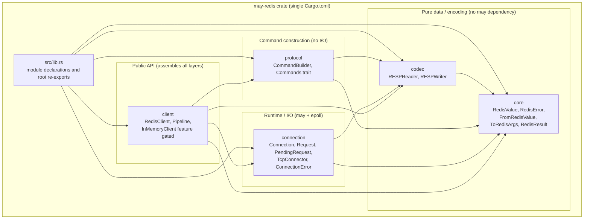
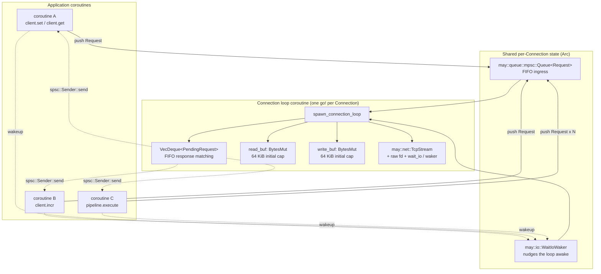
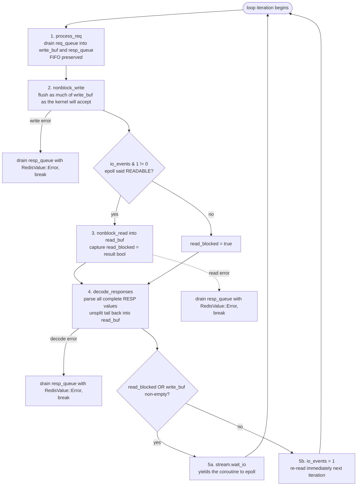
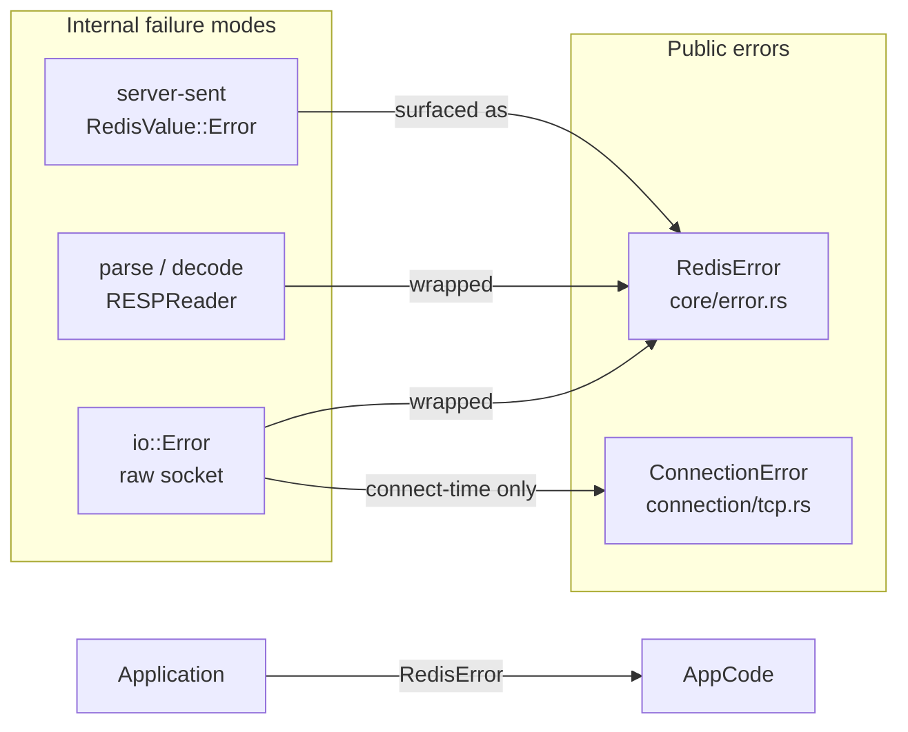
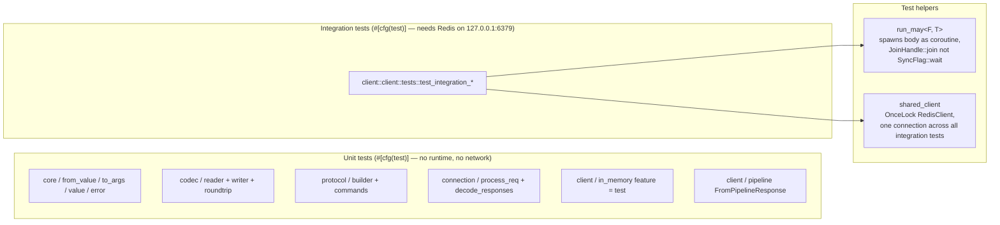

# may-redis Architecture

Canonical, code-accurate architecture reference for `may-redis`. If this
document and any other doc disagree, this one is right and the other one
needs updating. If this document and the code disagree, the code is right
and **this** document needs updating — open an issue.

- **Crate**: `may-redis` v0.1.0 (single crate, see
  [`docs/adr-001-single-crate-structure.md`](./adr-001-single-crate-structure.md))
- **Runtime**: [`may`](https://crates.io/crates/may) 0.3 stackful coroutines.
  Zero tokio, zero `async`/`.await`.
- **Wire protocol**: RESP2 only.
- **Reference implementation for the connection layer**:
  `../may_postgres/src/connection.rs` — when in doubt, mirror it.

## 1. Goals and non-goals

### Goals

1. **may-native Redis client.** The only allowed runtime is `may`. All
   I/O cooperation goes through may primitives (`go!`,
   `may::net::TcpStream`, `may::sync::spsc`,
   `may::queue::mpsc::Queue`, `WaitIo` / `WaitIoWaker`).
2. **API-compatible with the `redis` crate, where it matters.** The
   `Commands` trait surface (`get`, `set`, `incr`, `del`, `exists`,
   `ttl`, `expire`, `publish`, `keys`, `dbsize`, `flushdb`, `ping`,
   `auth`) is shaped for mechanical migration from `redis` to
   `may-redis`.
3. **Multi-coroutine sharing of one TCP socket.** A single
   `Connection` is cheap to `Arc`-share across many application
   coroutines; the connection loop demultiplexes responses back to the
   correct caller in FIFO order.
4. **First-class pipelines.** `Pipeline::add(..)` + `Pipeline::execute()`
   flushes N commands in one batch and reassembles N typed responses.
5. **Test-without-Redis option.** `InMemoryClient` (feature `test`)
   provides a clean per-test in-memory backend implementing the
   `Commands` semantics, so unit tests of higher-level code don't need
   a running server.

### Non-goals (out of scope for v1)

- RESP3 type markers (`~`, `=`, `_`, `,`, `%`, `>`).
- Pub/Sub, MULTI/EXEC transactions, Lua scripting.
- Cluster / Sentinel topology.
- TLS, AUTH/ACL flows beyond a single `AUTH password` command.
- Connection pooling — every `RedisClient` owns exactly one socket
  today. (Pool support is reserved for a future epic.)
- Publication to crates.io. The crate is consumed from sibling
  microscaler repos via path / git dependencies.

## 2. Crate shape

Single crate, single `Cargo.toml`, five top-level modules under `src/`.



### Module layer rules

| Layer        | Modules                    | May / I/O? | Purpose                                                              |
|--------------|----------------------------|------------|----------------------------------------------------------------------|
| Data         | `core`, `codec`            | **No**     | Pure types and RESP2 codec. Must build standalone.                  |
| Construction | `protocol`                 | **No**     | Build RESP-encoded commands. No runtime, no sockets.                |
| Runtime      | `connection`               | **Yes**    | Owns the socket, runs the epoll loop, demultiplexes responses.      |
| API          | `client`                   | **Yes**    | Public surface; assembles everything above.                          |

The "no may" rule for `core` / `codec` / `protocol` is a hard
architectural boundary. Any change that introduces a `may::` import in
those three modules should be rejected in review.

### File-level entry points

```text
src/
├── lib.rs                         Module roots, re-exports
├── core/
│   ├── mod.rs                     Re-exports
│   ├── value.rs                   RedisValue enum (SimpleString / Error / Integer / BulkString / Array / Null)
│   ├── error.rs                   RedisError + RedisResult + FromRedisValue trait
│   ├── from_value.rs              FromRedisValue impls for primitives, Option, Vec
│   └── to_args.rs                 ToRedisArgs trait + impls
├── codec/
│   ├── mod.rs                     Re-exports
│   ├── writer.rs                  RESPWriter (encoder, BytesMut-backed)
│   ├── reader.rs                  RESPReader (decoder, cursor-based)
│   └── roundtrip.rs               #[cfg(test)] encode-then-decode property tests
├── protocol/
│   ├── mod.rs                     Re-exports
│   ├── builder.rs                 CommandBuilder + cmd() free fn
│   └── commands.rs                Commands trait + default impls
├── connection/
│   ├── mod.rs                     Re-exports
│   ├── connection.rs              Connection, Request, PendingRequest, spawn_connection_loop
│   ├── tcp.rs                     TcpConnector, ConnectionError, address resolution
│   └── epoll.rs                   (reserved — currently empty / placeholder)
└── client/
    ├── mod.rs                     Re-exports
    ├── client.rs                  RedisClient + Commands impl + integration tests
    ├── pipeline.rs                Pipeline + FromPipelineResponse tuple impls
    └── in_memory.rs               #[cfg(feature = "test")] InMemoryClient
```

## 3. Runtime architecture

One `Connection` owns one TCP socket and one background coroutine. Any
number of application coroutines may share a `Connection` (typically
via `Arc`, as `RedisClient` does internally).



### Key may primitives in use

| Primitive                         | Role                                                                            |
|-----------------------------------|---------------------------------------------------------------------------------|
| `may::go!`                        | Spawn the connection loop coroutine.                                            |
| `may::net::TcpStream`             | may-aware TCP socket (registers with epoll, supports `wait_io`).                |
| `may::io::WaitIo` / `WaitIoWaker` | The loop's epoll yield point and the cross-coroutine wakeup hook.               |
| `may::queue::mpsc::Queue<T>`      | Many-producer, single-consumer ingress queue for `Request`s.                    |
| `may::sync::spsc::channel`        | One-shot response channel per `Request` (sender held by loop, receiver by app). |
| `may::coroutine::JoinHandle`      | Lets `Drop for Connection` cancel the loop coroutine.                           |

### Why FIFO matching works without per-message tags

RESP itself does not tag replies; the server returns responses in the
exact order it received the corresponding commands. The loop therefore
matches responses to senders purely by position:

1. `process_req` pops a `Request` and pushes a `PendingRequest`
   (holding the `spsc::Sender`) onto `resp_queue` **in arrival order**.
2. `decode_responses` pops from the **front** of `resp_queue` for each
   fully-decoded RESP value.

The `tag_counter` on `Connection` is therefore a debugging /
observability aid only — it's returned from `Connection::send` so
callers can correlate log lines, but it is **not** used for
demultiplexing.

## 4. End-to-end request lifecycle

```mermaid
sequenceDiagram
    autonumber
    participant App as Application coroutine
    participant Client as RedisClient
    participant Conn as Connection
    participant Loop as Connection loop (go!)
    participant Sock as TCP socket
    participant Redis as redis-server

    App->>Client: client.execute(client.get("k"))
    Client->>Client: CommandBuilder.build() -> RESP bytes
    Client->>Client: spsc::channel() -> (tx, rx)
    Client->>Conn: send(Request { data, sender: tx })
    Conn->>Conn: tag_counter += 1
    Conn->>Loop: req_queue.push(request)
    Conn->>Loop: waker.wakeup()
    Client->>Client: rx.recv()   (suspends the app coroutine)
    Loop->>Loop: process_req: pop req, push PendingRequest, append to write_buf
    Loop->>Sock: nonblock_write(write_buf)
    Sock->>Redis: *2\r\n$3\r\nGET\r\n$1\r\nk\r\n
    Redis->>Sock: $5\r\nvalue\r\n
    Loop->>Loop: stream.wait_io()   (yields until epoll READABLE)
    Loop->>Sock: nonblock_read -> read_buf
    Loop->>Loop: decode_responses: parse RedisValue, unsplit remaining bytes
    Loop->>Client: pending.sender.send(value)   (wakes rx.recv)
    Client->>Client: T::from_redis_value(&value)
    Client->>App: Ok(Some("value"))
```

Pipelines are the same picture with steps 4 / 12 happening N times in a
row, separated by exactly one `yield_now()` so the loop sees the whole
batch before any `rx.recv()` is waited on. See
[`docs/Epics/Epic_5/`](./Epics/Epic_5/) for the pipeline-specific story.

## 5. The connection loop, step by step

The body of `spawn_connection_loop` performs the following 5 steps in
this exact order, every iteration. (This list is mirrored as numbered
`(1)…(5)` comments in the source.)



The two non-obvious correctness properties hidden in this diagram are
**load-bearing** and have caused production hangs when broken:

- **Step 3 must propagate `nonblock_read`'s `bool` return value into
  `read_blocked`.** That bool is the only signal that decides whether
  step 5 yields to epoll (`stream.wait_io()`) or busy-spins. Dropping
  it makes the loop hog its may worker and starves every other
  coroutine sharing it. See Bug 1 in
  [`llmwiki/topics/connection-loop-pitfalls.md`](../llmwiki/topics/connection-loop-pitfalls.md).
- **Step 4 must put `RESPReader`'s unconsumed tail back into
  `read_buf` on every match arm (including success).** A single TCP
  read commonly contains multiple concatenated RESP values; if the
  tail is dropped, every response after the first is silently lost
  and callers hang on `rx.recv()` forever. See Bug 2 on the same
  pitfalls page.

Both invariants are now also documented in the `rustdoc` for
`spawn_connection_loop`, `nonblock_read`, and `decode_responses` so
they show up in `cargo doc` output.

## 6. Error handling



- `ConnectionError` is the **connect-time** error type
  (`Connection::connect`, `RedisClient::connect`). DNS resolution, TCP
  refusal, and `TCP_NODELAY` failure all show up here.
- `RedisError` is the **steady-state** error type returned from
  `client.execute(..)`. It carries parse errors, type-conversion
  errors, and server-side `-ERR …` replies.
- **Fatal loop errors** (write error, read error, hard decode error)
  drain every pending `spsc::Sender` in `resp_queue` with a synthetic
  `RedisValue::Error("Write error: …" | "Read error: …" | "Decode
  error: …")` so every caller waiting on a response fails explicitly
  rather than silently hanging. The loop then breaks; the
  `JoinHandle` becomes joinable; new `connection.send(..)` calls will
  enqueue but never be drained.
- Dropping `Connection` cancels the loop coroutine via
  `Coroutine::cancel`; any `spsc::Sender`s still in `resp_queue` are
  dropped, so app coroutines waiting on the matching `Receiver` get
  the standard "channel closed" error from `recv()`.

## 7. Public API surface

```rust
// Connect: from inside a may coroutine.
let client: RedisClient = RedisClient::connect("127.0.0.1", 6379)?;
//                            ^^^^^^^^^^^^^^^^^^^^^^^^^^ host, port — NOT a single URL
//                                                       use connect_url("redis://host:port")
//                                                       for the URL form.

// One-shot command via Commands trait + execute<T>:
let val: Option<String> = client.execute(client.get("mykey"))?;
client.execute::<()>(client.set("k", "v"))?;
client.execute::<()>(client.set_ex("session:42", "...", 3600))?;
let n: i64 = client.execute(client.incr("counter"))?;
let exists: bool = client.execute(client.exists("k"))?;
let keys: Vec<String> = client.execute(client.keys("user:*"))?;
let size: usize = client.execute(client.dbsize())?;

// PING has a convenience method that wraps execute:
let pong: String = client.ping()?;            // returns the literal "PONG"

// Pipeline: batch several commands into one network round-trip.
let mut pipe = client.pipeline();
pipe.add(client.set("a", "1"));
pipe.add(client.set("b", "2"));
pipe.add(client.get("a"));
let ((), (), got_a): ((), (), Option<String>) = pipe.execute()?;
```

### Tuple shapes for `Pipeline::execute<T>`

`FromPipelineResponse` is implemented for:

- `(T1,)`, `(T1, T2)`, `(T1, T2, T3)`, `(T1, T2, T3, T4)`
- `Vec<T>`

…where every `Ti: FromRedisValue`. Pipelines of more than 4 mixed-type
commands should use `execute_raw()` (returns `Vec<RedisValue>`) or
the `Vec<T>` impl when every result has the same type.

### `Commands` trait method shapes

| Method                                            | Returns         | RESP command produced                |
|---------------------------------------------------|-----------------|--------------------------------------|
| `get<K>(key)`                                     | `CommandBuilder`| `GET key`                            |
| `set<K, V>(key, value)`                           | `CommandBuilder`| `SET key value`                      |
| `set_ex<K, V>(key, value, seconds)`               | `CommandBuilder`| `SET key value EX seconds`           |
| `exists<K>(key)`                                  | `CommandBuilder`| `EXISTS key`                         |
| `del<K>(key)`                                     | `CommandBuilder`| `DEL key`                            |
| `incr<K>(key)`                                    | `CommandBuilder`| `INCR key`                           |
| `ttl<K>(key)`                                     | `CommandBuilder`| `TTL key`                            |
| `expire<K>(key, seconds)`                         | `CommandBuilder`| `EXPIRE key seconds`                 |
| `publish<K, M>(channel, message)`                 | `CommandBuilder`| `PUBLISH channel message`            |
| `keys<K>(pattern)`                                | `CommandBuilder`| `KEYS pattern`                       |
| `dbsize()`                                        | `CommandBuilder`| `DBSIZE`                             |
| `flushdb()`                                       | `CommandBuilder`| `FLUSHDB`                            |
| `Commands::ping()`                                | `CommandBuilder`| `PING`                               |
| `auth(password)`                                  | `CommandBuilder`| `AUTH password`                      |

`RedisClient::ping()` (inherent method) wraps `Commands::ping()` and
calls `execute::<String>` for you. Auto-deref picks the inherent
`ping()` when calling on `&RedisClient`; callers wanting the raw
builder use `Commands::ping(&client)`.

## 8. Feature flags

The crate currently ships **two** features. Anything else you may see
in older docs is aspirational and not present in `Cargo.toml`.

| Feature   | Default | What it gates                                                  |
|-----------|---------|----------------------------------------------------------------|
| `default` | yes     | Empty — nothing extra is enabled by default.                  |
| `test`    | no      | Compiles `client::in_memory::InMemoryClient` and re-exports it. |

A future `pool` feature is reserved for a connection-pool epic and is
not implemented today.

## 9. Testing architecture



Key testing rules — these are also enforced in code review for the
connection loop because regressions tend to hang rather than fail:

- **Never use `#[tokio::test]`, `async fn`, or `.await` anywhere.**
- **Integration tests must use `run_may(..)` from `src/client/client.rs::tests`.** It spawns the test body as a may coroutine and uses `JoinHandle::join()` (coroutine-level park/unpark) instead of `SyncFlag::wait()` (std-thread block — deadlocks because it starves the connection loop).
- **Reuse a single `RedisClient` across all integration tests** via the `shared_client()` `OnceLock`. Creating a fresh connection per test spawns a fresh epoll coroutine which is then cancelled on drop, and after ~4 tests the may scheduler runs out of free coroutine slots.
- **Run integration tests under `cargo test ... -- --test-threads=1`.** They share Redis state via `FLUSHDB` and will race otherwise.
- **Add a multi-value test for every decoder change.** Single-value tests will not catch dispatch bugs that only appear when several RESP frames share one TCP read (Bug 2).

Full test breakdown lives in [`docs/10-test-strategy.md`](./10-test-strategy.md);
this section only covers the architectural shape.

## 10. Reference patterns and known pitfalls

- **Canonical reference for the connection loop**:
  `../may_postgres/src/connection.rs::connection_loop`. Any divergence
  in `src/connection/connection.rs::spawn_connection_loop` must be
  justified in a code comment.
- **Bug post-mortems and regression coverage**:
  [`llmwiki/topics/connection-loop-pitfalls.md`](../llmwiki/topics/connection-loop-pitfalls.md).
  Two production-impacting bugs have shipped in the connection loop
  to date; both are dissected there with the regression tests that
  now guard them.
- **may primitive cheat-sheet**:
  [`llmwiki/topics/may-coroutine-pattern.md`](../llmwiki/topics/may-coroutine-pattern.md).
- **RESP2 wire format**:
  [`docs/01-protocol-analysis.md`](./01-protocol-analysis.md).
- **Why we collapsed the original 6-crate workspace to a single
  crate**:
  [`docs/adr-001-single-crate-structure.md`](./adr-001-single-crate-structure.md).
- **Per-epic implementation plan**:
  [`docs/Epics/`](./Epics/) — Epic 0 (scaffolding) through Epic 6
  (integration). Each epic has `Story_0.md` (overview) plus
  `Story_1..N.md` (granular implementation stories).

## 11. What this document deliberately does not cover

- **Per-method semantics** (argument shapes, return-type matrices,
  error mappings). Those live next to the code as rustdoc on the
  `Commands` trait, `RedisClient`, and `Pipeline`. Run
  `cargo doc --open` for the full surface.
- **Step-by-step implementation guidance.** That is the job of
  `docs/Epics/Epic_*/Story_*.md`.
- **Sesame-IDAM integration specifics.** See
  [`docs/03-sesame-idam-redis-usage.md`](./03-sesame-idam-redis-usage.md).
- **Migration recipes for the `redis` crate.** Will live in a future
  `docs/migration-guide.md` once Epic 6 lands.
